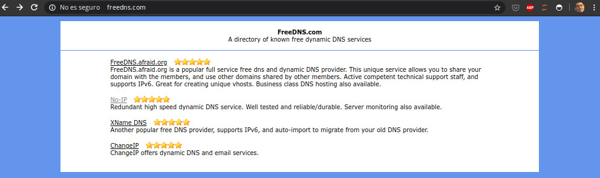

## Acceso desde internet

Además de abrir los puertos necesarios

Proveedores gratuitos de servicios de DDNS

En mi caso usaré el servicio de NoIP

Ahora configuramos en el router la cuenta para que automáticamente se refresque

