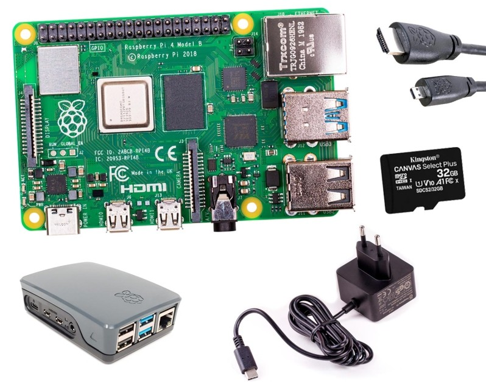

## Materiales

¿Qué necesito para trabajar con la Raspberry Pi?

### Componentes necesarios

A día de hoy tenemos disponibles en el mercado al menos 4 modelos de Raspberry (con diferentes cantidades de memoria RAM):

* 3 de ellos en el típico formato de placa
    - Raspberry Pi 3+, la más antigua
    - Rasbperry Pi 4, que podemos encontrar con distintas cantidades de RAM 
    - Raspberry Pi 5 con 2, 4 u 8Gb de RAM. 

* Rasbperry Pi 400, es equivalente a una Rasapberry Pi 4 con 4GB de RAM, pero en formato teclado, con carcasa incorporada. 

## ¿Cuál elegiremos?

Por todo esto, si tu presupuesto te lo permite...

* Te recomiendo una Raspberry Pi 5, con al menos 4Gb de RAM aunque el curso se puede hacer perfectamente con cualquiera de los modelos 4.
* Fuente de alimentación de 5V con conector USB tipo C con al menos 5A (unos 27W) para la Raspberry Pi 5 y 3A con USB-C para la Raspberry 4.
* Tarjeta SD de al menos 16Gb  o más (recomendados 32Gb). La propia [Raspberry Pi ha creado unas nuevas tarjetas SD de extremada calidad](https://www.raspberrypi.com/products/sd-cards/) y rendimiento. Se recomienda mínimo de clase 10 por su velocidad ya que la elección de una tarjeta de calidad es crítica, con tarjetas baratas nos vamos a encontrar un bajo rendimiento, cuelgues inesperados e incluso puede que tengamos problemas de arranque.

Y si la vas a usar como un ordenador:

* Monitor y cable microHDMI-HDMI o adaptador VGA (existen muchos tipos de conversores, pero no todos funcionan bien con cables largos).
* Salvo que hayas elegido una Raspberry Pi 400, teclado y ratón USB (mejor si es inalámbrico, porque consume menos).

### Material electrónico básico
(No se necesita para superar las tareas del curso)
* Leds de colores
* Resistencias variadas
* Pulsadores
* Led RGB
* Servo
* Protoboard
* Cables de conexión
* Pantalla LCD I2C

### Opcionales

* Una caja o carcasa (para evitar problemas, es muy fácil hacer un contacto con algo metálico), también te puedes imprimir o montar una. Comprueba que sea la adecuada para tu modelo.
* Ventilador: si vas a utilizarla intensamente, mejor refrigerarla con un ventilador adecuado para tu modelo y caja.
* Conexión a la red: Cable ethernet, aunque tengas Wifi, el cable es mucho más rápido que el mejor wifi.
* Conector Hub USB con alimentación, así podremos añadir más dispositivos y evitaremos cargar la potencia de la Raspberry.

### Materiales para realizar los proyectos

Dado que a lo largo del curso se tratan muchos proyectos diferentes, se incluirá en la documentación de cada uno de los proyectos, una lista de los materiales requeridos en cada uno para montarlo.

Estos materiales y los proyectos no son necesarios para superar los test y tareas del curso.

### ¿Dónde encontrarlos?

* [Raspberrypi.com](http://Raspberrypi.com)
* [www.tiendatec.es](https://www.tiendatec.es/)
* [www.bricogeek.com](http://www.bricogeek.com)

En la mayoría de estas tiendas, como en [TiendaTec](https://www.tiendatec.es/13-kits-raspberry-pi), puedes encontrar kits que incluyen todo lo necesario y te aseguras que son los adecuados.

También puedes encontrar kits en amazon o en aliexpress, pero comprueba las opiniones de los usuarios antes de comprar...

