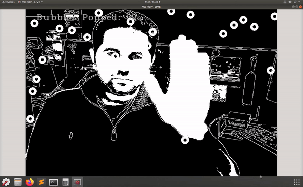

## OpenVX



```sh
git clone --recursive https://github.com/KhronosGroup/OpenVX-sample-impl.git
cd OpenVX-sample-impl/
sudo apt install cmake
python Build.py --os=Linux --venum --conf=Debug --conf_vision --enh_vision --conf_nn
export OPENVX_DIR=$(pwd)/install/Linux/x32/Debug
export VX_TEST_DATA_PATH=$(pwd)/cts/test_data/
mkdir build-cts
cd build-cts/
cmake -DOPENVX_INCLUDES=$OPENVX_DIR/include -DOPENVX_LIBRARIES=$OPENVX_DIR/bin/libopenvx.so\;$OPENVX_DIR/bin/libvxu.so\;pthread\;dl\;m\;rt -DOPENVX_CONFORMANCE_VISION=ON -DOPENVX_USE_ENHANCED_VISION=ON -DOPENVX_CONFORMANCE_NEURAL_NETWORKS=ON ../cts/
cmake --build .

git clone https://github.com/KhronosGroup/openvx-samples.git
cd openvx-samples/
mkdir pop-build 
cd pop-build/
cmake -DOPENVX_INCLUDES=$OPENVX_DIR/include -DOPENVX_LIBRARIES=$OPENVX_DIR/bin/libopenvx.so ../bubble-pop/
make
cmake -DOPENVX_INCLUDES=$OPENVX_DIR/include -DOPENVX_LIBRARIES=$OPENVX_DIR/bin/libopenvx.so ../openvx-samples/bubble-pop/
```


https://www.raspberrypi.org/blog/openvx-api-for-raspberry-pi/

### Ejemplos 

https://github.com/KhronosGroup/openvx-samples


## OpenCV

Inslacion https://descubrearduino.com/opencv-en-raspberry-pi/

https://www.pyimagesearch.com/2019/04/15/live-video-streaming-over-network-with-opencv-and-imagezmq/

## Reconocimiento de caras

[Reconocimiento de caras en 25 lineas de python](https://realpython.com/face-recognition-with-python/)

## Reconocimiento de bordes

https://programarfacil.com/blog/vision-artificial/detector-de-bordes-canny-opencv/

## Deteccion de movimiento

https://www.hackster.io/absoluteAbu/motion-detection-opencv-raspberry-pi-telegram-91fdf5

Proyecto: varita de harry potter

https://www.instructables.com/id/Real-Working-Harry-Potter-Wand-Using-Computer-Visi/

[Piedra/Papel/Tijera con openCV y IA](https://www.hackster.io/310178/rock-paper-scissor-ai-e98cfa)
