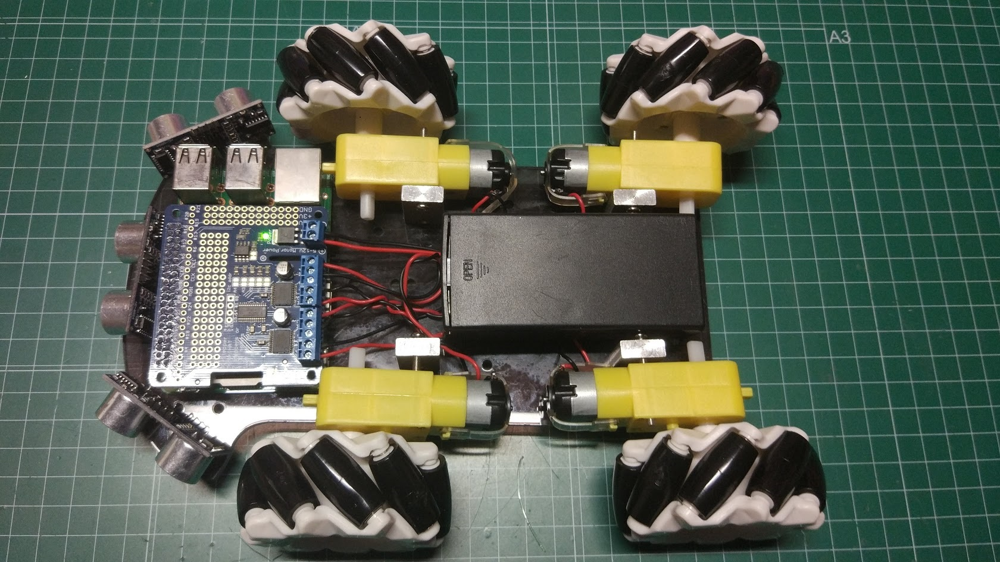

# Robotica

## Placa Adafruit

[Producto](https://www.adafruit.com/product/2348)

## Referencias

[Tutorial placa adafruit](https://learn.adafruit.com/adafruit-dc-and-stepper-motor-hat-for-raspberry-pi?view=all)

### Robot con placa adafruit

[Robot sencillo con placa adafruit](https://learn.adafruit.com/simple-raspberry-pi-robot?view=all)

### Robot sencillo

[Raspberry Pi Web-controlled Robot with video](https://www.hackster.io/jrance/raspberry-pi-web-controlled-robot-with-video-c1b723)

### Pi Wars 2018

[Pi Wars 2018](http://www.piandchips.co.uk/uncategorized/pi-wars-2018-the-evolution-of-x-bot-360/)
