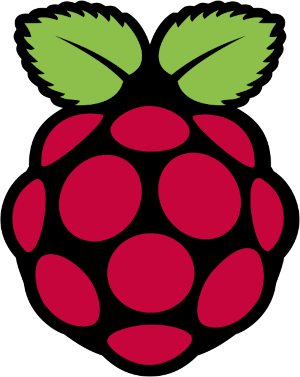

# Tema 1 - ¿Qué es Raspberry?

Raspberry Pi se ha convertido, junto con Arduino, en uno de los máximos exponentes del desarrollo casero y profesional basado en herramientas libres, pudiendo ser una plataforma hardware de desarrollo, un pequeño ordenador personal sobre el que programar, navegar o editar un documento de texto, un reproductor de música, películas o imágenes, o la base sobre la que construir un sistema de almacenamiento en red para compartir archivos entre los equipos que tengamos conectados.

Raspberry Pi se puede convertir fácilmente, por tanto, en un ordenador versátil utilizando cualquier teclado y ratón convencional USB. Además tiene un conector Ethernet y wifi para conectarse a la red local y a Internet y al menos una salida HDMI de vídeo. Por sus características y bajo precio, se ha convertido en una plataforma con muchísimo potencial que contribuye a desarrollar habilidades tecnológicas, promoviendo el aprendizaje de lenguajes de programación como Python, C o Perl, llevando el mundo de la programación a todo aquel que tenga interés en aprender, experimentar y realizar sus propios proyectos.

### Esquema del curso

A lo largo del curso veremos los siguientes temas:

- Introducción.
- Características generales de la placa Raspberry Pi. Hardware.
- Instalación.
- Primeros pasos con Raspberry Pi. Software para instalar.
- Lenguaje de programación y entorno de desarrollo integrado.
- Conexión con equipos electrónicos y Arduino.
- Proyectos con Raspberry Pi.

### Objetivos del curso

* Familiarizarse con la plataforma Raspberry Pi, aprendiendo a instalar y a usarla para
diferentes fines.
* Aprender a realizar programas sencillos usando lenguajes de scripts como Python o Shell
* Aprender a montar proyectos fáciles con electrónica que se puedan controlar desde la plataforma

