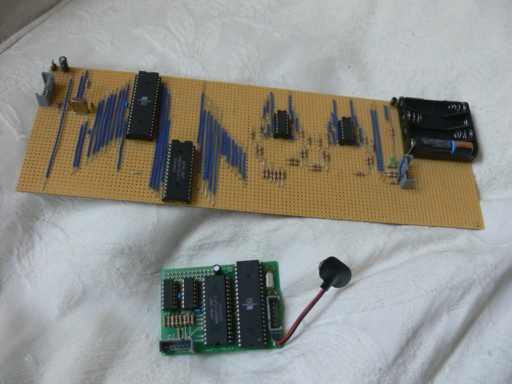
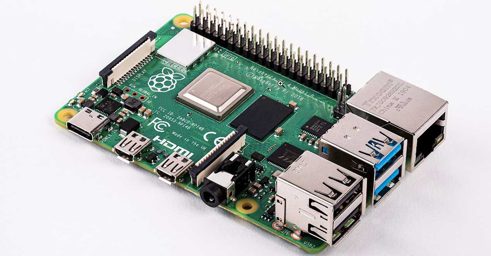
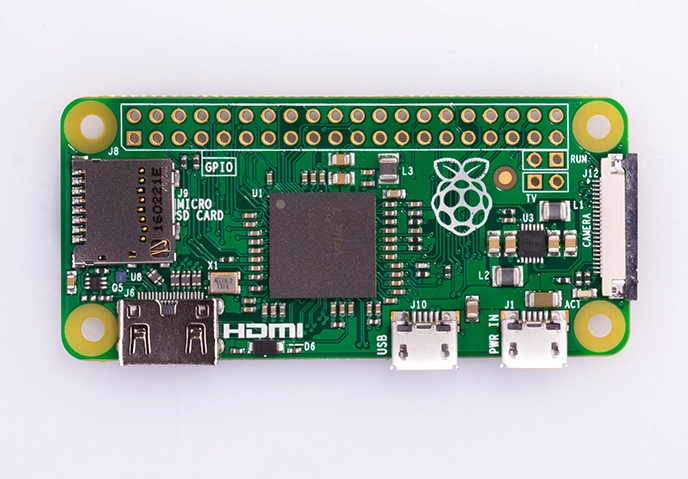
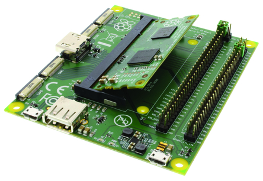
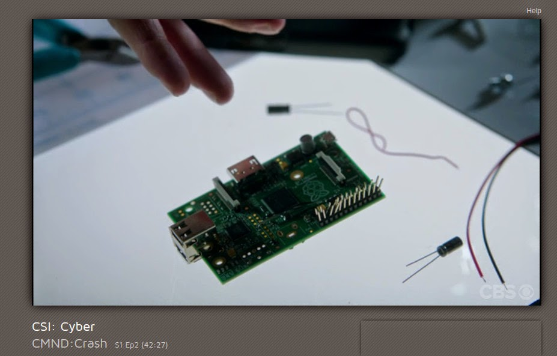

## Orígenes de Raspberry Pi

La intención de los creadores de Raspberry era crear un sistema barato que nos permitiera enseñar a programar a niños y adultos.

* En 2005, la Universidad de Cambridge notó como cada vez menos estudiantes quería estudiar informática

* Pensaron que la solución podía ser un ordenador superbarato con el que pudieran jugar, aprendiendo en el camino.

* Se empezó a construir en 2006, pero era difícil con la electrónica de la época
  

* En 2009 ya existía la tecnología necesaria y se creó "Raspberry Pi Fundation" administrada por Eben Upton

* En 2011 aparecen los primeros prototipos y se ven factibles modelos de 25$ y 35$. Aparece el modelo B Beta

  

Utiliza un diseño avanzado, como podemos ver en la imagen donde se ve que se ha colocado un chip encima de otro.

Actualmente existen varios formatos, vamos a ver los más usados:

* La versión más actual a día de hoy (Julio de 2020) es la [Versión 4](https://www.raspberrypi.org/products/raspberry-pi-4-model-b/) (1.5GHz quad core hasta 8Gb, USB 3.0, 2 HDMI 4K Gigabit, Wifi y bluetooth)

* La versión [Zero](https://www.raspberrypi.org/products/pi-zero/) (1Ghz 512Mb) con un tamaño muy pequeño

* [Raspberry Pi Compute Module 3+](https://www.raspberrypi.org/products/compute-module-3-plus/): es equivalente a una Rasperry pi 3 B+ pero en un formato pensado para construir ordenadores a partir de la Raspberry. Se puede adquirir con un disco interno eMMC de 8GB/16GB/32GB que sustituye a la tarjeta SD

Se puede integrar en Module Kit 3

Más adelante veremos muchos más detalles de esta versión y de las anteriores. 

Puedes encontrar más detalles en el [Artículo de la wikipedia sobre RaspBerry Pi](https://en.wikipedia.org/wiki/Raspberry_Pi)

## Raspberry Pi vs Arduino

Una pregunta muy frecuente es si para determinado proyecto es mejor usar Arduino o Raspberry Pi: la respuesta es sencilla, son equipos muy distintos con capacidades diferentes y generalmente son complementarios.

Vamos a ver las diferencias en detalle, pero podíamos resumirlas diciendo que Raspberry es el cerebro donde Arduino hace más el papel de músculo (desde el punto de vista eléctrico).

Arduino es más robusto eléctricamente: si se produce un cortocircuito entre pines o se comente un error se apagará y reseteará pero las probabilidades de romperlo son bajas. En cambio si hacemos esto mismo con una Raspberry lo más seguro es que la dejemos inservible.

Algunas ventajas de Arduino:

* Es capaz de dar una mayor corriente por cada patilla (hasta 40mA) mientras que Raspberry Pi no puede dar más de 5mA
* Dispone de entradas analógicas, es decir, es capaz de leer valores eléctricos intermedios entre 0 y 5v, no solo digitales como Raspberry Pi
* La sencillez de su funcionamiento (como microcontrolador ) le aporta una gran robustez a la hora de soportar cortes de alimentación.
* Últimamente están apareciendo diversas versiones de Arduino con mayor capacidad, soportando una programación más compleja y potente, como Yún o Galileo.

Raspberry Pi tiene una mayor capacidad de procesamiento, lo que la hace más adecuada para determinadas tareas, como reconocimiento de imágenes o cálculos complejos, algo que sería impensable para Arduino.

  

* Raspberry Pi dispone de mayor capacidad de almacenamiento y de memoria permitiendo utilizar programación más avanzada.

* Raspberry Pi es un entorno completo, no necesita de ningún dispositivo externo para programarse

¿Son incompatibles? en absoluto, lo más frecuente es usarlas conjuntamente, conectándolos y haciendo que la Raspberry actúe como cerebro y Arduino como ejecutor.

Vistas las diferencias entre los dos dispositivos queda claro que son perfectamente complementarios:

* Donde uno adolece de poco cerebro, el otro aporta gran procesamiento
* Donde uno es eléctricamente débil, el otro es robusto

## Raspberry en los medios

Han sido muchas las películas y series donde han aparecido últimamente Raspberry Pi

* [Serie Mr. Robot](http://null-byte.wonderhowto.com/how-to/hacks-mr-robot-build-hacking-raspberry-pi-0163143/): utilizan como punto de acceso externo y para inyectar datos erróneos en el sistema de control de temperatura y así poder controlarlo.

  

* CSI Cyber: lo usan como un router que les permite capturar datos de la red donde están (un parque de atracciones) y así descubren como poder controlar las atracciones.

  

¿Cónoces alguna aparición más en los medios? No dudes en contárnosla.

### Recursos

Las imágenes de los distintos modelos de Raspbery están tomadas de la wikipedia.
