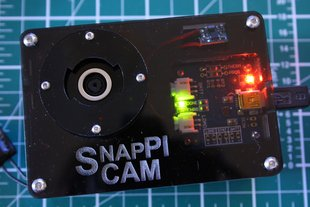

## Proyectos

Vamos a presentar algunos proyectos donde se usa una (o varias) Raspberry Pi con el objeto de da ideas, en absoluto vamos en este punto  detalles de cómo implementarlos. Antes de eso tenemos que aprender a instalar, programar y constuir la electrónica necesaria.

Sí que nos van a mostrar la gran cantidad de usos de la Raspberry Pi.

Al tratarse de enlaces externos al curso, puede ocurrir que algunos enlaces no estén disponibles. En tal caso os agradezco que lo notifiquéis para corregirlos si es posible

### Enseñanza

#### Distribuciones

* Occidentalis: Existen [distribuciones  educativas como Occidentalis de Adafruit](https://learn.adafruit.com/adafruit-raspberry-pi-educational-linux-distro) pensadas para aprender electrónica con la Raspberry. Actualmente la distribución oficial de Raspberry ya contiene la mayoría de las herramientas

* [Coder](https://googlecreativelab.github.io/coder/): es una distribución creada por Google para usar la Raspberry como cliente/servidor para aprender programación.

* [Aulas informáticas](https://www.raspberrypi.org/blog/bringing-computing-to-rural-cameroon/): Unas Raspberries, unos monitores, teclados y ratones reciclados y una mínima infraestructura de red permite crear unas aulas informáticas perfectas para el día.

* Servidor de contenidos educativos: como este [servidor de aula con los contenidos de (Kahn Academy Offline)](http://www.raspberrypi.org/archives/3829?sf12291563=1). Por unos 100$ tenemos un servidor con todos los contenidos de Kahn Academy (o de wikipedia) descargados y sin necesidad de acceso a internet.

### Instrumentación de Laboratorio

Añadiendo algo de hardware externo podemos utilizarlo como equipamiento de laboratorio.

* Generadores de onda: [DAC](https://learn.adafruit.com/mcp4725-12-bit-dac-with-raspberry-pi)

  

* [Analizador de frecuencias](https://learn.adafruit.com/freq-show-raspberry-pi-rtl-sdr-scanner)

  

### MediaCenter

Uno de los usos más frecuentes es como MediaCenter, hasta existen distribuciones dedicadas a ello. En próximos temas veremos en detalle cómo hacerlo nosotros mismos.

* [How to make a MediaCenter](https://learn.adafruit.com/raspberry-pi-as-a-media-center?view=all)

* [Radio wifi](https://learn.adafruit.com/pi-wifi-radio?view=all) 

### Robots

Raspberry aúna las posibilidades de programación sencilla (usando python o Scratch) con una gran versatilidad a la hora de conectar dispositivos electrónicos.

Es por eso que la hacen ideal para crear Robots. Nosotros veremos en el último tema cómo hacer un robot desde cero:

En este otro [tutorial explican como conectar la Raspberry con Lego Mindstorm](https://learn.sparkfun.com/tutorials/getting-started-with-the-brickpi?_ga=1.260570443.733603098.1443800444)

### Juegos

* Juega a MineCraft desde tu Raspberry Pi con este [tutorial](https://learn.adafruit.com/running-minecraft-on-a-raspberry-pi)

#### Máquina de juegos

Uno de los usos más frecuentas de la Raspberry es para jugar, su pequeño tamaño y su capacidad la hacen ideal. Veremos más adelante que es más fácil de lo que parece montarse una.

* [Mame](https://learn.adafruit.com/retro-gaming-with-raspberry-pi?view=all) (Emulador de máquinas recreativas antiguas)

  

* [Mini máquina recreativa](https://learn.adafruit.com/cupcade-raspberry-pi-micro-mini-arcade-game-cabinet?view=all) aprovechando si mini-tamaño

  

* [Cómo instalar y jugar al clásico videojuego  Doom](https://learn.sparkfun.com/tutorials/setting-up-raspbian-and-doom?_ga=1.227922267.733603098.1443800444)

  

### Juegos Portables

Existen muchos proyectos que aprovechan el bajo tamaño de la Raspberry para crear consolas portátiles, incluso emulando algunas de las consolas más conocidas.

[Raspberry Pi Gameboy](https://learn.adafruit.com/pigrrl-raspberry-pi-gameboy?view=all)

[Super consola](https://learn.adafruit.com/super-game-pi?view=all)

[Retro consola](https://www.instructables.com/id/Breadboard-RetroPie/)

### Ordenadores y material informático

Hay varios ordenadores basados en Raspberry Pi

* [Kano](http://www.raspberrypi-spy.co.uk/2016/04/kano-computer-kit-first-impressions/) es un portátil  basado en Raspberry Pi

* [pi-Top](https://www.pi-top.com/) es una marca que ha desarrollado varios modelos distintos de ordenadores sobre una Raspberry Pi

### Servidor NAS

Puedes usar tu Raspberry como [servidor de ficheros](https://www.adslzone.net/2016/08/24/convierte-cualquier-disco-duro-nas-gracias-la-raspberry-pi-3/)

### Clusters

* [Cluster de supercomputación](http://www.cyberhades.com/2014/02/19/tutorial-para-instalar-un-cluster-de-40-nodos-con-raspberry-pi/) Existen muchos proyectos donde aprovechan el bajo coste y toda la información disponible, junto con la compatibilidad con los equipos linux para crear cluster y explorar las posibilidades de supercomputación.

  

* [Minería de BitCoin](https://learn.adafruit.com/piminer-raspberry-pi-bitcoin-miner), conectando unos USB específicos para minar criptomonedas podemos ganarnos unos pocos bitcoins...

  

* [Portable Raspberry](https://learn.adafruit.com/touch-pi-portable-raspberry-pi)

* [MiniPortatil](https://learn.adafruit.com/mini-raspberry-pi-handheld-notebook-palmtop)

### Cámara

[SnapPiCam](https://learn.adafruit.com/snappicam-raspberry-pi-camera) o cómo crear un cámara con tu raspberry

### Teléfono

[RaspiPhone es un teléfono basado en Raspberry Pi](https://learn.adafruit.com/piphone-a-raspberry-pi-based-cellphone?view=all)

### Coche

[Datalogger de datos del coche](http://www.stuffaboutcode.com/2013/07/raspberry-pi-reading-car-obd-ii-data.html)

[Seguidor de flotas](http://www.stuffaboutcode.com/2013/10/raspberry-pi-car-cam-gps-data-map.html)

### Exteriores

Su bajo peso, y los pocos periféricos de los que depende, facilitan su uso en entornos aislados

Sí que tendremos que tener en cuenta el aislamiento, para soportar las temperaturas que nos vamos a encontrar, unas buenas baterías para poder alimentarla.

Incluso podemos llegar a lanzarla al espacio, como en el proyecto [astroPi](https://astro-pi.org/)

O volando en drone usando  [Autopilot](http://erlerobotics.com/blog/meet-the-last-autopilot-for-building-robots-erle-brain-2/)

### Arte

* [Ligth Painting](https://learn.adafruit.com/light-painting-with-raspberry-pi)

  

* [Iluminación con leds](https://learn.adafruit.com/neopixels-on-raspberry-pi)

  

* [Cortina luminosa](https://learn.adafruit.com/1500-neopixel-led-curtain-with-raspberry-pi-fadecandy?view=all)

  

#### Instrumentos de tortura

No te asustes es sólo un [láser que se mueve aleatoriamente](https://learn.adafruit.com/raspberry-pi-wifi-controlled-cat-laser-toy?view=all) y que le encantará a tu gato

[Cuadro diabólico](https://learn.adafruit.com/creepy-face-tracking-portrait?view=all)

  

### Hacking

Otra utilización cada vez más frecuente es como herramienta de Hacking, puesto que su pequeño tamaño y la cantidad de herramientas disponible la hacen ideal para estos usos.

En el libro "Raspberry Pi para agentes secretos" puedes encontrar como usarla como sniffer Wifi

Hay quien incluso la esconde dentro de una regleta [Turn a Raspberry Pi Into a Super Cheap, Packet-Sniffing Power Strip](http://lifehacker.com/six-great-diy-projects-for-hacking-computers-and-networ-1649618886)

Si por el contrario lo que quieres hacer es hackear una Raspberry Pi, en este [enlace](https://geekytheory.com/hacking-raspberry-pi/) puedes ver cómo hacerlo.

