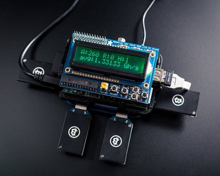
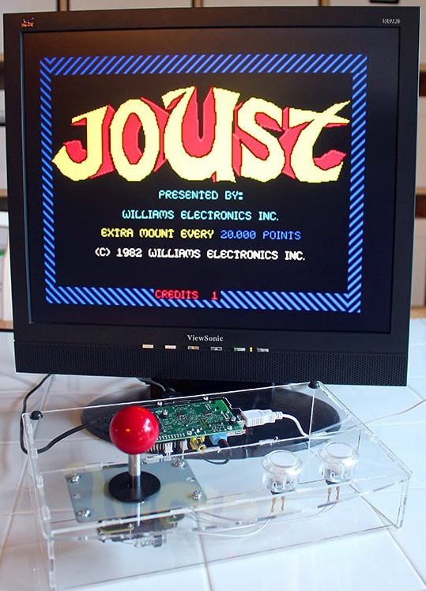
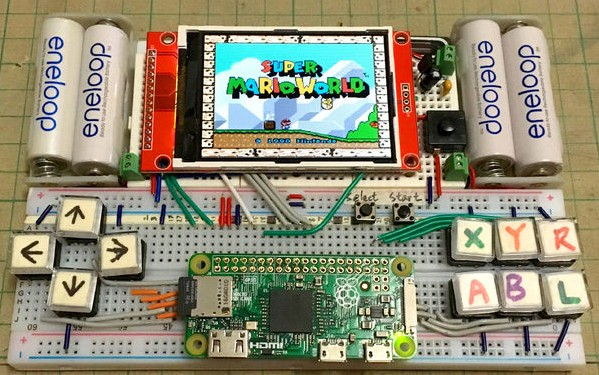

## Proyectos

Vamos a ver algunos proyectos donde se usa una (o varias) Raspberry Pi

### Enseñanza

Existen [distribuciones  educativas](https://learn.adafruit.com/adafruit-raspberry-pi-educational-linux-distro)

Podemos montar [Aulas informatica](https://www.raspberrypi.org/blog/bringing-computing-to-rural-cameroon/)

También podemos hacer un [servidor de aula con los contenidos de (Kahn Academy Offline)](http://www.raspberrypi.org/archives/3829?sf12291563=1)

	Raspebrry 35$
	SD 64Gb 50$
	Wifi USB 5$
	Caja 9$

### Instrumentación de Laboratorio

Añadiendo algo de hardware externo podemos utilizarlo como equipamiento de laboratorio.

* Generadores de onda
[DAC](https://learn.adafruit.com/mcp4725-12-bit-dac-with-raspberry-pi)

  

* [Analizador de precuencias](https://learn.adafruit.com/freq-show-raspberry-pi-rtl-sdr-scanner)

  

### MediaCenter

Uno de los usos más frecuentes es como MediaCenter, hasta existen distribuciones dedicadas a ello.

[How to make a MediaCenter](https://learn.adafruit.com/raspberry-pi-as-a-media-center?view=all)

### Robots

[Raspberry y Lego Minstorm](https://learn.sparkfun.com/tutorials/getting-started-with-the-brickpi?_ga=1.260570443.733603098.1443800444)

### [Minecraft](https://learn.adafruit.com/running-minecraft-on-a-raspberry-pi)

Juega a MineCraft desde tu RaspBerry Pi

### [Kano: portátil  basado en raspberrypi](http://www.raspberrypi-spy.co.uk/2016/04/kano-computer-kit-first-impressions/)

### Cerebro de una instalación domótica

[Regulación de temperatura](https://tackk.com/nightcooling)

## Servidor NAS

Puedes usar tu Raspberry como [servidor de ficheros](https://www.adslzone.net/2016/08/24/convierte-cualquier-disco-duro-nas-gracias-la-raspberry-pi-3/)

### Streaming

[Radio wifi](https://learn.adafruit.com/pi-wifi-radio?view=all)

## Data crunching: supercomputación

* [Cluster de supercomputación](http://www.cyberhades.com/2014/02/19/tutorial-para-instalar-un-cluster-de-40-nodos-con-raspberry-pi/)

  

* [Minería de BitCoin](https://learn.adafruit.com/piminer-raspberry-pi-bitcoin-miner)

  

## Cámara

[SnapPiCam](https://learn.adafruit.com/snappicam-raspberry-pi-camera)

## Máquina de juegos

Uno de los usos más frecuentas de la Raspberry es para jugar, su pequeño tamaño y su capacidad la hacen ideal.

* [Mame](https://learn.adafruit.com/retro-gaming-with-raspberry-pi?view=all) (Emulador de máquinas recreativas antiguas)

  

* [Mini máquina recreativa](https://learn.adafruit.com/cupcade-raspberry-pi-micro-mini-arcade-game-cabinet?view=all) aprovechando si mini-tamaño

  

* [Cómo instalar y jugar al clásico videojuego  Doom](https://learn.sparkfun.com/tutorials/setting-up-raspbian-and-doom?_ga=1.227922267.733603098.1443800444)

  

* [Minecraft](https://learn.adafruit.com/running-minecraft-on-a-raspberry-pi)

  

## Instrumentos de tortura

No te asustes es sólo un [láser que se mueve aleatoriamente](https://learn.adafruit.com/raspberry-pi-wifi-controlled-cat-laser-toy?view=all)
 y que le encantará a tu gato

[Cuadro diabólico](https://learn.adafruit.com/creepy-face-tracking-portrait?view=all)

  

## Arte

* [Ligth Painting](https://learn.adafruit.com/light-painting-with-raspberry-pi)

  

* [Iluminación con leds](https://learn.adafruit.com/neopixels-on-raspberry-pi)

  

* [Cortina luminosa](https://learn.adafruit.com/1500-neopixel-led-curtain-with-raspberry-pi-fadecandy?view=all)

  

### Juegos Portables

[Raspberry Pi Gameboy](https://learn.adafruit.com/pigrrl-raspberry-pi-gameboy?view=all)

[Super consola](https://learn.adafruit.com/super-game-pi?view=all)

[Retro consola](https://www.instructables.com/id/Breadboard-RetroPie/)

## Teléfono

[RaspiPhone es un teléfono basado en Raspberry Pi](https://learn.adafruit.com/piphone-a-raspberry-pi-based-cellphone?view=all)

## Coche

[Datalogger de datos del coche](http://www.stuffaboutcode.com/2013/07/raspberry-pi-reading-car-obd-ii-data.html)

[Seguidor de flotas](http://www.stuffaboutcode.com/2013/10/raspberry-pi-car-cam-gps-data-map.html)

### Exteriores

Su bajo peso, y los pocos periféricos de los que depende, facilitan su uso en entornos aislados

Sí que tendremos que tener en cuenta el aislamiento, para soportar las temperaturas que nos vamos a encontrar, unas buenas baterías para poder alimentarla.

Incluso podemos llegar a lanzarla al espacio, como en el proyecto [astroPi](https://astro-pi.org/)

O volando en drone usando  [Autopilot](http://erlerobotics.com/blog/meet-the-last-autopilot-for-building-robots-erle-brain-2/)

## Proyectos

* [Portable Raspberry](https://learn.adafruit.com/touch-pi-portable-raspberry-pi)

* [MiniPortatil](https://learn.adafruit.com/mini-raspberry-pi-handheld-notebook-palmtop)

Más detalles en el libro "RP para agentes secretos"

### Hacking

Otra utilización cada vez más frecuente es como herramienta de Hacking, puesto que su pequeño tamaño y la cantidad de herramientas disponible la hacen ideal para estos usos.

En el libro "Raspberry Pi para agentes secretos" puedes encontrar como usarla como sniffer Wifi

Hay quien incluso la esconde dentro de una regleta [Turn a Raspberry Pi Into a Super Cheap, Packet-Sniffing Power Strip](http://lifehacker.com/six-great-diy-projects-for-hacking-computers-and-networ-1649618886)

Si por el contrario lo que quieres hacer es hackear una Raspberry Pi, en este [enlace](https://geekytheory.com/hacking-raspberry-pi/) puedes ver cómo hacerlo.

