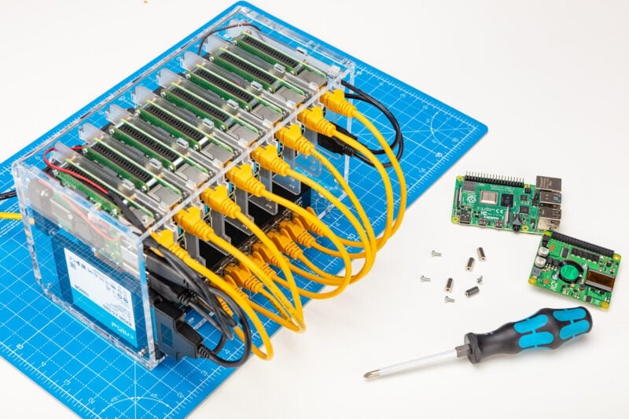
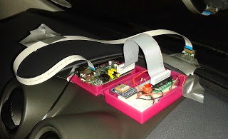

## Proyectos

Vamos a presentar algunos proyectos donde se usa una (o varias) Raspberry Pi con el objeto de dar ideas, pero aún, **no vamos a dar detalles de cómo implementarlos ni creo que estés preparado para abordarlos** en este momento. Antes de eso tenemos que aprender a instalar, programar y construir la electrónica necesaria.

Quizás, cuando termines el curso será un buen momento para revisitar esta sección y atreverte con alguno de los proyectos más avanzados.

Los mostraremos por dar una idea de la gran cantidad de usos de la Raspberry Pi.

Al tratarse de enlaces externos al curso, puede ocurrir que algunos no estén disponibles o los tutoriales estén obsoletos. En tal caso os agradezco que lo notifiquéis para corregirlos si es posible.

### Enseñanza

#### Distribuciones

* Occidentalis: Existen distribuciones  educativas como [Occidentalis de Adafruit](https://learn.adafruit.com/adafruit-raspberry-pi-educational-linux-distro) pensadas para aprender electrónica con la Raspberry. Actualmente la distribución oficial de Raspberry ya contiene la mayoría de las herramientas y en lugar de intentar mantenerse al día con las continuas versiones, han creado un programa que podemos ejecutar en nuestro ordenador o Pi, que instalará muchas de esas herramientas y el soporte.

* [Coder](https://googlecreativelab.github.io/coder/): Es una distribución gratuita y de código abierto, muy útil para la enseñanza de conceptos sencillos de programación, creada por Google para usar la Raspberry Pi como un servidor remoto.

* [Aulas informáticas](https://www.raspberrypi.org/blog/bringing-computing-to-rural-cameroon/): Unas Raspberries, unos monitores, teclados y ratones reciclados con una mínima infraestructura de red, permiten crear unas aulas informáticas perfectas para el día a día hasta en lugares de difícil acceso a Internet.

* Servidor de contenidos educativos: como este [servidor de aula con los contenidos de (Kahn Academy Offline)](https://pi.mujica.org/howto_es.html). Por un poco más 100€ tenemos un servidor con todos los contenidos de Kahn Academy (o de wikipedia) descargados y sin necesidad de acceso a internet.

### Instrumentación de Laboratorio

Añadiendo algo de hardware externo, podemos utilizarlo como equipamiento de laboratorio.

* Generadores de onda: Añadiendo unos sencillos [componentes electrónicos](https://learn.adafruit.com/mcp4725-12-bit-dac-tutorial) podemos generar diferentes tipos de señales.

  

* [Analizador de frecuencias](https://learn.adafruit.com/freq-show-raspberry-pi-rtl-sdr-scanner)

  

### MediaCenter

Uno de los usos más frecuentes es como MediaCenter, de hecho existen distribuciones dedicadas a ello. En próximos temas veremos en detalle cómo hacerlo nosotros mismos.

### Robots

La Raspberry Pi aúna las posibilidades de programación sencilla (usando Python o Scratch) con una gran versatilidad a la hora de conectar dispositivos electrónicos.

Es por eso que la hacen ideal para crear Robots. Nosotros veremos en el último tema, cómo hacer un robot tan estupendo como ete desde cero:

También podemos crear y programar robots con motores y sensore de Lego usando la [placa Build HAT](https://www.raspberrypi.com/products/build-hat/)

### Juegos

* Juega a MineCraft Pi Edition desde tu Raspberry Pi con este [tutorial](https://learn.adafruit.com/running-minecraft-on-a-raspberry-pi)

#### Máquina de juegos

Uno de los usos más frecuentes de la Raspberry es para jugar, su pequeño tamaño y su capacidad la hacen ideal para convertirla en una consola de videojuegos. Veremos más adelante que es más fácil de lo que parece, montarse una.

* [Mame](https://learn.adafruit.com/retro-gaming-with-raspberry-pi?view=all) (Emulador de máquinas recreativas antiguas)

  

* [Mini máquina recreativa](https://learn.adafruit.com/cupcade-raspberry-pi-micro-mini-arcade-game-cabinet?view=all) aprovechando su mini-tamaño

  

* Incluso podemos [instalar y jugar al clásico videojuego  Doom](https://learn.sparkfun.com/tutorials/setting-up-raspbian-and-doom?_ga=1.227922267.733603098.1443800444)

  

### Consolas Portátiles

Existen muchos proyectos que aprovechan el bajo tamaño de la Raspberry para crear consolas portátiles, incluso emulando algunas de las consolas más conocidas.

[Raspberry Pi Gameboy](https://learn.adafruit.com/pigrrl-raspberry-pi-gameboy?view=all)

[Súper consola](https://learn.adafruit.com/super-game-pi?view=all)

[Retro consola](https://www.instructables.com/id/Breadboard-RetroPie/)

### Ordenadores y material informático

Hay varios ordenadores basados en Raspberry Pi:

* [Kano](http://www.raspberrypi-spy.co.uk/2016/04/kano-computer-kit-first-impressions/) es un portátil  basado en Raspberry Pi.
![[Kano_computer.png]]

* [pi-Top](https://www.pi-top.com/) que empezó siendo un ordenador portátil basada en la Raspberry Pi

Ahora es un sistema modular para crear ordeenadores, tablets y robots.

### Servidor NAS

Puedes usar tu Raspberry como [servidor de ficheros](https://www.raspberrypi.com/tutorials/nas-box-raspberry-pi-tutorial/) lo que solemos denominar NAS.

### Clusters

* Un cluster es un conjunto de ordenadores (a los que llamamos nodos) que conectamos entre sí y que podemos controlar como si se tratara de uno solo. Aprovechando el bajo coste de las Raspberry Pi y la compatibilidad con equipos Linux podemos crear cluster y explorar las posibilidades de supercomputación repartiendo tareas entre los distintos nodos. En [este tutorial avanzado](https://www.raspberrypi.com/tutorials/cluster-raspberry-pi-tutorial/) te explican cómo puedes montar tu propio cluster.

  

* [Portable Raspberry](https://learn.adafruit.com/touch-pi-portable-raspberry-pi) construyendo una Raspberry portátil, excelente punto de partida para construir porque puedes modificar, reutilizar componentes para ajustarlos a un proyecto concreto.

* [MiniPortatil](https://learn.adafruit.com/mini-raspberry-pi-handheld-notebook-palmtop) para monitorear y controlar impresiones, verificar cámaras web o incluso transmitir música , incluso puedes jugar juegos de aventuras de texto.

### Cámara

[SnapPiCam](https://learn.adafruit.com/snappicam-raspberry-pi-camera) o cómo crear un cámara con tu Raspberry Pi.

### Teléfono

[RaspiPhone es un teléfono basado en Raspberry Pi](https://learn.adafruit.com/piphone-a-raspberry-pi-based-cellphone?view=all)

### Controlar tu impresora 3D

La capacidad de procesamiento de la Raspberry y la facilidad para acceder a ella remotamente nos premite controlar nuestra impresora 3D. Para ello basta con instalar la distribución adecuada (octoPi) como te explican en [este tutorial](https://www.raspberrypi.com/tutorials/set-up-raspberry-pi-octoprint/). Si además le añades una cámara podrás vigilar tus impresiones 3D.

### Coche

[Datalogger de datos del coche](http://www.stuffaboutcode.com/2013/07/raspberry-pi-reading-car-obd-ii-data.html) para leer o tratar datos de su motocicleta o coche

[Seguidor de flotas](http://www.stuffaboutcode.com/2013/10/raspberry-pi-car-cam-gps-data-map.html) con la cámara Raspberry Pi superpuesta con datos OBD

### Exteriores

Su bajo peso, y los pocos periféricos de los que depende, facilitan su uso en entornos aislados, aunque sí que tendremos que tener en cuenta el aislamiento para soportar las temperaturas que nos vamos a encontrar, y unas buenas baterías para poder alimentarla.

Incluso podemos llegar a lanzarla al espacio, como en el proyecto [astroPi](https://astro-pi.org/)

O volando en dron usando  [Autopilot](https://ardupilot.org/copter/docs/common-erle-brain-linux-autopilot.html)

### Arte

* [Ligth Painting](https://learn.adafruit.com/light-painting-with-raspberry-pi) Raspberry Pi puede facilitar mucho el proceso en las imágenes grandes y coloridas que requieren mucha memoria.
  

* [Iluminación con leds](https://learn.adafruit.com/neopixels-on-raspberry-pi) gracias a la biblioteca Adafruit CircuitPython NeoPixel, ahora podemos controlar NeoPixels o LED directamente desde tu Raspberry Pi.

  

* [Cortina luminosa](https://learn.adafruit.com/1500-neopixel-led-curtain-with-raspberry-pi-fadecandy?view=all) En este proyecto mostrará cómo se puede construir una pantalla flexible y luminosa de gran tamaño

  

#### Instrumentos de tortura

No te asustes es sólo un [láser que se mueve aleatoriamente](https://learn.adafruit.com/raspberry-pi-wifi-controlled-cat-laser-toy?view=all) Este proyecto enseña cómo hacer que un láser se controle a través de la web con una Raspberry Pi.

[Cuadro diabólico](https://learn.adafruit.com/creepy-face-tracking-portrait?view=all) proyecto creado usando una Raspberry Pi y una cámara ejecutando un código que simula un movimiento.

  

### Hacking

Otra utilización cada vez más frecuente es como herramienta de Hacking, puesto que su pequeño tamaño y la cantidad de herramientas disponible la hacen ideal para estos usos.

En el libro "Raspberry Pi para agentes secretos" puedes encontrar como usarla como Wifi sniffer  que puede localizar la red wifi más cercana y además de esto, le ayudará a determinar la intensidad de la señal WiFi 

Hay quien incluso la esconde dentro de una regleta [Turn a Raspberry Pi Into a Super Cheap, Packet-Sniffing Power Strip](http://lifehacker.com/six-great-diy-projects-for-hacking-computers-and-networ-1649618886)

Si por el contrario, lo que quieres hacer es hackear una Raspberry Pi, en este [enlace](https://geekytheory.com/hacking-raspberry-pi/) puedes ver cómo hacerlo.

