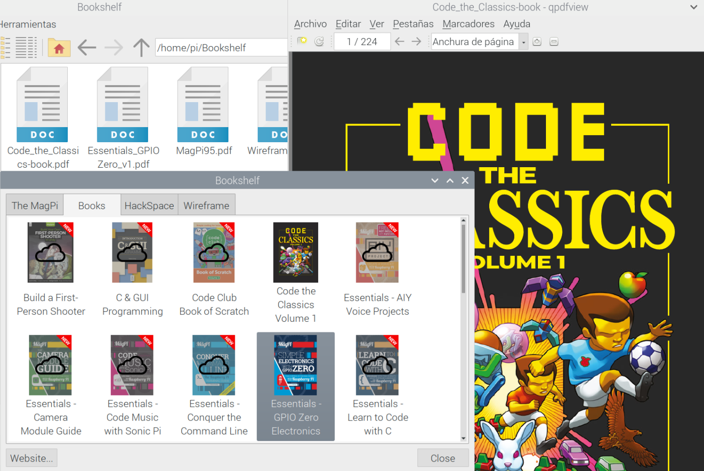

## Documentación sobre Raspberry Pi

Existe mucha documentación sobre Raspberry Pi, veamos como obtener alguna de ella.

### Aplicación Bookshelf

En las últimas versiones de Raspberry Pi OS (antes Raspian) se incluye una aplicación llamada Boolshelf que nos permite descargar y ver las publicaciones gratuitas de la Fundación Raspberry, que incluyen las revistas TheMagPi, HackSpace y Wireframe

### Revistas

La principal revista (mensual) sobre Rasperry Pi es [The Magpi](https://www.raspberrypi.org/magpi/). Es una fuente de información extraordinaria, repleta de proyectos y consejos. Se puede descargar gratuitamente pero si compras la edición en papel suele traer regalos. El famoso número 40 de la revista ¡regalaban un Rasperry Pi Zero! por los 5€ que cuesta. Ni que decir tiene que se agotó rápidamente.

Puedes descargar [todos los números](https://www.raspberrypi.org/magpi/issues/) directamente.

También hay una revista sobre proyectos makers: [HackSpace](https://hackspace.raspberrypi.org/) y otra sobre videojuegos: [WireFrame](https://wireframe.raspberrypi.org/)

También han creado una colección de [libros](https://magpi.raspberrypi.org/books) algunos temáticos (sobre la cámara, programación en C, Scratch, etc.) o con proyectos.

Todas estas publicaciones se pueden comprar en papel (y tienen una edición muy cuidada) a precios muy bajos, pero siempre son descargables en pdf de forma gratuita.

### Libros

Te recomiendo estos 3 libros.  

* Programing the Raspberry Pi, Simon Monk: es un clásico y en sus 90 páginas encontrarás casi todo lo que necesitas saber para manejar y programar tu Raspberry Pi.
* Raspberry Pi for Secret Agents: tiene proyectos más avanzados
* Raspberry Pi Gamming: te enseña a hacer juegos con la Raspberry Pi

### Tutoriales

Algunos tutoriales para aprender rápidamente a manejar tu Raspberry Pi

(Si solo puedes mirar uno mira el primero)

[Proyectos con Raspberry](http://projects.raspberrypi.org)

[Raspberry pi Class (instructables)](http://www.instructables.com/class/Raspberry-Pi-Class/?utm_source=newsletter&utm_medium=email)

[Vídeo tutorial Raspberry Pi (sparkfun)](https://www.youtube.com/watch?v=b6h95jNWg1g)

[Vídeo tutorial Raspberry Pi 2 (sparkfun)](https://www.youtube.com/watch?v=jmPgdcec53s)

[Tutoriales de Adafruit](https://learn.adafruit.com/search?q=raspberry)

[Tutoriales de sparkfun](https://www.sparkfun.com/search/results?term=raspberry)
