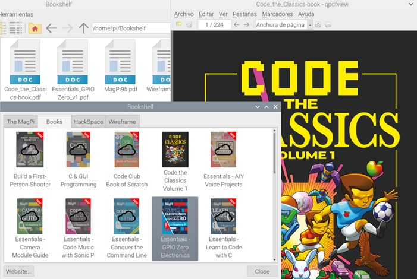

## Documentación sobre Raspberry Pi

Existe mucha documentación sobre Raspberry Pi, veamos cómo obtener alguna de ella.

### Aplicación Bookshelf

En las últimas versiones de Raspberry Pi OS (antes Raspbian), se incluye una aplicación llamada Boolshelf que nos permite descargar y ver las publicaciones gratuitas de la Fundación Raspberry Pi, que incluyen libros y las revistas The Mag Pi, Hack Space y Wireframe...

### Revistas

La principal revista (mensual) sobre Raspberry Pi es [The Magpi](https://magpi.raspberrypi.com/). Es una fuente de información extraordinaria, repleta de proyectos y consejos. Se puede descargar gratuitamente pero si compras la edición en papel, suele traer regalos. En el famoso número 40 de la revista ¡regalaban una Raspberry Pi Zero! Ni que decir tiene que se agotó rápidamente.

Puedes descargar gratis [todos los números](https://magpi.raspberrypi.com/issues) directamente. 

También han creado una colección de [libros](https://magpi.raspberrypi.com/books), algunos temáticos (sobre la cámara, programación en C, Scratch, etc.) o con proyectos.

Todas estas publicaciones se pueden comprar en papel (tienen una edición muy cuidada) a precios muy bajos, pero la mayoría son descargables en pdf de forma gratuita.

### Libros

Si te gusta leer en papel, te recomiendo estos 3 libros.  

* **Programing the Raspberry Pi** de Simon Monk: es un clásico y aunque parece un libro breve, encontrarás casi todo lo que necesitas saber para manejar y programar tu Raspberry Pi.
* **Raspberry Pi for Secret Agents**: tiene proyectos más avanzados.
* **Raspberry Pi Gaming**: te enseña a hacer juegos con la Raspberry Pi.

