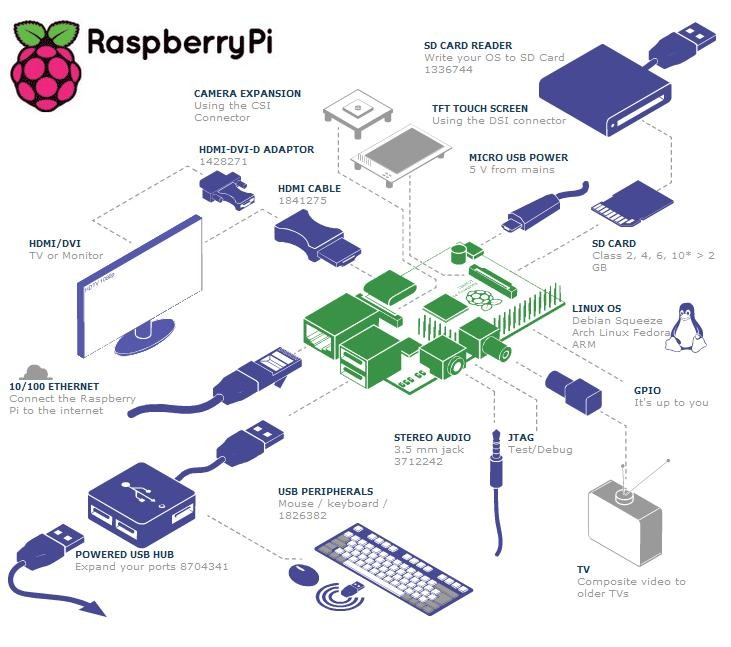

## Arquitectura

En este diagrama puedes ver la arquitectura de una Raspberry Pi original:

Vemos que tiene un bloque central con la CPU y GPU, un frontal con conectores USB y Ethernet (LAN), en un lateral las salidas HDMI y en el lateral opuesto un doble fila de pines, llamados GPIO (General purpose Input/Output o Entradas/Salidas de Propósito General) donde podemos conectar nuestros propios componentes o proyectos electrónicos.

Su tamaño es realmente pequeño: 86 x 57 mm, y aunque a lo largo de las distintas versiones ha ido evolucionando, añadiendo y mejorando los componentes, han manteniendo el mismo tamaño. 

Las versiones posteriores usan cada vez procesadores más potentes y mayor cantidad de memoria RAM. También se han ido añadiendo nuevos conectores externos. 

En la siguiente imagen podemos ver los distintos conectores y componentes de  la [Raspberry Pi 3+](https://www.raspberrypi.com/products/raspberry-pi-3-model-b-plus/) 

* USB: podremos conectar cualquier dispositivo USB, pero teniendo en cuenta que no debe consumir demasiado.
* HDMI: conectamos el monitor HDMI
* LAN: típico conector RJ45 para cable ethernet
* Conector Micro-USB en las primeras versiones y USB-C en las recientes por el que la alimentaremos.
* Conector CSI para la cámara
* Conector DSI para un monitor específico
* GPIO, 40 pines accesibles para utilizar como entradas y salidas. Hay que tener mucho cuidado con ellos porque están conectados directamente al microprocesador y podríamos estropearlos fácilmente.

Si ahora la comparamos con la versión 5 de la imagen inferior, veremos que guarda gran similitud:

En las versiones 4 y 5 se han incluido 2 conectores micro-HDMI, se ha cambiado el conector de alimentación que ahora es USB-C y las placas son cada vez más complejas.

En la versión 5 se han incluido conectores para permitir la conexión de más periféricos de alto rendimiento.

## Dispositivos para conectar

En este diagrama vemos los dispositivos que se pueden conectar a la Raspberry Pi:

Para conectar dispositivos y con el fin de no sobrecargar la fuente de alimentación, deberíamos intentar usar dispositivos autoalimentados, incluir un adaptador hub USB alimentado y en la medida de lo posible, usar teclado y ratón inalámbricos.
