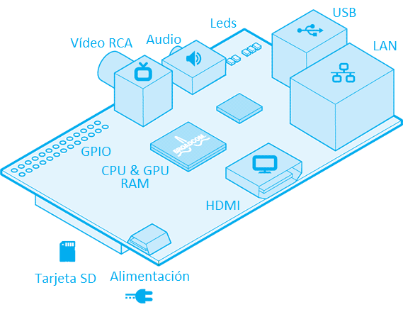

## Arquitectura

En este diagrama simplificado puedes ver la arquitectura de una Raspberry Pi:

Vemos que tiene un bloque central con la CPU y GPU, un frontal con conectores USB y Ethernet, en un lateral la salida HDMI y en el lateral opuesto un doble fila de pines, llamados GPIO donde podremos conectar nuestros proyectos de electrónica.

Su tamaño es realmente pequeño: 86x57 mm

A lo largo de las distintas versiones ha ido evolucionando. Veamos los dos modelos más recientes

En estos dibujos esquemáticos podemos ver los distintos conectores:

* USB: podremos conectar cualquier dispositivo USB, pero teniendo en cuenta que no debe consumir demasiado.
* HDMI: conectamos el monitor HDMI
* LAN: típico conector RJ45 para cable ethernet
* Algunas versiones tienen salidas de vídeo en formato RCA
* MicroUSB por el que alimentaremos
* Conector CSI para la cámara
* Conector DSI para un monitor específico
* GPIO, 40 pines accesibles para utilizar como entradas y salidas. Hay que tener mucho cuidado con ellos porque están conectados directamente el microprocesador y podríamos estropearlo fácilmente.

Podemos ver que la [Raspberry Pi 3](https://www.raspberrypi.com/products/raspberry-pi-3-model-b-plus/) guarda una gran similitud con las versiones originales.

