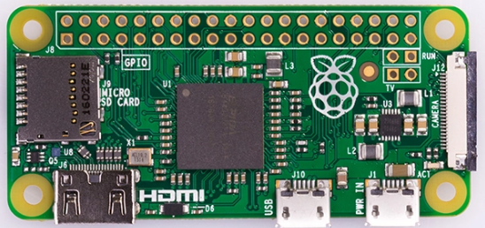
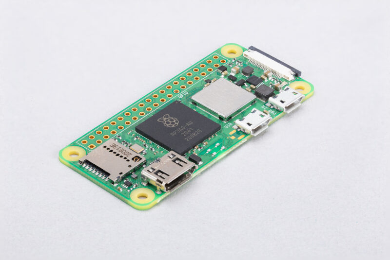
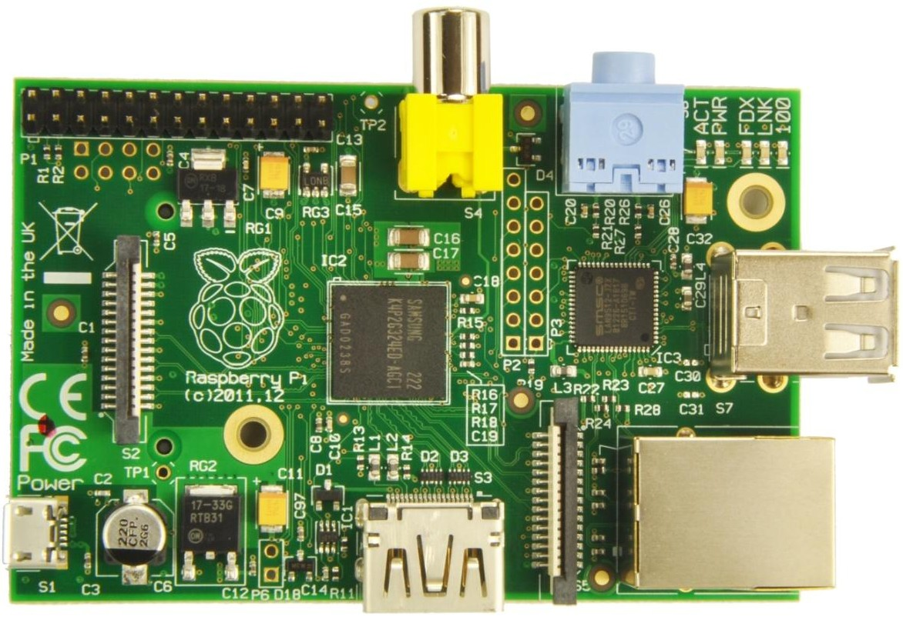
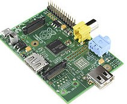
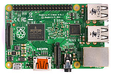
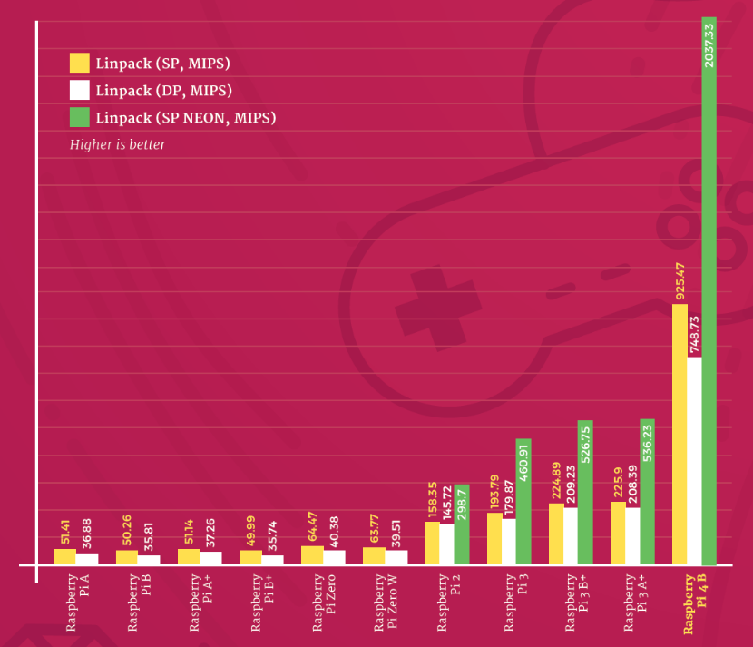
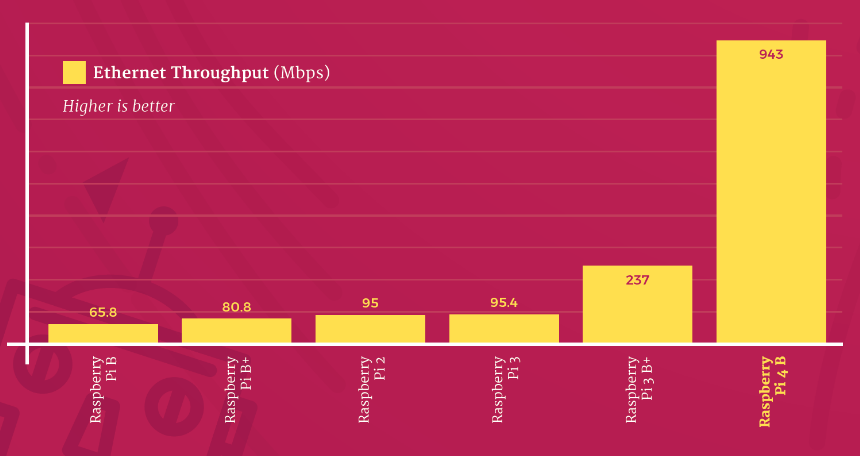
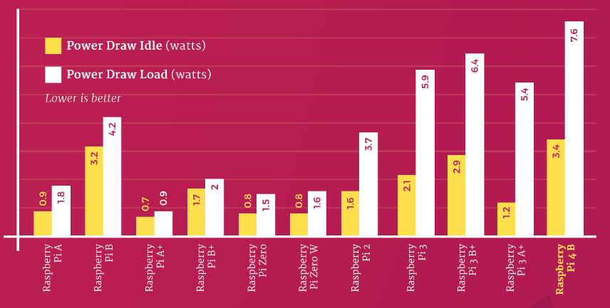

### Raspberry Pi 4

Veamos las diferencias con las versiones anteriores

* 2 USB 3.0 y 2 USB 2.0
* LAN Gigabit
* 2 x mini-HDMI
* Alimentación via USB-C
* 2Gb/4Gb/8Gb de RAM

El cambio a nivel de rendimiento es brutal.

### [Raspberry Pi V3+](https://www.raspberrypi.com/products/raspberry-pi-3-model-b-plus/) vs V4

||Raspberry Pi 4	|Raspberry Pi 3 B+
|---|---|---
|CPU|Broadcom BCM2711, Quad coreCortex-A72 (ARM v8) 64-bit SoC @ 1.5GHz	|Broadcom BCM2837B0 quad-core A53 (ARMv8) 64-bi @ 1.4GHz
|GPU|	Broadcom VideoCore VI|	Broadcom Videocore-IV
|RAM|	1 GB, 2 GB, o 4 GB LPDDR4 SDRAM	|1 GB LPDDR2 SDRAM
|Bluetooth|	Bluetooth 5.0, BLE	|Bluetooth 4.2, BLE
|Pantalla y sonido	|2 × micro-HDMI 2.0, 3.5 mm audio-vídeo analógico|	HDMI, 3.5 mm audio-vídeo analógico 
|USB	|2x USB 3.0 + 2x USB 2.0	|4x USB 2.0
|Ethernet|	Native Gigabit Ethernet	|300 Mbps Giga Ethernet
|Video Decoder|	H.265 4Kp60, H.264 1080p60|	H.264 & MPEG-4 1080p30
|Aimentación|	5V via USB type-C con 3A y GPIO  a 3A| 5V vía micro USB con 2.5A y GPIO a 3A
|Expansión|	40-pin GPIO |40-pin GPIO 
|Wifi	|2.4 GHz y 5 GHz 802.11b/g/n/a wifi LAN	|2.4 GHz and 5 GHz 802.11b/g/n/a wifi LAN
|Almacenamiento|	microSD card	|microSD card
|Precio|	$35 – 2 GB RAM, $45 – 4 GB RAM, $55 – 8 GB RAM	|$35 – 1 GB RAM

Cómo podemos ver, la V4 gana en todas las características 

[Fuente: seeedstudio](http://www.seeedstudio.com/blog/2019/09/30/raspberry-pi-4-vs-pi-3-all-the-major-differences)

## Dispositivos para conectar

En este diagrama vemos los dispositivos que se pueden conectar a la Raspberry Pi

Como vemos a la hora de conectar dispositivos y con el fin de cargar la fuente de alimentación deberíamos intentar usar dispositivos autoalimentados, incluir un hub USB alimentado y en la medida de lo posible usar teclado y ratón inalámbricos.

## Modelos

Hasta la fecha se han creado diferentes modelos, cada vez con mayores prestaciones.

En el siguiente enlace podemos leer en detalle sobre las diferentes [versiones](https://es.wikipedia.org/wiki/Raspberry_Pi)

(falta la v4)

Las versiones más actuales son la Raspberry 4 (de la hablamos en detalle poco más adelante) y la Zero.

La [Raspberry Zero](https://www.raspberrypi.com/products/raspberry-pi-zero-2-w/) es una versión superreducida con el mismo procesador pero a 1Ghz y  512Mb de RAM. La gran diferencia es que casi no dispone de conectores, para así reducir su tamaño y precio ¡Cuesta 5-15€! según queramos una versión sin wifi o con conectividad wifi.

Recientemente ha aparecido una nueva versión: la Raspberry Pi Zero 2 W, con micro de cuatro núcleos, 64bits, 1GHz y 512 Mb de RAM integrados en el propio chip. Según sus pruebas es 5x veces más potente. Sale por 15$ y eso sí, con el mismo mini tamaño . Utiliza el mismo procesador que la Raspberry 3, eso sí, en un espacio más reducido.

El que tenga un CPU quad-core que hace que la ejecución multitarea mejore muchísimo, lo que aumenta mucho su rendimiento

[Referencia sobre la Raspberry Pi Zero 2 W](https://www.raspberrypi.com/news/new-raspberry-pi-zero-2-w-2/)

¿Para qué elegir un modelo u otro? La Zero tiene la ventaja de un tamaño muy reducido y por tanto es ideal para proyectos móviles o que necesitamos "esconder". Por otro lado tiene menor capacidad de procesamiento y de memoria RAM lo que la inutiliza para proyectos que requieran un mayor rendimiento.

### Versiones antiguas

Por motivos históricos vamos a incluir aquí algunos detalles sobre las versiones anteriores.

#### [Raspberry Pi Versión B](https://www.raspberrypi.com/products/raspberry-pi-1-model-b-plus/)

Tenía 512M de RAM, ethernet y 2 puertos USB.

#### [Raspberry Versión A](https://www.raspberrypi.com/products/raspberry-pi-1-model-a-plus/)

Apareció en 2011 y tenía 256MB de RAM, un único USB y no tenía conector Ethernet. Costaba unos 25€.

#### [Versión B+](https://www.raspberrypi.com/documentation/computers/raspberry-pi.html#modelbplus)

En 2014 se libera esta versión con algunas mejoras internas, pero sin grandes cambios.

#### [Versión 2 B](https://www.raspberrypi.com/products/raspberry-pi-2-model-b/)

El micro quad core va a 900MHz  y tiene 1Gb de RAM, 4 puertos USBs. Incorporan el nuevo formato de los 40 pines GPIO.

[Vídeo](https://drive.google.com/file/d/1mtwGpUcBtEkt6OTd9XJhdIc6THwIzxlv/view?usp=sharing) sobre los distintos modelos/versiones de Raspberry Pi.

Puedes encontrar más detalles en la [página de productos de la fundación Raspberry Pi](https://www.raspberrypi.com/products/)

## Raspberry Pi 4

Veamos más detalles sobre la Raspberry pi 4

Es un gran avance en cuanto a prestaciones, pero conservando su esencia: un mismo tamaño, compatibilidad con las anteriores versiones y un precio base alucinante: desde 35$

Veamos algunas de sus características

* Procesador Quad core ARM A8 de 64 bits a 1.5Ghz. Los primeros tests de velocidad dicen que 2x veces más rápida que la 3+

* Compatible con OpenGL 3, con lo que esperemos que software 3D debe mejorar enormemente
* 3 Versiones con diferente cantidad de memoria RAM:  1Gb, 2Gb y 4Gb. Este aumento debe hacer que el rendimiento mejore mucho en aplicaciones pesadas como son los navegadores web 
* Doble salida mini-HDMI de 4K (personalmente no me gusta que sea mini-HDMI)
* 2 USB de tipo 3  y  2 USB de tipo 2
* Full Gigabit Ethernet real con POE (estándar de alimentación via red ethernet). Según los test de velocidad de transferencia por fin se ha eliminado la arquitectura de red conectada vía USB y el cambio es espectacular
  

* Wifi 2.4GHz y 5GHz b/g/n/ac
* Bluetooth 5.0 Low Energy (BLE)
* GPIO de 40 pines como en anteriores versiones
* Necesita 15W (5V y 3A) de alimentación,  y se ha pasado al USB-C para la alimentación. Según los test el consumo no ha subido en la misma proporción.

Como vemos está muy, muy cerca de las prestaciones de un portátil estándar a día de hoy

Esas aulas de ordenadores van a echar humo...

Se han encontrado algunos problemas en el diseño de la parte de alimentación lo que hace que algunos cargadores no funcionen bien.

También se han visto problemas de sobrecalentamiento, lo que hace necesario usar disipadores y ventiladores en la caja.

La posibilidad de elegir entre varios tamaños de RAM es muy interesante, pero también encarece el precio. Antes de comprar deberíamos pensar si vamos a necesitar tanta capacidad

### Referencias

[Página del producto](https://www.raspberrypi.com/products/raspberry-pi-4-model-b/)

[Más detalles sobre las especificaciones y el comportamiento](https://magpi.raspberrypi.com/articles/raspberry-pi-specs-benchmarks)

[Más información sobre los tests de rendimiento](https://magpi.raspberrypi.com/articles/raspberry-pi-4-specs-benchmarks)

[Sobre el desarrollo de esta nueva versión](https://eandt.theiet.org/content/articles/2019/06/raspberry-pi-4-unveiled-interview-with-founder-eben-upton/)

(Imágenes oficiales tomadas de Raspberry.org) y [MagPi85](https://magpi.raspberrypi.com/issues/85)
