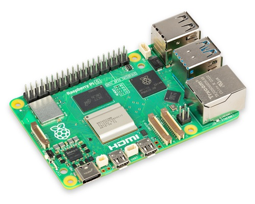
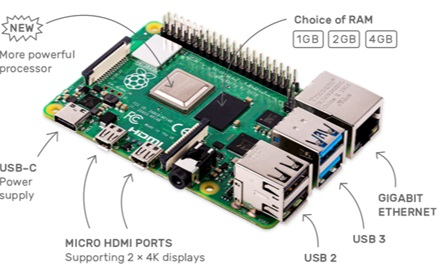
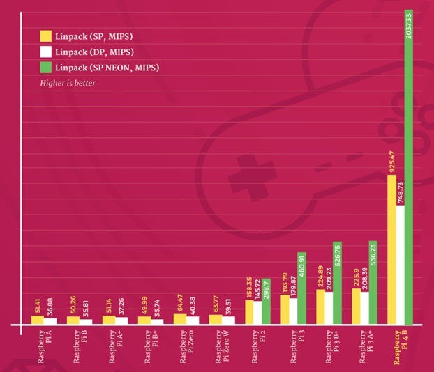
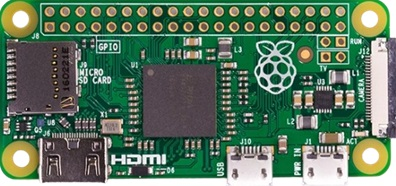
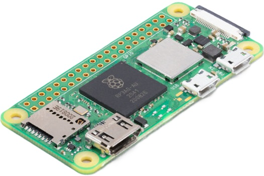
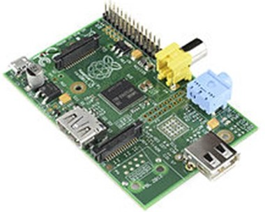

### Versiones de la Raspberry Pi

Ya son muchas las versiones que han aparecido de la Raspberry Pi, y cada vez aparecen más deprisa... (ya hay rumores de un nuevo modelo Raspberry Pi 500 basado en la 5)

### Raspberry Pi 5 

La versión 5 de Raspberry Pi, mejora aún más el rendimiento de las anteriores versiones y añade algunas características:

* ¡¡**Botón de apagado/encendido**!! Sí, resulta curioso que hasta ahora no lo hayan incluído.
* Procesador a 2.4GHz.
* Está disponible con tamaños de 2GB, 4GB y 8GB de RAM.
* 2 conectores para cámaras o monitores MIPI y un conector ePCI que permite conectar periféricos de alto rendimiento como coprocesadores orientados a IA o discos SSD.
* Reloj de tiempo real (RTC) que necesita una pila externa para guardar la hora.

	

La Raspberry Pi 5 ofrece un **rendimiento mejorado** y más **flexibilidad** que sus predecesoras. 

**Procesador y memoria:**

* **Chip propio Broadcom BCM2712:** Un procesador Arm Cortex-A76 de cuatro núcleos y 64 bits a 2,4GHz, que ofrece un aumento del 2-3 veces en el rendimiento de la CPU respecto a la Raspberry Pi 4.
* **Memoria RAM LPDDR4X:** Disponible en versiones de 4GB y 8GB.

**Gráficos:**

* **GPU VideoCore VII:** Compatible con OpenGL ES 3.1 y Vulkan 1.2
* **Decodificador HEVC 4Kp60:** Para disfrutar de contenido multimedia en alta definición.

**Conectividad:**

* **2 puertos HDMI:** Permite conectar hasta dos monitores 4K a 60 Hz.
* **2 puertos USB 3.0:** Ofrecen velocidades de transferencia de hasta 5 Gbps.
* **2 puertos USB 2.0:** Para mayor compatibilidad con dispositivos periféricos.
* **Gigabit Ethernet:** Conexión a red de alta velocidad.
* **Wi-Fi 802.11ac de doble banda:** Conectividad inalámbrica rápida y confiable.
* **Bluetooth 5.0:** Para conectar auriculares, teclados y otros dispositivos inalámbricos.
* **Nuevo ISP desarrollado por Raspberry Pi:** Captura imágenes y vídeos de hasta 1 Gigapixel por segundo.

### Diferencias principales entre la Raspberry Pi 4 y la Raspberry Pi 5:

**Procesador y rendimiento:**

* **Raspberry Pi 4:** CPU Broadcom BCM2711 de cuatro núcleos Cortex-A72 a 1.5GHz.
* **Raspberry Pi 5:** CPU Broadcom BCM2712 de cuatro núcleos Cortex-A76 a 2.4GHz. **Unas 2-3 veces más rápida.**

**Memoria:**

* **Raspberry Pi 4:** LPDDR4 de 2GB, 4GB y 8GB.
* **Raspberry Pi 5:** LPDDR4X de 4GB y 8GB. **Más rápida y eficiente.**

**Gráficos:**

* **Raspberry Pi 4:** GPU VideoCore VI a 500MHz.
* **Raspberry Pi 5:** GPU VideoCore VII a 800MHz. **Mejor rendimiento gráfico, especialmente para juegos y decodificación de video.**

**Conectividad:**

* **Ambas:** 2 puertos HDMI, 2 puertos USB 3.0, 2 puertos USB 2.0, Gigabit Ethernet, Wi-Fi 802.11ac, Bluetooth 5.0.
* **Raspberry Pi 5:** Añade un **conector PCIe** para mayor flexibilidad.

**Otras características:**

* **Raspberry Pi 5:**
    * **ISP propio:** Captura imágenes y vídeos de hasta 1 Gigapixel por segundo.
    * **Disipador de calor y ventilador más eficientes:** Para un mejor rendimiento térmico.
    * **Elimina el conector de audio estéreo.**

La Raspberry Pi 5 ofrece un **rendimiento significativamente superior**, mejor **rendimiento gráfico**, mayor **flexibilidad** y algunas características adicionales en comparación con la Raspberry Pi 4. 

**¿Cuál elegir?**

Depende de tus necesidades y presupuesto. Si necesitas el **máximo rendimiento** y las últimas funciones, la Raspberry Pi 5 es la mejor opción. Sin embargo, si tienes un presupuesto ajustado o tus necesidades no son tan exigentes, la Raspberry Pi 4 sigue siendo una excelente opción.

### Raspberry Pi 4

Veamos las diferencias con las versiones anteriores

* Procesador a 1.5GHz
* 2 USB 3.0 y 2 USB 2.0
* LAN Gigabit
* 2 x mini-HDMI
* Alimentación vía USB-C
* Disponibilidad de varias versiones con diferentes cantidades de memoria RAM: 2GB, 4GB o 8GB.

El cambio a nivel de rendimiento con las anteriores versiones es brutal.

Veamos sus características y cómo influyen en la mejora de rendimiento respecto a los modelos anteriores. Para ello usaremos los [test que se realizaron en su lanzamiento](https://magpi.raspberrypi.com/articles/raspberry-pi-specs-benchmarks). 

* Procesador Quad-Core ARM A8 de 64 bits a 1.5Ghz. Los primeros test de velocidad dicen que es 2x veces más rápida que la 3+

* Compatible con OpenGL 3, con lo que el rendimiento del software de diseño 3D y los videojuegos, deben mejorar enormemente.
* 3 Versiones con diferente cantidad de memoria RAM:  1GB, 2GB, 4GB y 8GB. Este significativo aumento debe hacer que el rendimiento mejore mucho en aplicaciones pesadas como son los navegadores web. 
* Full Gigabit Ethernet real con POE (estándar de alimentación vía red ethernet). Según los test de velocidad de transferencia, por fin se ha eliminado la arquitectura de red conectada vía USB y el cambio es espectacular.

  

* Wifi 2.4GHz y 5GHz b/g/n/ac.
* Bluetooth 5.0 Low Energy (BLE).
* GPIO de 40 pines como en anteriores versiones.
* Necesita 15W (5V y 3A) de alimentación, y se ha pasado al USB-C para la alimentación. Según los test, el consumo no ha subido en la misma proporción.

Como vemos está muy, muy cerca de las prestaciones de un portátil estándar a día de hoy.

Esas aulas de ordenadores van a echar humo...

Se han encontrado algunos problemas en el diseño de la parte de alimentación lo que hace que algunos cargadores no funcionen bien, también se han visto problemas de sobrecalentamiento, lo que hace necesario usar disipadores y ventiladores en la caja.

La posibilidad de elegir entre varios tamaños de RAM es muy interesante, pero también encarece el precio. Antes de comprar deberíamos pensar si vamos a necesitar tanta capacidad.

### Raspberry Pi 3+ vs 4 vs 5

Vamos a hacer una tabla comparativa con las características más destacadas de los 3 modelos en formato placa, disponibles a día de hoy

|                          | Raspberry Pi 5                                            | Raspberry Pi 4                                                      | Raspberry Pi 3 B+                                       |
| ------------------------ | --------------------------------------------------------- | ------------------------------------------------------------------- | ------------------------------------------------------- |
| CPU                      | Broadcom BCM2712 Quad-Core 64-bit Arm Cortex-A76 @ 2.4GHz | Broadcom BCM2711, Quad-Core Cortex-A72 (ARM v8) 64-bit SoC @ 1.5GHz | Broadcom BCM2837B0 Quad-Core A53 (ARMv8) 64-bi @ 1.4GHz |
| GPU                      | Broadcom VideoCore VII                                    | Broadcom VideoCore VI                                               | Broadcom Videocore-IV                                   |
| RAM                      | 2GB, 4GB o 8GB LPDDR4X-4267                               | 1GB, 2GB, o 4GB LPDDR4 SDRAM                                        | 1GB LPDDR2 SDRAM                                        |
| Bluetooth                | Bluetooth 5.0, BLE                                        | Bluetooth 5.0, BLE                                                  | Bluetooth 4.2, BLE                                      |
| Pantalla y sonido        | 2 × micro-HDMI                                            | 2 × micro-HDMI 2.0, 3.5 mm audio-vídeo analógico                    | HDMI, 3.5 mm audio-vídeo analógico                      |
| USB                      | 2 x USB 3.0 + 2 x USB 2.0                                 | 2 x USB 3.0 + 2 x USB 2.0                                           | 4 x USB 2.0                                             |
| Ethernet                 | Gigabit Ethernet, with PoE+ support                       | Native Gigabit Ethernet                                             | 300 Mbps Giga Ethernet                                  |
| Video Decoder            | 4Kp60 HEVC                                                | H.265 4Kp60, H.264 1080p60                                          | H.264 & MPEG-4 1080p30                                  |
| Alimentación             | 5V vía USB type-C con 5A                                  | 5V vía USB type-C con 3A y GPIO  a 3A                               | 5V vía micro USB con 2.5A y GPIO a 3A                   |
| Expansión                | 40-pin GPIO                                               | 40-pin GPIO                                                         | 40-pin GPIO                                             |
| Wifi                     | Dual-band 802.11ac Wi-Fi                                  | 2.4 GHz y 5 GHz 802.11b/g/n/a wifi LAN                              | 2.4 GHz y 5 GHz 802.11b/g/n/a wifi LAN                  |
| Almacenamiento           | microSD card                                              | microSD card                                                        | microSD card                                            |
| Precio (octubre de 2024) | 59€ - 2GB, 70€ - 4GB, 90€ - 8GB                           | 46€ - 1GB, 56€ – 2GB, 70€ – 4GB, 90€ – 8GB                          | 43€ – 1GB RAM                                           |

Cómo podemos ver, la V5 gana en todas las características aunque la versión 4 sigue siendo apta para muchos otros usos. 

La [Raspberry Zero](https://www.raspberrypi.com/products/raspberry-pi-zero-2-w/) es una versión superreducida con el mismo procesador pero a 1Ghz y  512Mb de RAM. La gran diferencia es que casi no dispone de conectores, para así reducir su tamaño y precio, según queramos una versión sin wifi o con conectividad wifi.

Existe una nueva versión : la Raspberry Pi Zero 2 W, con micro de cuatro núcleos, 64 bits, 1GHz y 512 Mb de RAM integrados en el propio chip. Según sus pruebas es 5x veces más potente y con el mismo mini tamaño. Utiliza el mismo procesador que la Raspberry 3, eso sí, en un espacio aún más reducido.

El que tenga una CPU Quad-Core hace que la ejecución multitarea mejore muchísimo, lo que aumenta mucho su rendimiento.

[Referencia sobre la Raspberry Pi Zero 2 W](https://www.raspberrypi.com/news/new-raspberry-pi-zero-2-w-2/)

¿Para qué elegir un modelo u otro? La Zero tiene la ventaja de un tamaño muy reducido y por tanto es ideal para proyectos móviles o que la necesitemos "esconder o guardar". Por otro lado, tiene menor capacidad de procesamiento y de memoria RAM, lo que la inutiliza para proyectos que requieran un mayor rendimiento.

### Versiones antiguas

Hasta la fecha se han creado diferentes modelos, cada vez con mayores prestaciones.

En el siguiente enlace podemos leer en detalle sobre las diferentes [versiones de la Raspberry Pi](https://es.wikipedia.org/wiki/Raspberry_Pi)

(En la foto familiar faltan las versiones de la Raspberry Pi v4, la 400 y la v5)

Por motivos históricos vamos a incluir aquí algunos detalles sobre las versiones anteriores.

#### [Raspberry Versión A](https://www.raspberrypi.com/products/raspberry-pi-1-model-a-plus/)

Apareció en 2011 y tenía 256MB de RAM, un único USB y no tenía conector Ethernet. Costaba unos 25€.

#### [Raspberry Pi Versión B](https://www.raspberrypi.com/products/raspberry-pi-1-model-b-plus/)

Tenía 512M de RAM, ethernet y 2 puertos USB.

#### [Versión B+](https://www.raspberrypi.com/documentation/computers/raspberry-pi.html#modelbplus)

En 2014 se libera esta versión con algunas mejoras internas, pero sin grandes cambios.

#### [Versión 2 B](https://www.raspberrypi.com/products/raspberry-pi-2-model-b/)

El micro Quad-Core va a 900MHz  y tiene 1GB de RAM, 4 puertos USB. Incorporan el nuevo formato de los 40 pines GPIO.

[Vídeo](https://drive.google.com/file/d/1mtwGpUcBtEkt6OTd9XJhdIc6THwIzxlv/view?usp=sharing) sobre algunos de los modelos/versiones anteriores de Raspberry Pi.

Puedes encontrar más detalles de los últimos modelos/versiones actuales en la [página de productos de la fundación Raspberry Pi](https://www.raspberrypi.com/products/)

