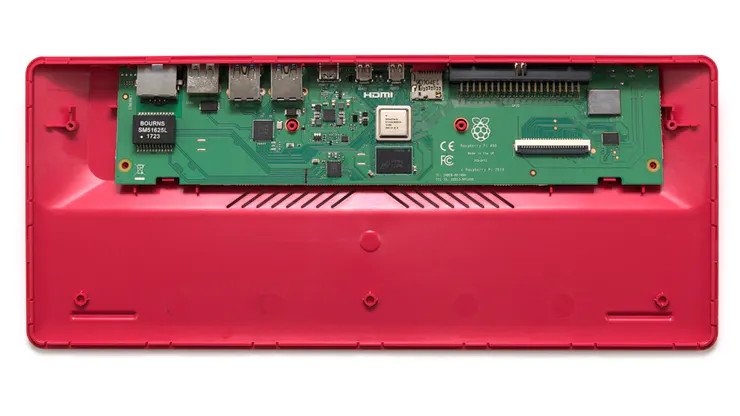
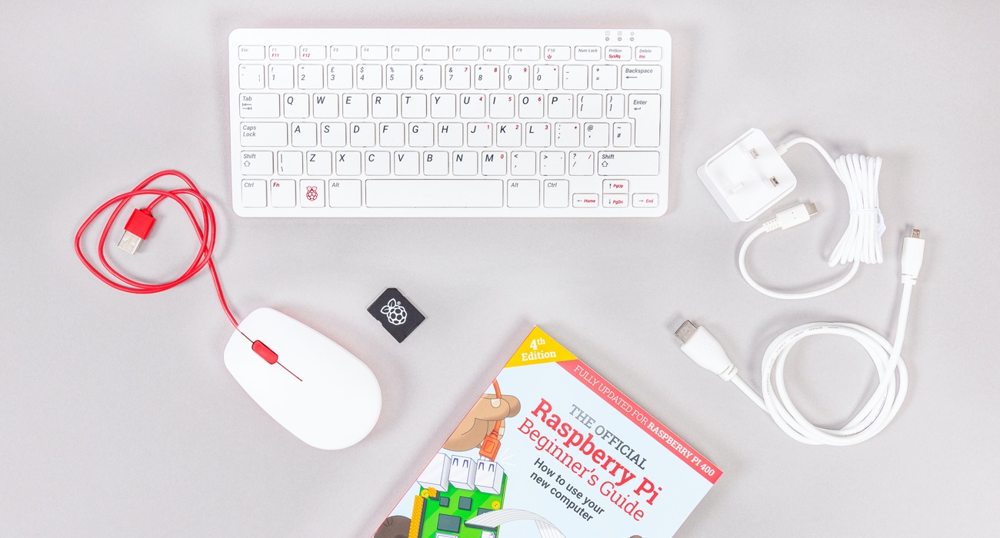

## Raspberry Pi 400

Recientemente ha aparecido un nuevo formato de Raspberry, en la todo el hardware se ha incluído dentro de un teclado.

Se trata de una Raspberry Pi 4 acelerada a 1.8GHz, con un nuevo formato alargado, para que todos los conectores estén del mismo lado (también los 40 GPIOs) y a la que han añadido un bonito teclado blanco y un enorme disipador para no tener que incluir ventilador.

Por dentro

En ese rediseño han eliminado el conector CSI para la cámara, una pena en mi opinión, y ahora mismo sólo existe la versión de 4Gb de RAM.

Se venderá como kit con todo lo necesario para usarse (tarjeta SD, ratón, alimentación, cables, fuente de alimentación y libro traducido) salvo el monitor por 100$ y por 70$ sólo la Raspberry Pi 400, con teclado Inglés, USA, francés, italiano, alemán o español.

### Recursos sobre la Raspberry Pi 400

[Análisis en Hackter IO](https://www.hackster.io/news/hands-on-with-the-raspberry-pi-400-the-first-consumer-product-raspberry-pi-2718c6b45ad3) (de donde hemos tomado la imágenes)

[Descripción del kit Raspberry Pi 400](https://magpi.raspberrypi.org/articles/raspberry-pi-400-specifications-benchmarks-and-personal-computer-kit)

[Página del producto en raspberrypi.org](https://raspberrypi.org/products/raspberry-pi-400/?resellerType=home)

