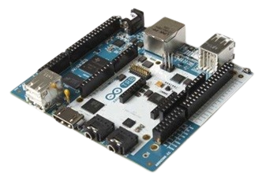
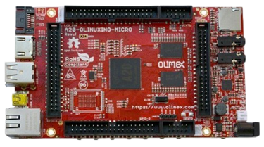
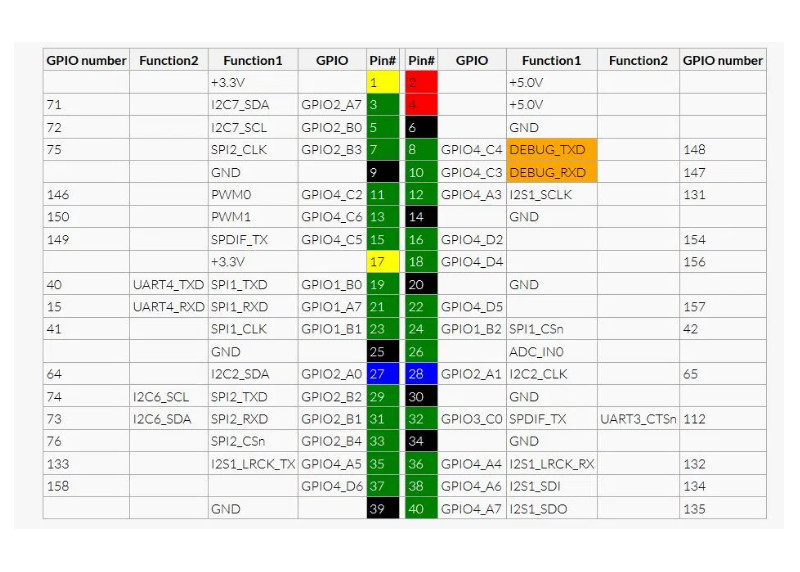
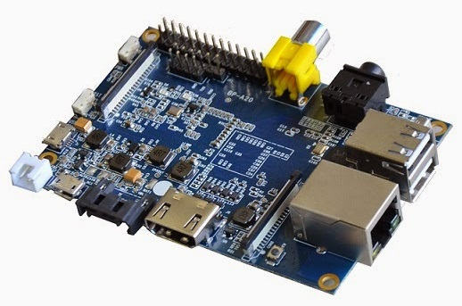
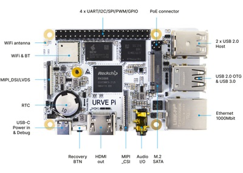
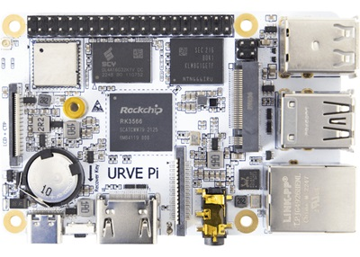

## ¿Clones?

En el mercado han aparecido muchas empresas que sin llegar a copiar directamente la Raspberry, han producido equipos muy similares, en prestaciones y tamaños.

Además algunos de ellos, son tremendamente similares y a un precio sensiblemente inferior.

¿Dónde está el problema? Podemos encontrarnos con un hardware estupendo pero con una base de usuarios pequeña, lo que redundará en que tengamos poco software y pocos desarrollos. Además el soporte en este tipo de hardware muchas veces viene más desde otros usuarios, vía foros, que del propio fabricante, con lo que a más usuarios más fácil es encontrar la solución a nuestros problemas.

Veamos algunos de ellos. Los precios indicados en algunas de las placas son orientativos, no exactos y varían continuamente, pero se muestran para que nos hagamos una idea comparativa.

## BeagleBoard

* [BeagleBoard](https://beagleboard.org/)  
	* 1GHz ARM Cortex-A8  
		* Memoria: 
			* SDRAM: 512MB DDR3L 800MHZ
			* Flash: 4GB, 8bit Embedded MMC (eMMC)
		* Conectividad: 
			* USB0  miniUSB
			* USB1 Tipo A Socket, 500mA LS/FS/HS
			* Serial Port: UART0 access via 6 pin 3.3V TTL Header
			* 10/100M Ethernet (RJ45)
			* Precio orientativo: 89$
					

		
## Arduino Tre
[Arduino Tre e Intel Galileo](http://blog.elcacharreo.com/2013/10/04/nuevos-arduino-galileo-y-tre/) 

* Características de la placa Arduino Tre: 
	* Procesador:
	* [Texas Instruments Sitara AM335x ARM Cortex-A8 processor](http://e2e.ti.com/blogs_/b/toolsinsider/archive/2013/10/03/introducing-arduino-tre.aspx "TI")  a 1 GHz
	* Memoria: 512Mb de RAM
	* HDMI (HD)
	* Audio: estéreo
	* Conectividad: USB, Ethernet
	* Almacenamiento externo: Tarjeta microSD.
					 		 
	
					
	
  ## Intel Galileo
	*  Características placa Intel Galileo:
		* Incorpora un Intel® Quark SoC X1000 Application Processor, de 32 bit, perteneciente a la familia Pentium con lo que su arquitectura es x86 con una velocidad de 400MHz.
		* Dispone de 512Kb de RAM
		* 256MB de Almacenamiento
		* Ethernet 10/100
		* Conector PCI
		* Reloj de tiempo real RTC
		* USB HOST2.0
		* USB de programación
		* Tarjeta microSD
			
## OlinuXino
* [OLinuXino](https://www.olimex.com/Products/OLinuXino/open-source-hardware)  
	* El fabricante Olimex tiene una amplia gama de placas
		* Cortex A8 1GHz  512 MB 55€ *
		* Procesador Cortex-A7 de doble núcleo Allwinner A20 (T2), cada núcleo normalmente funciona a 1 GHz y GPU Mali 400 de doble núcleo.
		* Capaz de reproducir vídeo FullHD (1080p).
		* Memoria RAM DDR3 de 1GB.
		* Memoria: flash eMMC opcional de 4 GB o 16 GB (en variantes de placa xxx-e4Gyyy o xxx-e16Gyyy).
		* Ethernet nativo de 100 Mbit con controlador y conector	* Conector SATA y conector de alimentación HDD de 5 V
			* Conectores:
			* Entrada de micrófono en conector entrada micrófono.
			* 2 conectores UEXT
			* Tarjeta microSD
			* Tarjeta SD/MMC
			* DEBUG-UART para depuración de consola con cable USB-SERIAL
			* HDMI
 
 
## Rock Pi Modelo B 
* Características:
	*  Procesador: Dual Cortex-A72, frecuencia 1.8Ghz con quad Cortex-A53, frecuencia 1.4Ghz
	* GPU: Mali T860MP4, soporta OpenGL ES 1.1 /2.0 /3.0 /3.1 /3.2, Vulkan 1.0, Open CL 1.1 1.2, DX11.
	* Memoria RAM: 4GB - 64bit dual channel LPDDR4@3200Mb/s
	* Almacenamiento: micro SD (opcional) y M.2 SSD (opcional)
	* Salida HDMI 2.0 hasta  4k@60 (Type A)
	* Conector MIPI DSI 2 FPC
	* Audio: Salida Jack 3.5mm con entrada de micrófono
	* Entrada MIPI CSI para cámara
	* Conectividad Wifi 802.11ac y Bluetooth 5.0 con antena integrada
	* Entradas USB (host) 3.0 y 2.0
	* Conector ethernet Gigabit

* La [Rock Pi](https://tienda.bricogeek.com/compatibles-raspberry/1651-rock-pi-4-modelo-b-4gb.html) es una placa de características muy similar a la Raspberry Pi pero no es compatible al 100%.
* Los GPIO son parecidos a los de la Raspberry Pi, pero tenemos que tener cuidado al usarlos porque algunos cambian: 

* Podemos [instalar varios sistemas operativos](https://wiki.radxa.com/Rockpi4/downloads), entre ellos el Armbian (que es el mismo de la Raspberry), a partir de esto el uso es el mismo.

## Banana Pi
* [Banana Pi](http://www.banana-pi.org/) es una de las más parecidas a Raspberry y se puede encontrar en varias versiones y a unos precios muy reducidos.
* Características:
	* Banana Pi BPI-M4 Berry con Allwinner H618, 2G RAM, 8G eMMC integrado
	* Allwinner H618, procesador ARM Cortex™-A53 de cuatro núcleos
	* GPU ARM Mali G31
	* Wi-Fi y Bluetooth
	* RAM 2G LPDDR4
	* Memoria flash eMMC de 8G
	* 1x USB2.0 Tipo-C OTG, fuente de alimentación de 5V
	* 4x USB2.0 tipo A
	* 1xHDMI 2.0a
	* 1x conector jack de audio y TVE de 3,5 mm
	* 1 puerto Ethernet GbE
	
En el esquema vemos que algunos modelos de hecho tienen más conectores que la Raspberry Pi (por ejemplo el conector SATA) 

  Los pines del conector GPIO son muy similares
				

## URVE Board Pi
  [URVE Board PI - 1.8GHz (2GB)](https://tienda.bricogeek.com/compatibles-raspberry/1787-urve-board-pi-18ghz-2gb.html)
  * Características: 
	  * CPU: Rockchip RK3566 Quad Core Cortex™ - A55 
	  * Velocidad: 1.8 GHz Quad Core (4-core)
	  * SO: Android™ 11 y Linux Debian 11
	  * Memoria RAM: 2GB LPDDR4
	  * Memoria SSD: 8GB eMMC
	  * Gráficos: Mali-G52 : HDMI 2.0 con HDCP 1.4/2.2, hasta 4K@60fps
	  * Soporta: 4 lineas MIPI DSI hasta 2560x1440@60Hz, LVDS hasta 1920x1080@60Hz
	  * Salida de video: HDMI® V2.0
	  * Red ethernet: 1 Gbit/s
	  * Red wifi: 2.4G/5G WiFi (802.11 a/b/g/n/ac)
	  * Conectividad: Bluetooth 4.2
	  * Puertos USB: 2 USB 2.0 y 1 USB 3.0
	  * Expansión: Puerto PCIE/M.2 SSD
	  * Micrófono integrado y salida de audio estéreo
	  * Slot Micro SD
	  * Alimentación: Puerto USB-C (5V)

   

Aquí puedes encontrar, el enlace [SO](https://oc.eveo.pl:789/owncloud/s/FcMZ3CpSf6lPMTw/download) de imagen de Sistema Operativo para descargar.

[Vídeo](https://drive.google.com/file/d/1AXbB0wSZAc-FnOvhnLwY1ILlbNocvv-5/view?usp=sharing) sobre los clones de Raspberry Pi.

### ¿Conoces algún clon más? No dudes en comentarlo.
