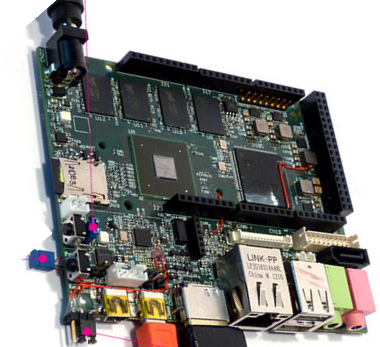
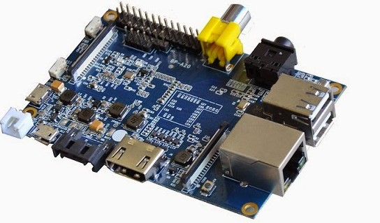

## ¿Clones?

En el mercado han aparecido muchas empresas que sin llegar a copiar directamente la Raspberry, han producido equipos muy similares, en prestaciones y tamaños.

Además algunos de ellos, son treméndamente similares y a un precio sensiblemente inferior.

¿Dónde está el problema? Podemos encontrarnos con un hardware estupendo pero con una base de usuarios pequeña, lo que redundará en que tengamos poco software y pocos desarrollos. Además el soporte en este tipo de hardware muchas veces viene más desde otros usuarios, vía foros, que del propio fabricante, con lo que a más usuarios más fácil es encontrar la solución a nuestros problemas.

Veamos algunos de ellos:

* [BeagleBoard](https://beagleboard.org/)  ARM Cortex-A8 256MB 89€

  

* [OLinuXino](https://www.olimex.com/Products/OLinuXino/open-source-hardware)  Cortex A8 1GHz  512 MB 55€

  

* [UDOO](https://www.udoo.org/) = raspberry+arduino
6 ARM Cortex-A9 CPU Dua/Quad core 1GHz
1GB

  

* [Cubieboard](http://cubieboard.org/model/) ARM cortex-A8 y 512 MB 49$

  

* [Carambola 8devices](https://www.8devices.com/products/carambola) (32Mb RAM) 22$

* [Arduino Tre e Intel Galileo](http://blog.elcacharreo.com/2013/10/04/nuevos-arduino-galileo-y-tre/)

* [Nanode y waspmote](http://blogthinkbig.com/4-alternativas-arduino-beaglebone-raspberrypi-nanode-waspmote/)

* [Banana Pi](http://www.bananapi.org/) Es una de las más parecidas a Raspberry y se puede encontrar en varias versiones y a unos precios muy reducidos.

  

  En el esquema vemos que algunos modelos de hecho tienen más conectores que la Raspberry Pi (por ejemplo el conectr SATA)

  

  Los pines del conector GPIO son muy similares

  

* [PCDuino](http://www.linksprite.com/linksprite-pcduino/)

  

¿Conoces algún clon más? No dudes en decirlo.

[Vídeo](https://youtu.be/OX3YdERMgOo) sobre los clones de Raspberry Pi

### Referencias

[Alternativas](http://blogthinkbig.com/alternativas-raspberry-pi/)

[Otras placas similares](http://en.wikipedia.org/wiki/Raspberry_Pi#See_also)

[Comparativa entre clones](https://learn.adafruit.com/embedded-linux-board-comparison?view=all)

[Qué modelo compro](https://descubrearduino.com/comprar-raspberry-pi/)
