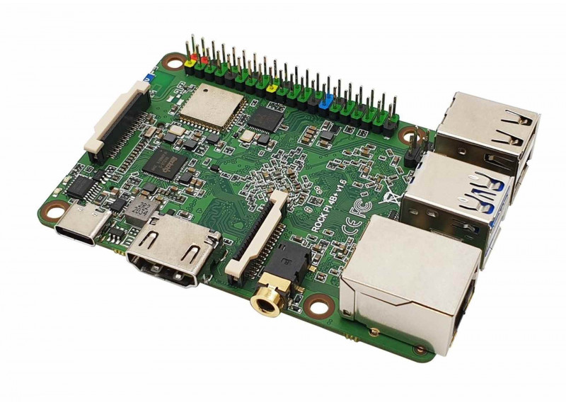
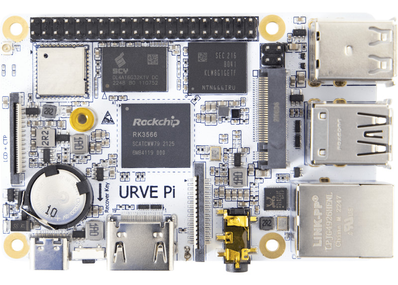
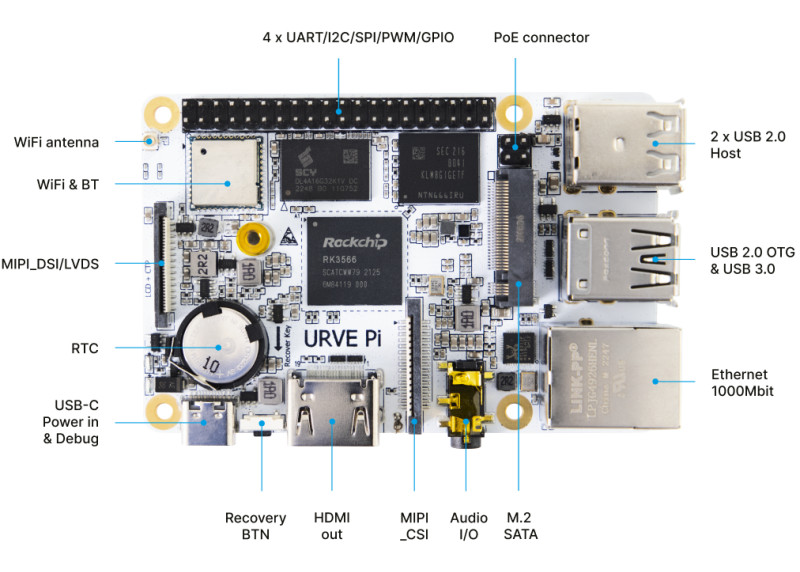

## Rock Pi Modelo B

[Rock Pi](https://tienda.bricogeek.com/compatibles-raspberry/1651-rock-pi-4-modelo-b-4gb.html)

La [Rock Pi](https://wiki.radxa.com/Rockpi4) es una placa de características muy similars a la Raspberry Pi pero no es compatible al 100%

Los GPIO son parecidos pero algunos cambian

Podemos [instalar varios sistemas operativos](https://wiki.radxa.com/Rockpi4/downloads), entre el el armbian (que esl mismo de la Raspi). A partir de esto el uso es el mismo 

## URVE Board PI

[URVE Board PI - 1.8GHz (2GB)](https://tienda.bricogeek.com/compatibles-raspberry/1787-urve-board-pi-18ghz-2gb.html)

procesador de 1.8GHz, 2GB de RAM, eMMC, conector M.2, Red Gigabit, Wifi y Bluetooth 4.2

[SO](https://oc.eveo.pl:789/owncloud/s/FcMZ3CpSf6lPMTw/download)

