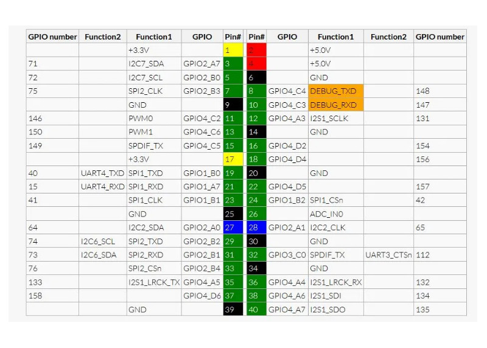

## Rock Pi Modelo B

[Rock Pi](https://tienda.bricogeek.com/compatibles-raspberry/1651-rock-pi-4-modelo-b-4gb.html)

La [Rock Pi](https://wiki.radxa.com/Rockpi4) es una placa de características muy similar a la Raspberry Pi pero no es compatible al 100%

Los GPIO son parecidos a los de la Raspberry Pi, pero tenemos que tener cuidado al usarlos porque algunos cambian:

Podemos [instalar varios sistemas operativos](https://wiki.radxa.com/Rockpi4/downloads), entre ello el armbian (que es el mismo de la Raspi). A partir de esto el uso es el mismo.

