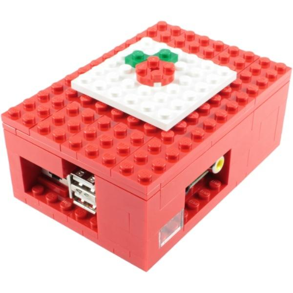
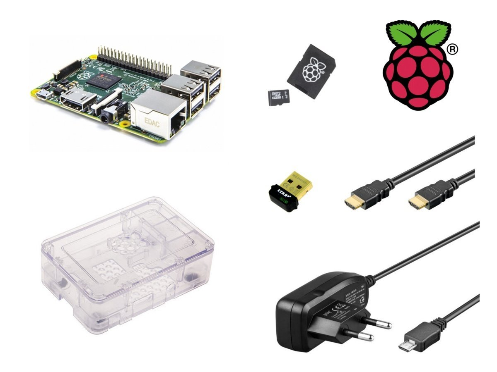

# Tema 3 - Instalación de Raspberry Pi

## Materiales

¿Qué necesito para trabajar con la Raspberry Pi?

### Componentes Obligatorios

* Raspberry Pi (ahora hablaremos del modelo a elegir...)
* Fuente de alimentación de 5V con conector micro-USB con al menos 2A (mejor si son 2.5A) para la Raspberry Pi 3+ o fuente de 5V con conector USB-C y al menos 3A para la Raspberry Pi 4, pero cuidado porque hay algunas fuentes que no funcionan bien.
* Tarjeta SD de al menos 8 GB  o más (máximo 128Gb para la Raspberry Pi 3). Se recomienda de clase 10 por su velocidad. La calidad de la tarjeta es crítica, en tarjetas baratas con problemas de rendimiento nos vamos a encontrar cuelgues inesperados e incluso puede que no arranque.
* Cable de red ethernet (no es necesario si tenemos Wifi, pero facilita la primera conexión que no requiere configuración)

Y si la vas a usar como un ordenador:

* Monitor y cable HDMI (o VGA con adaptador. Existen muchos tipos de conversores, pero no todos funcionan bien con cables largos) para la 3 o cable mini-HDMI para la versión 4.
* Teclado y ratón USB (mejor si es inalámbrico, porque consume menos)

## ¿Raspberry 3+ o 4? 

Esa es la pregunta del millón: Las primeras unidades del último modelo 4 han salido con algunos problemas de calentamiento y no funcionan con algunas fuentes de alimentación de tipo USB-C. Los problemas de calentamiento se han resuelto con actualizaciones de software y es de suponer que las placas que salen de fábrica ya tienen resueltos los problemas eléctricos.

Por esto, y dada la poca diferencia de precio, salvo que encuentres una buena oferta para la Raspberry Pi 3+ yo me inclinaría por la versión 4. 

### Opcionales

* Una caja o carcasa (para evitar problemas, es muy fácil hacer un contacto con algo metálico)
* Conexión a la red: Cable ethernet o dongle Wifi
* Hub USB con alimentación, así podremos añadir más dispositivos y evitaremos cargar la potencia de la Raspberry

[¿Más carcasas?](https://www.google.es/search?q=raspberry+case&safe=off&espv=2&biw=838&bih=896&tbm=isch&tbo=u&source=univ&sa=X&ved=0CD4QsARqFQoTCP2a_r-_nMkCFci0GgodzpUMHA)

[Vídeo: Carcasas para Raspberry Pi](https://drive.google.com/file/d/1bo17jYxdETlA9CN_bqataObaAca9dtdV/view?usp=sharing) 

### ¿Dónde encontrarlos?

* [www.inven.es](http://www.inven.es)
* [www.electan.com](http://www.electan.com)
* [www.amazon.es](http://www.amazon.es)
* [www.bricogeek.com](http://www.bricogeek.com)
* [www.raspipc.es](http://www.raspipc.es)

