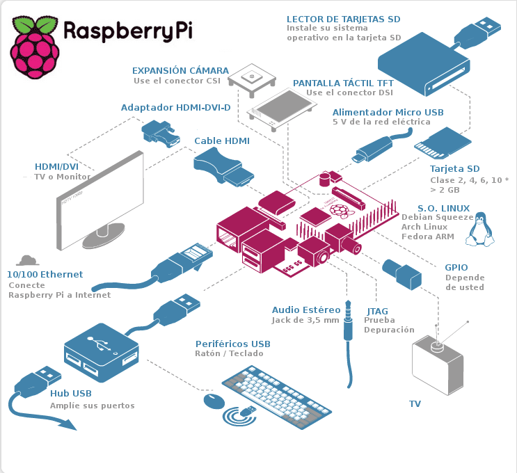
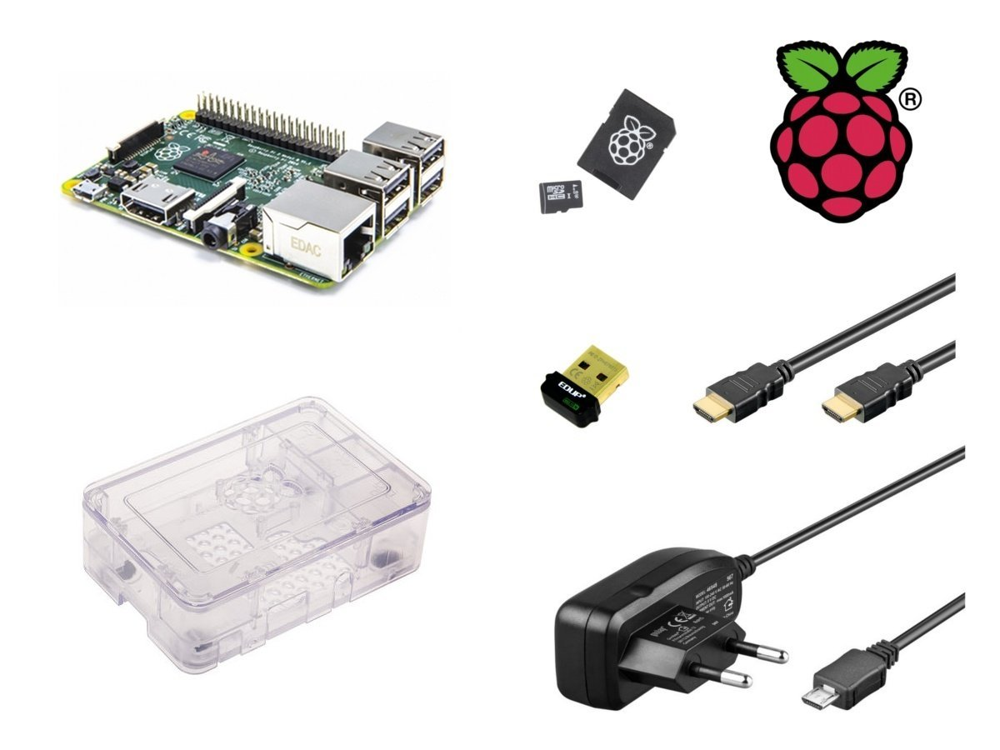

# Tema 3 - Instalación de Raspberry Pi

## Materiales

¿Qué necesito para trabajar con la Raspberry Pi?

### Componentes Obligatorios

* Raspberry Pi (ahora hablaremos del modelo a elegir...)
* Fuente de alimentación de 5V con conector micro-USB con al menos 2A (mejor si son 2.5A) para la Raspberry Pi 3+ o fuente de 5V con conector USB-C y al menos 3A para la Raspberry Pi 4, pero cuidado porque hay algunas fuentes que no funcionan bien.
* Tarjeta SD de al menos 8 GB  o más ([máximo 128Gb par la Raspberry Pi 3 y 4](https://www.raspberrypi.org/help/faqs/#sdMax)). Se recomienda de clase 10 por su velocidad. La calidad de la tarjeta es crítica, en tarjetas baratas con problemas de rendimiento nos vamos a encontrar cuelgues inesperados e incluso puede que no arranque.
* Cable de red ethernet (no es necesario si tenemos Wifi, pero facilita la primera conexión que no requiere configuración)

Y si la vas a usar como un ordenador:

* Monitor y cable HDMI (o VGA con adaptador. Existen muchos tipos de conversores, pero no todos funcionan bien con cables largos) para la 3 o cable mini-HDMI para la versió 4
* Teclado y raton USB (mejor si es inalámbrico, porque consume menos)

## ¿Raspberry 3+ o 4? 

Esa es la pregunta del millón: Las primeras unidades del último modelo 4 han salido con algunos problemas de calientamiento y no funcionan con algunas fuentes de alimentación de tipo USB-C. Los problemas de calentamiento se ha resuelto con actualizaciones software y es de suponer que las placas que salen de fábrica ya tienen resueltos los problemas eléctricos.

Por esto, y dada la poca diferencia de precio, salvo que encuentres una buena oferta para la Rasperry Pi 3+ yo me inclinaría por la versión 4. 

### Opcionales

* Una caja o carcasa (para evitar problemas, es muy fácil hacer un contacto con algo metálico)
* Conexión a la red: Cable ethernet o dongle Wifi
* Hub USB con alimentación, así podremos añadir más dispositivos y evitaremos cargar la potencia de la Raspberry

[¿Más carcasas?](https://www.google.es/search?q=raspberry+case&safe=off&espv=2&biw=838&bih=896&tbm=isch&tbo=u&source=univ&sa=X&ved=0CD4QsARqFQoTCP2a_r-_nMkCFci0GgodzpUMHA)

[Vídeo](https://youtu.be/RHmBmK33iuY) sobre las cajas para Raspberry Pi

### ¿Dónde encontrarlos?

* [www.inven.es](http://www.inven.es)
* [www.electan.com](http://www.electan.com)
* [www.amazon.es](http://www.amazon.es)
* [www.bricogeek.com](http://www.bricogeek.com)
* [www.raspipc.es](http://www.raspipc.es)

#### Veamos algunos kits de Inven

* [Raspberry](http://inven.es/raspberry-pi/557-kit-raspberry-pi-3-tarjeta-16gb-transformador-corriente.html)                      
* [Raspberry básico](http://inven.es/raspberry-pi/368-inven-pi3-kit-raspberry-pi-3-basico.html)

* [Raspberry completo](http://inven.es/raspberry-pi/369-inven-pi3-kit-raspberry-pi-3-completo.html)

* [Raspberry + electrónica](http://inven.es/raspberry-pi/370-inven-pi3-kit-raspberry-pi-3-electronica.html)

#### Otros kits

* [Kit base](http://www.electan.com/kit-raspberry-con-caja-alimentador-microsd-hdmi-usb-p-6584.html)
* [Shield electronica](http://tinkersphere.com/raspberry-pi-hats/633-starter-raspberry-pi-led-hat.html)
* [Kit amazon 1](http://www.amazon.es/s/ref=sr_pg_2?rh=i%3Aaps%2Ck%3Araspberry+pi+2+kit+starter&page=2&sort=price-asc-rank&keywords=raspberry+pi+2+kit+starter&ie=UTF8&qid=1449858467)
* [Kit Amazon 2 1](http://www.amazon.es/Raspberry-Pi-Quad-Core-Starter/dp/B00T7KW3Y0/ref=sr_1_15?ie=UTF8&qid=1449858467&sr=8-15&keywords=raspberry+pi+2+kit+starter)
* [Kit Amazon 3](http://www.amazon.es/Raspberry-Pi-Quad-Starter-Bundle/dp/B00T7OHE9A/ref=sr_1_18?ie=UTF8&qid=1449858497&sr=8-18&keywords=raspberry+pi+2+kit+starter)

* [Kit base](http://www.electan.com/kit-raspberry-con-caja-alimentador-microsd-hdmi-usb-p-6584.html)
* [Shield electronica](http://tinkersphere.com/raspberry-pi-hats/633-starter-raspberry-pi-led-hat.html)
* [kit amazon](http://www.amazon.es/s/ref=sr_pg_2?rh=i%3Aaps%2Ck%3Araspberry+pi+2+kit+starter&page=2&sort=price-asc-rank&keywords=raspberry+pi+2+kit+starter&ie=UTF8&qid=1449858467)

