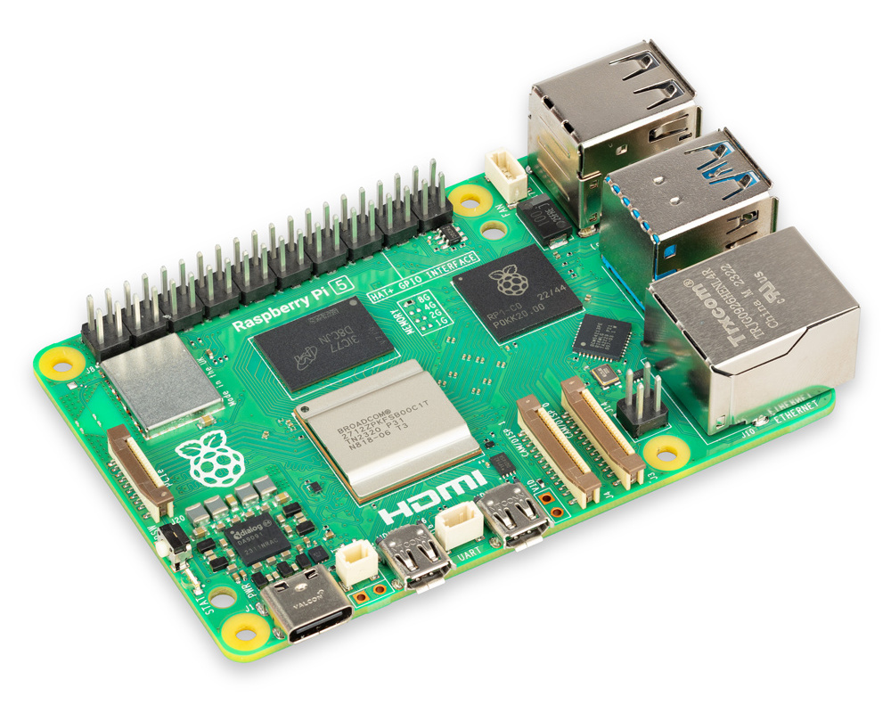
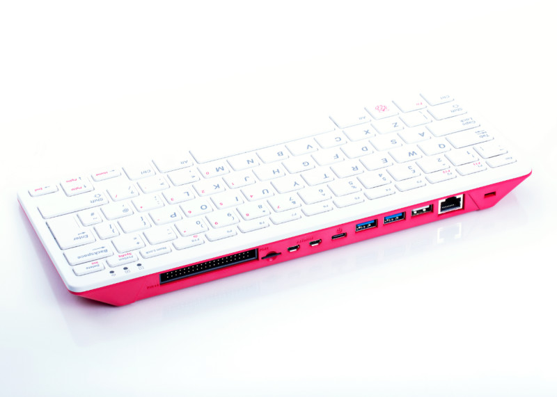

## ¿Qué Raspberry elegir?

A día de hoy tenemos disponibles en el mercado al menos 4 modelos de Raspberry (con diferentes cantidades de memoria RAM):

* 3 de ellos en el típico formato de placa
    - Raspberry Pi 3+, la más antigua
    - Raspberry Pi 4, que podemos encontrar con distintas cantidades de RAM 
    - Raspberry Pi 5 con 2, 4 u 8GB de RAM. 

* Raspberry Pi 400, es equivalente a una Raspberry Pi 4 con 4GB de RAM, pero en formato teclado, con carcasa incorporada. 

Por tanto será nuestra elección si lo que queremos es montar un ordenador de sobremesa a partir de nuestra Raspberry Pi.

La Raspberry Pi Zero está pensada para proyectos donde el tamaño debe ser muy reducido o para productos donde la Raspberry está integrado como una parte más, por ejemplo una cámara de fotos.

##  ¿Raspberry  4 ó 5? 

Esa es la pregunta del millón: ¿Compramos la versión más reciente o la anterior? A día de hoy, dada la poca diferencia de precio, salvo que encuentres una buena oferta para la Raspberry Pi 4 yo me inclinaría por la versión 5. 

Por todo esto, si tu presupuesto te lo permite...

* Te recomiendo una Raspberry Pi 5, con al menos 4GB de RAM aunque el curso se puede hacer perfectamente con cualquiera de los modelos 4.

