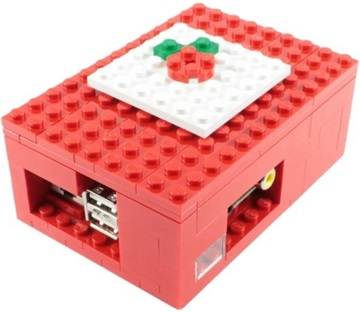

## Carcasas

Para que veas diferentes tipos de carcasas:

[¿Más carcasas?](https://www.google.es/search?q=raspberry+case&safe=off&espv=2&biw=838&bih=896&tbm=isch&tbo=u&source=univ&sa=X&ved=0CD4QsARqFQoTCP2a_r-_nMkCFci0GgodzpUMHA)

[Vídeo: Carcasas para Raspberry Pi](https://drive.google.com/file/d/1bo17jYxdETlA9CN_bqataObaAca9dtdV/view?usp=sharing) 

