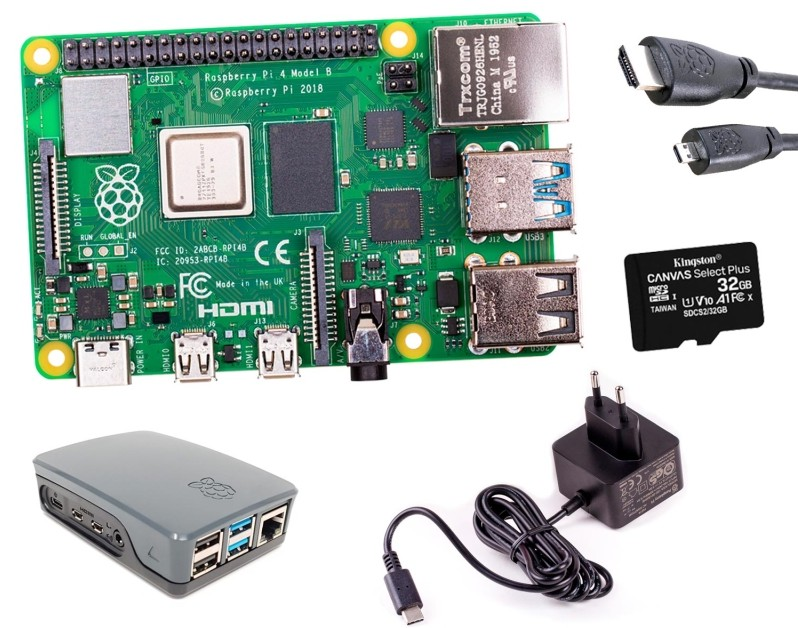

### ¿Dónde encontrarlos?

* [Raspberrypi.com](http://Raspberrypi.com)
* [www.tiendatec.es](https://www.tiendatec.es/)
* [www.bricogeek.com](http://www.bricogeek.com)

En la mayoría de estas tiendas, como en [TiendaTec](https://www.tiendatec.es/13-kits-raspberry-pi), puedes encontrar kits que incluyen todo lo necesario y te aseguras que son los adecuados.

También puedes encontrar kits en amazon o en aliexpress, pero comprueba las opiniones de los usuarios antes de comprar...

