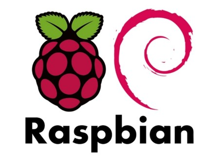
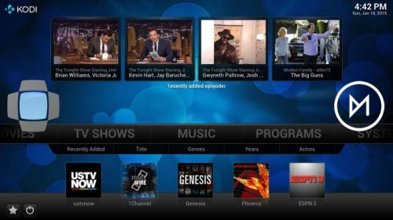
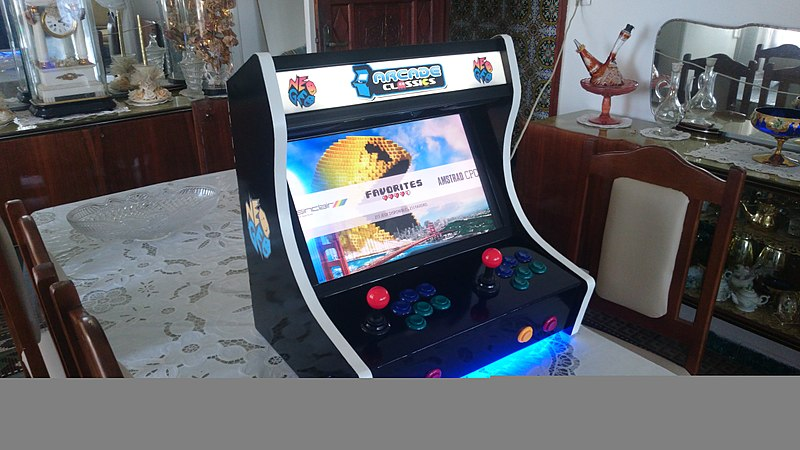

## Sistemas operativos disponibles

Existen varios sistemas operativos (SO) disponibles para Raspberry, cada uno de ellos está pensado para un fin concreto.

Piensa que para cambiar entre sistemas operativos, sólo tienes que apagar tu Raspberry, cambiar la tarjeta SD y volver a arrancar. Yo suelo tener varias SDs con los diferentes sistemas operativos instalados.

Puedes ver algunos de ellos en la página de [descargas de Raspberry.org](https://www.raspberrypi.com/software/)

Veamos algunos de los más utilizados

### [Raspberry Pi OS (Raspbian)](https://www.raspberrypi.com/software/operating-systems/)

(Hasta hace muy poco el sistema operativo oficial de Raspberry Pi se llamaba Raspbian, desde hace muy poco lo han renombrado como Raspberry Pi OS, por lo que puede que en alguna parte me siga refiriendo a él con ese nombre.)

Es la versión para Raspberry de Debian (una de las distribuciones de Linux con mayor solera). Es el sistema operativo más usado y contiene todo lo necesario.

Podemos elegir entre 3 versiones:
* Versión **Lite** donde sólo se instala la parte básica del sistema, sin escritorio, sólo podemos usar el modo texto.
* Versión **Escritorio** (Desktop) donde tenemos es escritorio gráfico y el sistema básico. No se incluye todo el software opcional
* Versión **Full** que integra el escritorio y todas las herramientas visuales. 

La primera está pensada para ser usada en servidores y sin herramientas gráficas. Si es para probar yo te recomiendo la tercera, para que veas el software disponible. La segunda la usaremos si queremos hacer nuestra propia instalación de software

### Otras distribuciones

* [Ubuntu Desktop](https://ubuntu.com/download/raspberry-pi): Es una versión de Ubuntu (Linux) para la Raspberry

* [Ubuntu Core](https://ubuntu.com/download/raspberry-pi-core): Es un Ubuntu (Linux) reducido al mínimo para funcionar en equipos más pequeños optimizado para un mejor rendimiento

* [Ubuntu Server](https://ubuntu.com/download/raspberry-pi): Para convertir tu Raspberry en un auténtico servidor

* [Windows 10 IOT Core](https://docs.microsoft.com/en-us/windows/iot-core/downloads): Es una versión reducida de Windows 10 para las Raspberry Pi 2 y 3, pero en 2020 parece que Microsoft no va a migrar a versiones más modernas de Raspberry Pi

* [OSMC](https://osmc.tv/download/): Es un SO orientado a convertir la Raspberry Pi en un centro multimedia

* [LibreElec](http://libreelec.tv/): Otra distribución especializada en el entretenimiento y que utiliza el conocido gestor multimedia [Kodi](https://kodi.tv/)

	

* [Android](https://emteria.com/): Se trata de un port de Android para Raspberry. En [este tutorial](https://magpi.raspberrypi.com/articles/android-raspberry-pi) nos dicen cómo instalarla.

* [Retropie](https://retropie.org.uk/): Es una distribución que contiene varios emuladores de máquinas recreativas y videoconsolas y que convierten a nuestra Raspberry en un máquina de jugar 

* Noobs: Es un SO mínimo pensado para facilitar la instalación. Arranca el sistema y nos permite elegir qué sistema operativo instalar, y si tenemos suficiente espacio en la tarjeta, podremos instalar varios en una misma SD. Durante mucho tiempo fue la opción recomendada, pero ahora es preferible usar Raspberry Pi Imager

