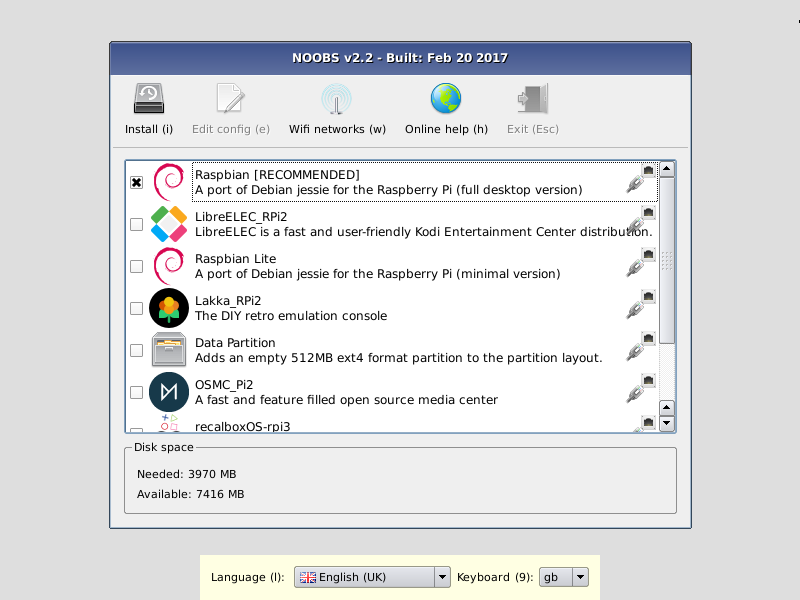

## Sistemas operativos disponibles

Existen varios sistemas operativos (SO) disponibles para Raspberry, cada uno de ellos está pensado para un fin concreto.

Piensa que para cambiar entre SO, sólo tienes que apagar tu Raspberry, cambiar la tarjeta SD y volver a arrancar. Yo suelo tener varias SDs con los diferentes SO

Puedes ver algunos de ellos en la página de [descargas de Raspberry.org](https://www.raspberrypi.org/downloads/)

Veamos algunos de los más utilizados

### [Noobs](https://www.raspberrypi.org/downloads/noobs/)

Es un SO mínimo pensado para facilitar la instalación. Arranca el sistema y nos permite luego elegir qué sistema operativo instalar, y si tenemos suficiente espacio en la tarjeta, podremos instalar varios en una misma SD

Sin duda es la mejor opción para el principiante. Además nos permite hacer un primera configuración de la red y seleccionar el idioma.

### [Raspberry Pi OS (Raspbian)](https://www.raspberrypi.org/downloads/raspbian/)

(Hasta hace muy poco el sistema operativo oficial de Raspberry Pi se llamaba Raspbian, desde hace muy poco lo han renombrado como Raspberry Pi OS, por lo que puede que en alguna parte me siga refiriendo a él con ese nombre.)

Es la versión para Raspberry de Debian (una de las distribuciones de Linux con mayor solera). Es el sistema operativo más usado y contiene todo lo necesario.

### [Ubuntu Mate](https://ubuntu-mate.org/raspberry-pi/)

Es una versión de Ubuntu (Linux) para la Raspberry

### [Ubuntu Core](https://ubuntu.com/download/raspberry-pi-2-3-core)

Es un Ubuntu (Linux) reducido al mínimo para funcionar en equipos más pequeños optimizado para un mejor rendimiento

### [Ubuntu Server](https://ubuntu.com/download/raspberry-pi)

Para convertir tu Raspberry en un auténtico servidor

### [Windows 10 IOT Core](https://docs.microsoft.com/en-us/windows/iot-core/downloads)

Es una versión reducida de Windows 10 para las Raspberry Pi 2 y 3, pero en 2020 parece que Microsoft no va a migrar a versiones más modernas de Raspberry Pi

### [OSMC](https://osmc.tv/download/)

Es un SO orientado a convertir la Raspberry Pi en un centro multimedia

### [LibreElec](http://libreelec.tv/)

Otra distribución especializada en el entretenimiento y que utiliza el conocido gestor multimedia [Kodi](https://kodi.tv/)

### [Chrome OS](https://fydeos.com/download/)

Es un port de la parte opensource del sistema operativo Chrome OS de Google para Raspberry

### [Android](https://emteria.com/)

Se trata de un port de Android para Raspberry. En [este tutorial](https://www.raspberrypi.org/magpi/android-raspberry-pi/) nos dicen cómo instalarla.

### [Retropie](https://retropie.org.uk/)

Es una distribución que contiene varios emuladores de máquinas recreativas y videoconsolas y que convierten a nuestra Raspberry en un máquina de jugar 

Una vez elegida la imagen vamos a proceder a instalar