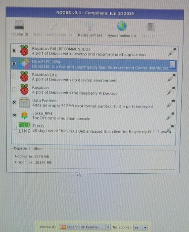
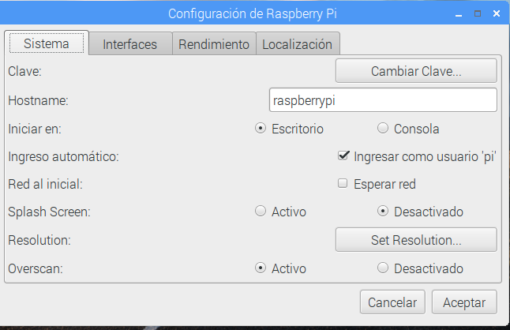
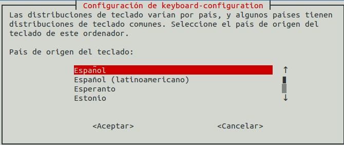

## Instalación

Desde hace poco se ha publicado una aplicación llamada **Raspberry Pi Imager** que permite hacer aún más sencilla la instalación del sistema operativo, encargándose de descargar, formatear y escribir la imagen del sistema directamente en la tarjeta SD


La versión actual nos permite instalar los siguientes sistemas operativos:


Al seleccionar el sistema operativo veremos distintas opciones, como por ejemplo al seleccionar Ubuntu:


Donde vemos que aparecen opciones de instalar versiones de 32 o de 64 bits

A día de hoy (diciembre de 2021) existen 2 versiones disponibles de Raspbian:

* La derivada de **Bullseye**, que es la más reciente, pero que hasta ahora mismo no es compatible con las librerías de python para el uso de la cámara (ahora mismo no hay versión alternativa).
* La versión **Legacy** que es una actualización de la versión anterior **Buster**, que sí es compatible con las librerías de python para usar la cámara.


Podemos descargar Imager desde la página de [Descargas de Raspberry Pi](https://www.raspberrypi.com/software/) donde seleccionaremos nuestro sistema operativo

Una vez descargado seleccionaremos el sistema operativo que queremos usar, luego seleccionaremos la tarjeta SD donde vamos a escribir la imagen (los datos de la tarjeta se borrarán)

A día de hoy Imager no permite instalar varios sistemas operativos en la misma tarjeta

Al pulsar **Write** se descargará la imagen desde internet.

También podemos usar Imager para formatear la tarjeta, para crear tarjetas SD capaces de recupear una instalación con problemas, para escribir imágenes que ya hemos descargado, etc.

[](https://drive.google.com/file/d/1vZCdJa2551mNAdr1cwsOAJMn440eqXMG/view?usp=sharing)

[Vídeo: Instalación de Raspberry Pi OS usando Imager](https://drive.google.com/file/d/1vZCdJa2551mNAdr1cwsOAJMn440eqXMG/view?usp=sharing)


### Instalación Manual

Vamos a ver cómo hacer todo el proceso manualmente para entender los pasos o por si Imager no nos permite usar esa versión de sistema operativo.

Realmente **NO RECOMIENDO HACERLO ASÍ** salvo que ya lo hayas hecho y controles 100% del tema.	

¿Qué necesitamos?

* Formatear tarjeta ([Formatter4](https://www.sdcard.org/downloads/formatter/))
* Descargamos la imagen del sistema que queramos desde la [página de descargas (Downloads) de la web de Raspberry.org](https://www.raspberrypi.com/software/)
* Si usamos una imagen tipo Noobs, basta con que descomprimamos el contenido del fichero zip en la tarjeta SD
* Si es una imagen (fichero tipo img o iso) lo grabamos con Imager o por ejemplo con la herramienta multiplataforma Etcher (Windows, OsX y Linux) para instalar imágenes https://www.balena.io/etcher/

	
* ¿Qué imagen usar?:
	* Empecemos con [Noobs](https://github.com/raspberrypi/noobs) que nos va a permitir instalar otras imágenes.
    * Tenemos 2 opciones para descargar la imagen de noobs:
        * Una instalación mínima de noobs, que descargará luego todo lo necesario desde la red.
        * Una instalación base de Noobs que incluye todo lo necesario para instalar el sistema operativo Raspbian, que es el más usado y que una vez copiado en la tarjeta no necesita conexión a la red.
	

	

Vemos que desde la pantalla de arranque de noobs nos permite elegir la imagen que queremos instalar. 

Algunas aparecen directamente (ya están en la tarjeta) y si tenemos conectividad a internet (bien por que tenemos conectado un cable ethernet o porque hemos configurado el wifi) podremos seleccionar más imágenes, que se descargarán durante la instalación.

Podemos instalar varios sistemas operativos y cada vez que arranquemos podremos escoger cuál queremos usar.



Según la selección que hagamos hará falta más espacio en la tarjeta y pudiera ocurrir que no quepan todos los que queremos instalar.

Podemos seleccionar el idioma y la configuración de teclado

Para empezar deberíamos seleccionar Raspbian y se arrancará el proceso de instalación, que tarda unos minutos

##  ¡¡¡Arrancar!!!


Al arrancar el sistema Raspbian aparecerá una pantalla multicolor que nos indica que la imagen está operativa.


Y después se verá en formato texto el arranque


Si hemos instalado varios sistemas podremos elegir entre ellos, si no hacemos nada arrancará el último que usáramos.


Si todo va bien al cabo de unos segundos veremos el escritorio Pixel, un escritorio ligero pero con buen aspecto y con la funcionalidad a la que estamos acostumbrados hoy en día


La primera vez que arranquemos tendremos que configura el idioma y la zona horaria, establecer la contraseña del usuario "pi" y el sistema se actualizará.

Vamos a ver algunos de los menús e iconos más importantes de pixel.

A la izquierda tenemos el menú de aplicaciones y a la derecha podemos pulsar sobre el icono del Wifi o de la red para configurarla si fuera necesario.


[](https://drive.google.com/file/d/1Xctv-39GG117f1Zm_0QbfQbRZoZd_MKG/view?usp=sharing)


En este [vídeo](https://drive.google.com/file/d/1Xctv-39GG117f1Zm_0QbfQbRZoZd_MKG/view?usp=sharing) podéis ver el uso del entorno visual  Pixel de Raspberry Pi

## Configuración

Existe un asistente para configurar la manera en la que funcionará nuestra Raspberry. Podemos hacerlo desde el menú de configuración


Al abrirlo veremos que hay 4 pestañas, cada una de ellas dedicada a unos aspectos diferentes de la configuración:

### Configuración del sistema



Aquí podemos decidir si el sistema arranca en modo texto o escritorio visual o la configuración de red.

Lo más importante es cambiar la contraseña para evitar que cualquiera pudiera entrar.

### Configuración de Interfaces


Aquí veremos qué drivers activamos (porque vayamos a usar esos dispositivos) o qué protocolos de comunicación usaremos para acceder.

Si vamos a acceder desde otro ordenador deberemos activar SSH en el caso de  acceder vía consola (texto) o VNC para acceder al escritorio.

### Configuración de rendimiento


A partir de la versión 3 de Raspberry no se puede cambiar la velocidad del procesador desde este interface (en las versiones anteriores sí), pero sí que podemos cambiar la cantidad de memoria que se asigna al procesador gráfico con lo que conseguiremos que aplicación que usan intensivamente gráficos vayan más rápidas

### Configuración de idiomas y teclado


Esta parte de la configuración es fundamental para configurar la zona horaria, el idioma (Local) y el teclado

[](https://drive.google.com/file/d/1TAKfTNZ3QrOeabAnJ4CJK58w5HaJ_vpD/view?usp=sharing)


[Vídeo de la primera configuración de Raspberry Pi](https://drive.google.com/file/d/1TAKfTNZ3QrOeabAnJ4CJK58w5HaJ_vpD/view?usp=sharing)


### Configuración desde consola

Si necesitamos configurar desde consola de texto  podemos lanzar la aplicación de configuración escribiendo:

```sh
sudo raspi-config
```

Y obtendremos las pantallas de configuración. (Puede variar algo según la versión)





Una vez configurado podemos abrir el entorno visual con

```sh
startx
```


En cualquier momento podemos volver a reconfigurar con

```sh
sudo raspi-config
```

[](https://drive.google.com/file/d/1dP2cdq1loc6QcadgjP1hSeW0a7ovkmeU/view?usp=sharing)


[Vídeo de la configuración desde la consola de texto de Raspberry Pi](https://drive.google.com/file/d/1dP2cdq1loc6QcadgjP1hSeW0a7ovkmeU/view?usp=sharing)


### Pasar de Lite a Desktop

Si hemos instalado la versión mínima Lite y queremos pasar a la versión desktop, para tener disponible el escritorio podemos hacer:

```sh
sudo apt update
sudo apt upgrade
sudo apt dist-upgrade
sudo apt install xserver-xorg
sudo apt install raspberrypi-ui-mods
sudo apt install lightdm
```

Esta opción no nos instala las herramientas de escritorio, que tendremos que ir instalando manualmente.

### Otros instaladores: BerryBoot

El instalador de Noobs está basado en un desarrollo previo llamado [BerryBoot](https://www.berryterminal.com/doku.php/berryboot), [proyecto opensource](https://github.com/maxnet/berryboot) que ha seguido evolucionando independientemente y que a día de hoy tiene algunas ventajas


Ventajas:

* Ocupa solo 30Mb, porque sólo es el instalador, y luego se descarga toda la imagen de internet
* Hay muchas más opciones de SOs disponibles
* Podemos hacer la instalación en la SD (lo que es lo habitual) o en otro dispositivo USB (para luego clonarlo en una SD) o en un dispositivo de red, para reutilizarlo
* Lee las señales HDMI CEC de nuestro monitor y en el arranque podemos usar el mando a distancia de nuestra TV para seleccionar el SO del que queremos arrancar
* Podemos utilizar las imágenes guardadas en un USB para hacer la instalación, siendo en este caso la instalación totalmente offline
* Se pueden clonar imágenes de la tarjeta
* Permite hacer backups de sistemas operativos
* Podemos añadir otros OS a los ya instalados
* Si no tenemos monitor instalado podemos hacer una instalación vía VNC como [nos explican aquí](https://www.berryterminal.com/doku.php/berryboot/headless_installation) sin más que añadir esta línea al fichero cmdline.txt de la tarjeta SD

```sh
vncinstall ipv4=192.168.88.88/255.255.255.0/192.168.88.1 
```

Ahora solo tenemos que arrancar un cliente VNC y apuntar a esa IP
Si queremos usar wifi sólo necesitamos añadir al fichero wpa_supplicant.conf de la tarjeta SD la información siguiente:

```
ctrl_interface=DIR=/var/run/wpa_supplicant GROUP=netdev
ap_scan=1


network={
	ssid="ssid-punto-de-acceso"
	psk="contraseña-wpa"
}
```

Podemos descargar BerryBoot de [este enlace para Raspberry Pi 4](https://downloads.sourceforge.net/project/berryboot/berryboot-20200612-pi4.zip) y [de este para las versiones anteriores](https://downloads.sourceforge.net/project/berryboot/berryboot-20190612-pi0-pi1-pi2-pi3.zip)

## Simuladores

¿Y si no tengo una Raspberry Pi?

Existen [varios emuladores](https://www.google.es/search?q=raspberry+simulator&oq=raspberry+simulator&aqs=chrome..69i57j69i65l3j69i60l2.3806j0j7&sourceid=chrome&es_sm=93&ie=UTF-8) aunque no esperes que la experiencia sea la misma....


### Simulación en windows
Desde la página [diverteka](http://www.diverteka.com/?p=66) nos explican cómo instalar el emulador de una versión antigua en windows.


* Descargamos la imagen en  [http://sourceforge.net/projects/rpiqemuwindows/](http://sourceforge.net/projects/rpiqemuwindows/)
* Emulador qemu
* Imagen (2012-07-15-wheezy-raspbian.img) o (https://downloads.raspberrypi.org/raspbian/images/2012-07-15-wheezy-raspbian/2012-07-15-wheezy-raspbian.zip)

* Ejecutamos

```
	qemu-system-arm.exe -M versatilepb -cpu arm1176 -hda imagen/2013-09-25-wheezy-raspbian.img -kernel kernel-qemu -m 192 -append "root=/dev/sda2"
```

En este [Vídeo del emulador](http://www.youtube.com/watch?feature=player_embedded&v=QvqaNUx7-pU) podemos verlo en funcionamiento

### Emuladores en otros sistemas

En diferentes foros podemos ver cómo otros usuarios usan diferentes emuladores

* Emulador [en ubuntu](http://www.cnx-software.com/2011/10/18/raspberry-pi-emulator-in-ubuntu-with-qemu/)

* [Simulando en virtualBox](https://www.raspberrypi.org/forums/viewtopic.php?f=9&t=2961)


### Usando Pixel el entorno de Raspberry Pi en tu PC


Puedes usar Pixel el entorno gráfico de Raspberry en tu PC o MAC, solo necesitas descargar la [imagen](http://downloads.raspberrypi.org/pixel_x86/images/pixel_x86-2016-12-13/2016-12-13-pixel-x86-jessie.iso) desde un CD o USB.

Más detalles en [esta página](https://www.raspberrypi.com/news/pixel-pc-mac/)
