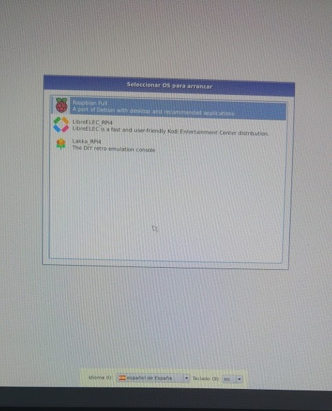
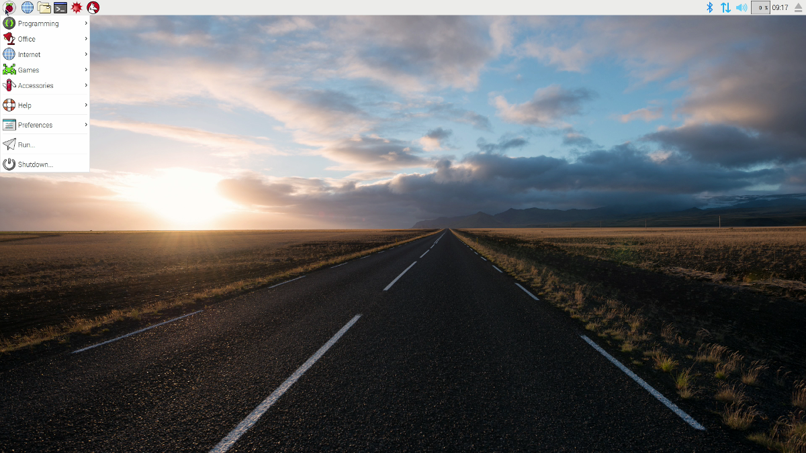
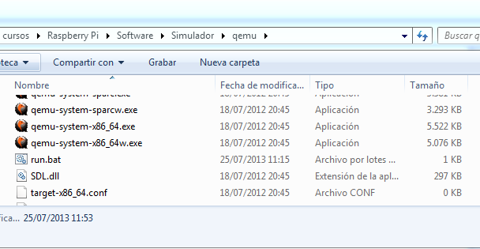

# Instalación

¿Qué necesitamos?

* Formatear tarjeta ([Formatter4](http://www.sdcard.org/downloads/formatter_4/))
* Descargamos la imagen del sistema que queramos desde la [página de descargas (Downloads) de la web de Raspberry.org](http://www.raspberrypi.org/downloads)
* Si usamos una imagen tipo Noobs, basta con que descomprimamos el contenido del fichero zip en la tarjeta SD
* Si es una imagen (fichero tipo img o iso) lo grabamos por ejempo con la herramienta multiplataforma Etcher (Windows, OsX y Linux) para instalar imagenes https://www.balena.io/etcher/

* ¿Qué imagen usar?
	* Empecemos con [Noobs](https://www.raspberrypi.org/blog/tag/noobs/) que nos va a permitir instalar otras imágenes.
    * Tenemos 2 opciones para descargar la imagen de noobs:
        * Una instalación mínima de noobs, que descargará luego todo lo necesario desde la red
        * Una instalación basde de Noobs que incluye todo lo necesiario para instalar el sistema operativo Raspbian, que es el más usado y que una vez copiado en la tarjeta no necesita conexión a la red	
	

	

Vemos que desde la pantalla de arranque de noobs nos permite elegir la imagen que queremos instalar. 

Algunas aparecen directamente (ya están en la tarjeta) y si tenemos conectividad a internet (bien por que tenemos conectado un cable ethernet o porque hemos configurado el wifi) podremos seleccionar más imágenes, que se descargarán durante la instalación.

Podemos instalar varios sistemas operativos y cada vez que arranquemos podremos escoger cuál queremos usar.

Según la selección que hagamos hará falta más espacio en la tarjeta y pudiera ocurrir que no quepan todos los que queremos instalar.

Podemos seleccionar el idioma y la configuración de teclado

Para empezar deberíamos seleccionar Raspbian y se arrancará el proceso de instalación, que tarda unos minutos

##  ¡¡¡Arrancar!!!

Al arrancar el sistema Raspian aparecerá una pantalla multicolor que nos indica que la imagen está operativa.

Y después se verá en formato texto el arranque

Si hemos instalado varios sistemas podremos elegir entre ellos, si no hacemos nada arrancará el último que usáramos.

Si todo va bien al cabo de unos segundos veremos el escritorio Pixel, un escritorio ligero pero con buen aspecto y con la funcionalidad a la que estamos acostumbrados hoy en día

La primera vez que arranquemos tendremos que configura el idioma y la zona horaria, establecer la contraseña del usuario "pi" y el sistema se actualizará.

Vamos a ver algunos de los menús e iconos más importantes de pixel.

A la izquierda tenemos el menú de aplicaciones y a la derecha podemos pulsar sobre el icono del Wifi o de la red para configurarla si fuera necesario.

En este [Vídeo](https://www.youtube.com/embed/IrjWoxWfewo) podéis ver el uso del entorno visual  Pixel de Raspberry Pi

<iframe width="560" height="315" src="https://www.youtube.com/embed/IrjWoxWfewo" frameborder="0" allowfullscreen></iframe>

## Configuración

Existe un asistente para configurar la manera en la que funcionará nuestra Raspberry. Podemos hacerlo desde el menú de configuración

Al abrirlo veremos que hay 4 pestañas, cada una de ellas dedicada a unos aspectos diferentes de la configuración:

### Configuración del sistema

Aquí podemos decidir si el sistema arranca en modo texto o escritorio visual o la configuración de red.

Lo más importante es cambiar la contraseña para evitar que cualquiera pudiera entrar.

### Configuración de Interfaces

Aquí veremos qué drivers activamos (porque vayamos a usar esos dispositivos) o que protocolos de comunicación usaremos para acceder.

Si vamos a acceder desde otro ordenador deberemos activar SSH en el caso de  acceder vía consola (texto) o VNC para acceder al escritorio.

### Configuración de rendimiento

A partir de la versión 3 de Raspberry no se puede cambiar la velocidad del procesador desde este interface (en las versiones anteriores sí), pero sí que podemos cambiar la cantidad de memoria que se asigna al procesador gráfico con lo que conseguiremos que aplicación que usan intensivamente gráficos vayan más rápidas

### Configuración de idiomas y teclado

Esta parte de la configuración es fundamental para configurar la zona horaria, el idioma (Local) y el teclado

[Vídeo de la primera configuración de Raspberry Pi](https://youtu.be/vHs_3HmI3mc)

### Configuración desde consola

Si necesitamos configurar desde consola de texto  podemos lanzar la aplicación de configuración escribiendo:

	sudo raspi-config

Y obtendremos las pantallas de configuración. (Puede variar algo según la versión)

Una vez configurado podemos abrir el entorno visual con

	startx

En cualquier momento podemos volver a reconfigurar con

	sudo raspi-config

<iframe width="560" height="315" src="https://www.youtube.com/embed/ERFH8AYjWxM" frameborder="0" allowfullscreen></iframe>

[Vídeo de la configuración desde la consola de texto de Raspberry Pi](https://www.youtube.com/embed/ERFH8AYjWxM)

## Simuladores

¿Y si no tengo una Raspberry Pi?

Existen [varios emuladores](https://www.google.es/search?q=raspberry+simulator&oq=raspberry+simulator&aqs=chrome..69i57j69i65l3j69i60l2.3806j0j7&sourceid=chrome&es_sm=93&ie=UTF-8) aunque no esperes que la experiencia sea la misma....

### [En windows](http://www.diverteka.com/?p=66)

* Descargamos la imagen en  [http://sourceforge.net/projects/rpiqemuwindows/](http://sourceforge.net/projects/rpiqemuwindows/)
* Emulador qemu
* Imagen (2012-07-15-wheezy-raspbian.img) o (http://downloads.raspberrypi.org/download.php?file=/images/raspbian/2013-05-25-wheezy-raspbian/2013-05-25-wheezy-raspbian.zip)

* Ejecutamos

		qemu-system-arm.exe -M versatilepb -cpu arm1176 -hda imagen/2013-09-25-wheezy-raspbian.img -kernel kernel-qemu -m 192 -append "root=/dev/sda2"

[Vídeo](http://www.youtube.com/watch?feature=player_embedded&v=QvqaNUx7-pU)

### [En ubuntu](http://www.cnx-software.com/2011/10/18/raspberry-pi-emulator-in-ubuntu-with-qemu/)

### [Simulando en virtualBox](https://www.raspberrypi.org/forums/viewtopic.php?f=9&t=2961)

### [Simulando el Sense Hat](https://www.raspberrypi.org/blog/sense-hat-emulator/)

### Usando Pixel el entorno de Raspberry Pi en tu PC

Puedes usar Pixel el entorno gráfico de Rasperry en tu PC o MAC, solo necesitas descargar la [imagen](http://downloads.raspberrypi.org/pixel_x86/images/pixel_x86-2016-12-13/2016-12-13-pixel-x86-jessie.iso) desde un CD o USB.

Más detalles en [esta página](https://www.raspberrypi.org/blog/pixel-pc-mac/)
