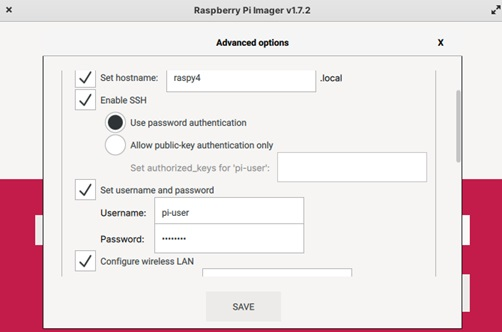

## Instalación

La Fundación Raspberry Pi ha publicado una herramienta gratuita llamada [**Raspberry Pi Imager**](https://www.raspberrypi.com/software/) que  hace aún más sencilla la instalación del sistema operativo, permitiéndonos elegir entre muchísimos sistemas operativos, encargándose de formatear la tarjeta SD, de descargar el sistema operativo y escribir la imagen del sistema directamente en la tarjeta. 

También nos permite hacer una primera configuración, como es el usuario, contraseña, wifi, nombre del equipo, ... que se grabarán en la tarjeta SD, arrancando ya el sistema con esa configuración.

Podemos descargarlo desde el apartado de [Software de la página de Raspberry Pi](https://www.raspberrypi.com/software/) eligiendo la versión adecuada para nuestro sistema operativo.


Tras descargarlo, lo instalaremos.

Para ejecutarlo, necesitamos estar conectados a Internet para que se pueda descargar la lista de los sistemas operativos disponibles y las imágenes que vamos a usar.

Al ejecutarlo, tendremos la siguiente pantalla


En primer lugar selecciona el tipo de Raspberry Pi que vamos a usar, para filtrar los sistemas operativos compatibles con el dispositivo seleccionado:


La versión 1.8.5  nos permite instalar los siguientes sistemas operativos:


Al seleccionar el sistema operativo veremos distintas opciones, como por ejemplo al seleccionar Ubuntu:


Donde vemos que aparecen opciones de instalar diferentes versiones de 32 o de 64 bits

A día de hoy (octubre de 2024) existen 2 versiones disponibles de Raspberry Pi OS:

* La versión derivada de **Bullseye**, que es la más reciente, pero que hasta ahora mismo no es compatible al 100% con algunas librerías de python. Cada vez son menos las aplicaciones que no son compatibles.
* La versión **Legacy** que es una actualización de la versión anterior **Buster**, que sí es compatible con las librerías de python antiguas, por ejemplo las de usar la cámara.


Elegiremos una u otra según el tipo de aplicación que queramos usar. Ante la duda mejor instalar la versión más moderna de 64 bits.

Por último seleccionaremos  la tarjeta SD o el dispositivo  donde vamos a escribir la imagen (los datos de la tarjeta se borrarán)

A día de hoy RPI Imager no permite instalar varios sistemas operativos en la misma tarjeta, pero sí que nos permite seleccionar entre muchos sistemas, además de los propios de raspberrypi.org como podemos ver en el siguiente vídeo

Desde RPI Imager también podemos configurar antes de hacer la instalación el **nombre de la Raspberry**, el **usuario** y **contraseña**, si queremos acceso ssh, la configuración del wifi, el idioma y el teclado... 




Este es una gran ventaja, pues al arrancar ya tendremos toda esta configuración realizada. Además esta configuración se guarda en el instalador y podemos fácilmente reutilizar los datos para posteriores instalaciones.

En las versiones actuales ya se permite que el usuario no sea "pi", pudiendo poner cualquier nombre de usuario.

[](https://drive.google.com/file/d/15T_fPbQdCdTvPMLpMd4RLAzlFYYnDi-c/view?usp=sharing)

[Vídeo: Nuevo instalador RPI Imager: 64 bits, configuración y bootloader](https://drive.google.com/file/d/15T_fPbQdCdTvPMLpMd4RLAzlFYYnDi-c/view?usp=sharing)


Al pulsar **Write** se descargará la imagen desde Internet, se escribirá en el soporte elegido y posteriormente se verificará si se ha grabado correctamente.

También podemos usar RPI Imager para formatear la tarjeta, para crear tarjetas SD capaces de recuperar una instalación con problemas, para escribir imágenes que ya hemos descargado, etc.

[](https://drive.google.com/file/d/1vZCdJa2551mNAdr1cwsOAJMn440eqXMG/view?usp=sharing)

[Vídeo: Instalación de Raspberry Pi OS usando Imager](https://drive.google.com/file/d/1vZCdJa2551mNAdr1cwsOAJMn440eqXMG/view?usp=sharing)


Si todo va bien al cabo de unos segundos veremos el escritorio Pixel, un escritorio ligero pero con buen aspecto y con la funcionalidad a la que estamos acostumbrados hoy en día


La primera vez que arranquemos tendremos que configurar, si no lo hemos hecho ya, el idioma y la zona horaria, establecer la contraseña del usuario por defecto “pi”  y el sistema se actualizará.

## ¿Escritorio o línea de comandos?

La Raspberry Pi (y todos los ordenadores que usan Linux/Unix) se puede usar con el ratón o con comando desde el terminal del sistema: 

* El ratón es más intuitivo, sólo hay que ir mirando por las opciones de menú, que suelen ser bastante descriptivos.
* La línea de comandos da un control más detallado y una vez que te acostubras es más productiva, sobre todo porque se pueden automatizar tareas con facilidad.


Sobre los comandos de consola, hay libros y libros y en el curso hemos intentado incluir algunas de las "recetas" más habituales. Muchos de ellos tampoco los recuerdo de memoria y los tengo que consultar, por eso están en la documentación del curso.  

Por ejemplo, como veremos un poco más adelante, para instalar software, podemos hacerlo usando el ratón desde la opción "Add/Remove software" del menú "Preferencias" o desde la consola con  

```bash
sudo apt update
sudo apt install wolfram-engine # Instala el  programa Mathematica de Wolfram
```

Hay gente que le gusta usar los comandos y otros son más de ratón, puedes hacer casi lo mismo con los dos sistemas. Usa el que más cómodo te sea. 

## Uso del escritorio

Vamos a ver algunos de los menús e iconos más importantes de pixel.

A la izquierda tenemos el menú de aplicaciones 


A la derecha podemos pulsar sobre el icono del Wifi o de la red para configurarla si fuera necesario.


Demos un paseo por el interfaz del escritorio.


[]
(https://drive.google.com/file/d/1Xctv-39GG117f1Zm_0QbfQbRZoZd_MKG/view?usp=sharing)
En este [vídeo](https://drive.google.com/file/d/1Xctv-39GG117f1Zm_0QbfQbRZoZd_MKG/view?usp=sharing) podéis ver el uso del entorno visual  Pixel de Raspberry Pi.


### Usando Pixel el entorno de Raspberry Pi en tu PC


Puedes usar Pixel el entorno gráfico de Raspberry en tu PC o MAC, solo necesitas descargar la [imagen](http://downloads.raspberrypi.org/pixel_x86/images/pixel_x86-2016-12-13/2016-12-13-pixel-x86-jessie.iso) desde un CD o USB.

Más detalles en [esta página](https://www.raspberrypi.com/news/pixel-pc-mac/)

