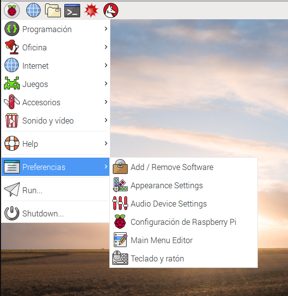
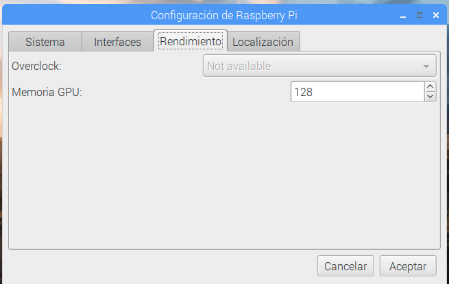

## Instalación

Desde hace poco se ha publicado una aplicación llamada [**Raspberry Pi Imager**](https://www.raspberrypi.com/software/) que permite hacer aún más sencilla la instalación del sistema operativo, encargándose de descargar, formatear y escribir la imagen del sistema directamente en la tarjeta SD. Lo descargamos desde el apartado de [Software de la página de Raspberry Pi](https://www.raspberrypi.com/software/)


En primer lugar selecciona el tipo de Raspberry Pi  que vamos a usar:


La versión 1.8.5  nos permite instalar los siguientes sistemas operativos:


Al seleccionar el sistema operativo veremos distintas opciones, como por ejemplo al seleccionar Ubuntu:


Donde vemos que aparecen opciones de instalar diferentes versiones de 32 o de 64 bits

A día de hoy (octubre de 2024) existen 2 versiones disponibles de Raspberry Pi OS:

* La derivada de **Bullseye**, que es la más reciente, pero que hasta ahora mismo no es compatible al 100% con algunas librerías de python para el uso de la cámara (ahora mismo no hay versión alternativa).
* La versión **Legacy** que es una actualización de la versión anterior **Buster**, que sí es compatible con las librerías de python para usar la cámara.


También tenemos disponible las primeras versiones de la versión de 64 bits que promete un mejor rendimiento en las Raspberry Pi 3, 4, 400 y la Zero 2. La parte esencial del sistema operativo ya es de 64, pero algunas aplicaciones todavía funcionan en 32 bits.

Podemos descargar RPI Imager desde la página de [Descargas de Raspberry Pi](https://www.raspberrypi.com/software/) donde seleccionaremos nuestro sistema operativo

Una vez descargado seleccionaremos el sistema operativo que queremos usar, luego seleccionaremos la tarjeta SD donde vamos a escribir la imagen (los datos de la tarjeta se borrarán)

A día de hoy Imager no permite instalar varios sistemas operativos en la misma tarjeta, pero sí que nos permite seleccionar entre muchos sistemas, además de los propios de raspberrypi.org como podemos ver en el siguiente vídeo

Desde RPI Imager podemos configurar también antes de hacer la instalación el **nombre de la raspberry**, el **usuario** y **contraseña**, si queremos acceso ssh, la configuración del wifi, el idioma y el teclado... 


Este es una gran ventaja, pues al arrancar ya tendremos toda esta configuración realizada

En las versiones actuales ya se permite que el usuario no sea "pi", pudiendo poner cualquier nombre de usuario.

[](https://drive.google.com/file/d/15T_fPbQdCdTvPMLpMd4RLAzlFYYnDi-c/view?usp=sharing)

[Vídeo: Nuevo instalador RPI Imager: 64 bits, configuración y bootloader](https://drive.google.com/file/d/15T_fPbQdCdTvPMLpMd4RLAzlFYYnDi-c/view?usp=sharing)


Al pulsar **Write** se descargará la imagen desde internet.

También podemos usar RPI Imager para formatear la tarjeta, para crear tarjetas SD capaces de recuperar una instalación con problemas, para escribir imágenes que ya hemos descargado, etc.

[](https://drive.google.com/file/d/1vZCdJa2551mNAdr1cwsOAJMn440eqXMG/view?usp=sharing)

[Vídeo: Instalación de Raspberry Pi OS usando Imager](https://drive.google.com/file/d/1vZCdJa2551mNAdr1cwsOAJMn440eqXMG/view?usp=sharing)


Si todo va bien al cabo de unos segundos veremos el escritorio Pixel, un escritorio ligero pero con buen aspecto y con la funcionalidad a la que estamos acostumbrados hoy en día


La primera vez que arranquemos tendremos que configurar, si no lo hemos hecho ya, el idioma y la zona horaria, establecer la contraseña del usuario por defecto “pi”  y el sistema se actualizará.

## ¿Escritorio o línea de comandos?

La Raspberry Pi (y todos los ordenadores que usan Linux/Unix) se puede usar con el ratón o con comandos desde el terminal del sistema: 

* El ratón es más intuitivo, sólo hay que ir mirando por las opciones de menú, que suelen ser bastante descriptivos.
* La línea de comandos da un control más detallado y una vez que te acostubras es más productiva, sobre todo porque se pueden automatizar tareas con facilidad.


Sobre los comandos de consola, hay libros y libros y en el curso hemos intentado incluir algunas de las "recetas" más habituales, muchos de ellos tampoco los recuerdo de memoria y los tengo que consultar, por eso están en la documentación del curso.  

Por ejemplo, como veremos un poco más adelante, para instalar software, podemos hacerlo usando el ratón desde la opción "Add/Remove software" del menú "Preferencias" o desde el teclado con  

```bash
sudo apt update
sudo apt install wolfram-engine
```

Hay gente que le gusta usar los comandos y otros son más de ratón, puedes hacer casi lo mismo con los dos sistemas. Usa el que más cómodo te sea. 

## Uso del escritorio

Vamos a ver algunos de los menús e iconos más importantes de pixel.

A la izquierda tenemos el menú de aplicaciones y a la derecha podemos pulsar sobre el icono del Wifi o de la red para configurarla si fuera necesario.


[](https://drive.google.com/file/d/1Xctv-39GG117f1Zm_0QbfQbRZoZd_MKG/view?usp=sharing)


En este [vídeo](https://drive.google.com/file/d/1Xctv-39GG117f1Zm_0QbfQbRZoZd_MKG/view?usp=sharing) podéis ver el uso del entorno visual  Pixel de Raspberry Pi

## Configuración del sistema

Existe una aplicación para configurar la manera en la que funcionará nuestra Raspberry. Podemos hacerlo desde el menú de configuración.

(Esta aplicación cambia con bastante frecuencia y puede ser que las opciones que veas en tu equipo no sean exactamente las mismas que se muestran en las imágenes)



Al abrirlo veremos que hay 4 pestañas, cada una de ellas dedicada a unos aspectos diferentes de la configuración:

### Configuración del sistema


Aquí podemos decidir si el sistema arranca en modo texto o escritorio visual o la configuración de red.

Lo más importante es cambiar la contraseña para evitar que cualquiera pudiera entrar.

### Configuración de Interfaces


Aquí veremos qué drivers activamos (porque vayamos a usar esos dispositivos) o qué protocolos de comunicación usaremos para acceder.

Si vamos a acceder desde otro ordenador deberemos activar SSH en el caso de  acceder vía consola (texto) o VNC para acceder al escritorio.

### Configuración de rendimiento



A partir de la versión 3 de Raspberry no se puede cambiar la velocidad del procesador desde este interface (en las versiones anteriores sí), pero sí que podemos cambiar la cantidad de memoria que se asigna al procesador gráfico con lo que conseguiremos que aplicación que usan intensivamente gráficos vayan más rápidas

### Configuración de idiomas y teclado


Esta parte de la configuración es fundamental para configurar la zona horaria, el idioma (Local) y el teclado

[](https://drive.google.com/file/d/1TAKfTNZ3QrOeabAnJ4CJK58w5HaJ_vpD/view?usp=sharing)


[Vídeo de la primera configuración de Raspberry Pi](https://drive.google.com/file/d/1TAKfTNZ3QrOeabAnJ4CJK58w5HaJ_vpD/view?usp=sharing)


### Configuración desde consola

Si necesitamos configurar desde consola de texto, también  podemos lanzar la aplicación de configuración escribiendo:

```sh
sudo raspi-config
```

(Recuerda que usamos _sudo_ para indicar que necesitamos acceder a la aplicación como administrador)

Y obtendremos las pantallas de configuración. (Puede variar algo según la versión)


Un
En cualquier momento podemos volver a reconfigurar con

```sh
sudo raspi-config
```

[](https://drive.google.com/file/d/1dP2cdq1loc6QcadgjP1hSeW0a7ovkmeU/view?usp=sharing)


[Vídeo de la configuración desde la consola de texto de Raspberry Pi](https://drive.google.com/file/d/1dP2cdq1loc6QcadgjP1hSeW0a7ovkmeU/view?usp=sharing)


### Pasar de Lite a Desktop

Si hemos instalado la versión mínima Lite y queremos pasar a la versión desktop, para tener disponible el escritorio podemos hacer:

```sh
sudo apt update
sudo apt upgrade
sudo apt dist-upgrade
sudo apt install xserver-xorg
sudo apt install raspberrypi-ui-mods
sudo apt install lightdm
```

Esta opción no nos instala las herramientas de escritorio, que tendremos que ir instalando manualmente.

### Otros instaladores: BerryBoot

El instalador de Noobs está basado en un desarrollo previo llamado [BerryBoot](https://www.berryterminal.com/doku.php/berryboot), [proyecto opensource](https://github.com/maxnet/berryboot) que ha seguido evolucionando independientemente y que a día de hoy tiene algunas ventajas


Ventajas:

* Ocupa solo 30Mb, porque sólo es el instalador, y luego se descarga toda la imagen de internet
* Hay muchas más opciones de SOs disponibles
* Podemos hacer la instalación en la SD (lo que es lo habitual) o en otro dispositivo USB (para luego clonarlo en una SD) o en un dispositivo de red, para reutilizarlo
* Lee las señales HDMI CEC de nuestro monitor y en el arranque podemos usar el mando a distancia de nuestra TV para seleccionar el SO del que queremos arrancar
* Podemos utilizar las imágenes guardadas en un USB para hacer la instalación, siendo en este caso la instalación totalmente offline
* Se pueden clonar imágenes de la tarjeta
* Permite hacer backups de sistemas operativos
* Podemos añadir otros OS a los ya instalados
* Si no tenemos monitor instalado podemos hacer una instalación vía VNC como [nos explican aquí](https://www.berryterminal.com/doku.php/berryboot/headless_installation) sin más que añadir esta línea al fichero cmdline.txt de la tarjeta SD

```sh
vncinstall ipv4=192.168.88.88/255.255.255.0/192.168.88.1 
```

Ahora solo tenemos que arrancar un cliente VNC y apuntar a esa IP
Si queremos usar wifi sólo necesitamos añadir al fichero wpa_supplicant.conf de la tarjeta SD la información siguiente:

```
ctrl_interface=DIR=/var/run/wpa_supplicant GROUP=netdev
ap_scan=1


network={
	ssid="ssid-punto-de-acceso"
	psk="contraseña-wpa"
}
```

Podemos descargar BerryBoot de [este enlace para Raspberry Pi 4](https://downloads.sourceforge.net/project/berryboot/berryboot-20200612-pi4.zip) y [de este para las versiones anteriores](https://downloads.sourceforge.net/project/berryboot/berryboot-20190612-pi0-pi1-pi2-pi3.zip)

## Simuladores

¿Y si no tengo una Raspberry Pi?

Existen [varios emuladores](https://www.google.es/search?q=raspberry+simulator&oq=raspberry+simulator&aqs=chrome..69i57j69i65l3j69i60l2.3806j0j7&sourceid=chrome&es_sm=93&ie=UTF-8) aunque no esperes que la experiencia sea la misma....


### Simulación en windows
Desde la página [diverteka](http://www.diverteka.com/?p=66) nos explican cómo instalar el emulador de una versión antigua en windows.


* Descargamos la imagen en  [http://sourceforge.net/projects/rpiqemuwindows/](http://sourceforge.net/projects/rpiqemuwindows/)
* Emulador qemu
* Imagen (2012-07-15-wheezy-raspbian.img) o (https://downloads.raspberrypi.org/raspbian/images/2012-07-15-wheezy-raspbian/2012-07-15-wheezy-raspbian.zip)

* Ejecutamos

```
	qemu-system-arm.exe -M versatilepb -cpu arm1176 -hda imagen/2013-09-25-wheezy-raspbian.img -kernel kernel-qemu -m 192 -append "root=/dev/sda2"
```

En este [Vídeo del emulador](http://www.youtube.com/watch?feature=player_embedded&v=QvqaNUx7-pU) podemos verlo en funcionamiento

### Emuladores en otros sistemas

En diferentes foros podemos ver cómo otros usuarios usan diferentes emuladores

* Emulador [en ubuntu](http://www.cnx-software.com/2011/10/18/raspberry-pi-emulator-in-ubuntu-with-qemu/)

* [Simulando en virtualBox](https://www.raspberrypi.org/forums/viewtopic.php?f=9&t=2961)


### Usando Pixel el entorno de Raspberry Pi en tu PC


Puedes usar Pixel el entorno gráfico de Raspberry en tu PC o MAC, solo necesitas descargar la [imagen](http://downloads.raspberrypi.org/pixel_x86/images/pixel_x86-2016-12-13/2016-12-13-pixel-x86-jessie.iso) desde un CD o USB.

Más detalles en [esta página](https://www.raspberrypi.com/news/pixel-pc-mac/)
