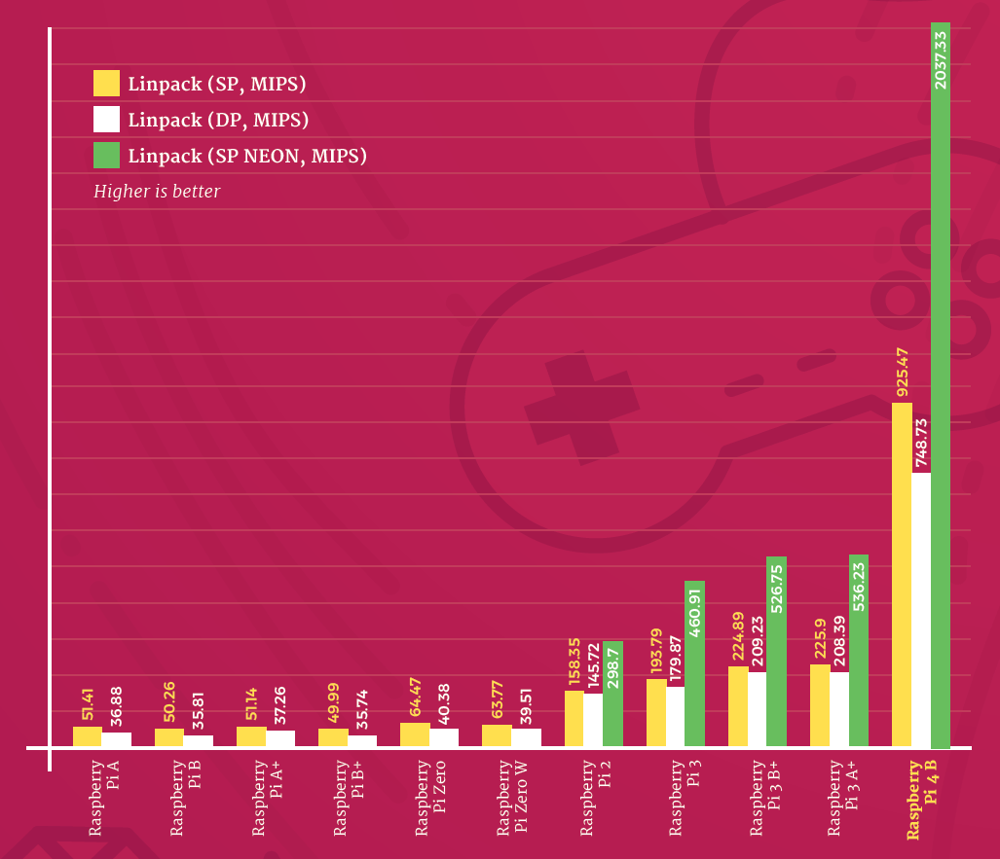
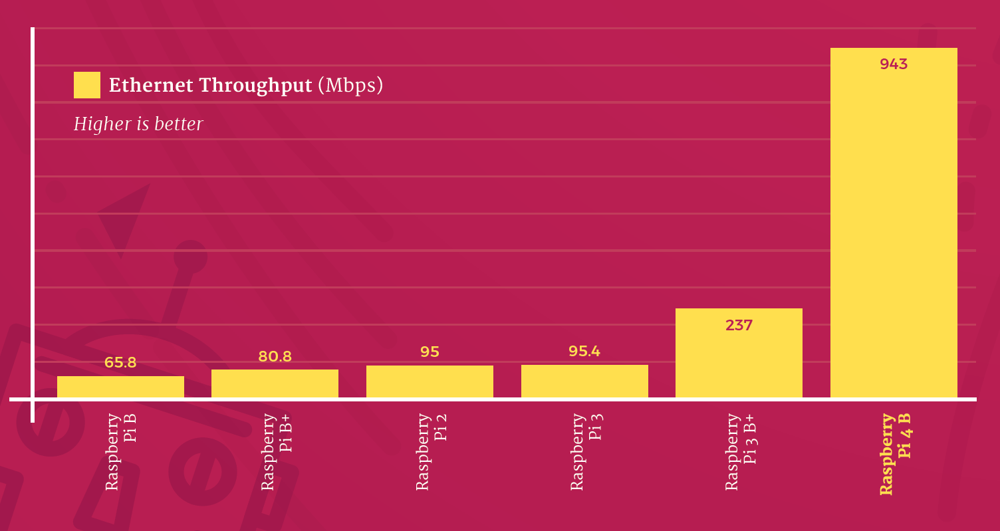
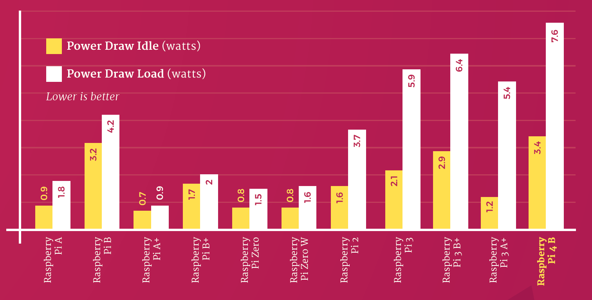

## Raspberry Pi 4

La Raspberry Pi 4 es la última versión disponible a día de hoy (presentada hace un año 24-6-2019)

Es un gran avance en cuanto a prestaciones, pero conservando su esencia: un mismo tamaño, compatibilidad con las anteriores versiones y un precio base alucinante: desde 35$

Veamos algunas de sus características

* Procesador Quad core ARM A8 de 64 bits a 1.5Ghz. Los primeros tests de velocidad dicen que 2x veces más rápida que la 3+

* Compatible con OpenGL 3, con lo que esperemos que software 3D debe mejorar enormemente
* 3 Versiones con diferente cantidad de memoria RAM:  2Gb, 4Gb y 8Gb. Este aumento debe hacer que el rendimiento mejore mucho en aplicaciones pesadas como son los navegadores web 
* Doble salida mini-HDMI de 4K (no me gusta que sea mini-HDMI)
* 2 USB de tipo 3  y  2 USB de tipo 2
* Full Gigabit Ethernet real con POE (estándar de alimentación via red ethernet). Según los test de velocidad de transferencia por fin se ha eliminado la arquitectura de red conectada vía USB y el cambio es espectacular

  

* Wifi 2.4GHz y 5GHz b/g/n/ac
* Bluetooth 5.0 Low Energy (BLE)
* GPIO de 40 pines como en anteriores versiones
* Necesita 15W (5V y 3A) de alimentación,  y se ha pasado al USB-C para la alimentación. Según los test el consumo no ha subido en la misma proporción.

Como vemos está muy, muy cerca de las prestaciones de un portátil estándar a día de hoy

Esas aulas de ordenadores van a echar humo...

## Recursos

[Página del producto](https://www.raspberrypi.org/products/raspberry-pi-4-model-b/)

[Más detalles sobre las especificaciones y el comportamiento](https://www.raspberrypi.org/magpi/raspberry-pi-specs-benchmarks/)

[Más información sobre los tests de rendimiento](https://www.raspberrypi.org/magpi/raspberry-pi-4-specs-benchmarks/)

[Sobre el desarrollo de esta nueva versión](https://www.raspberrypi.org/magpi/eben-upton-engineering-raspberry-pi-4/)

(Imágenes oficiales tomadas de Raspberry.org)
https://www.raspberrypi.org/magpi-issues/MagPi85.pdf

