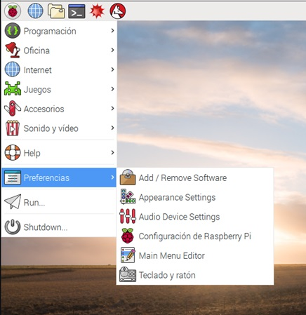
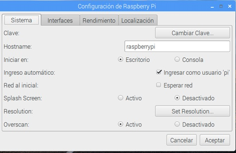
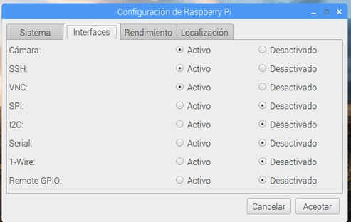
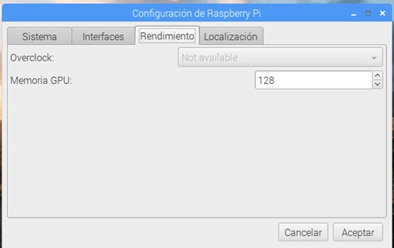
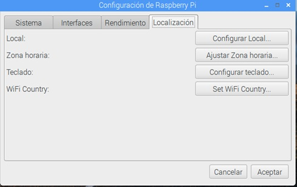
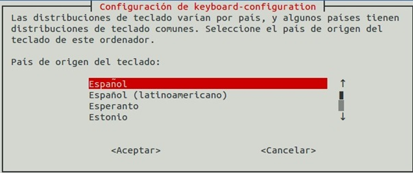
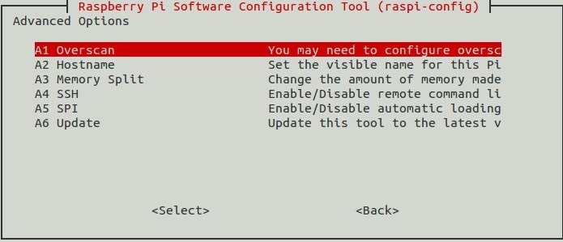
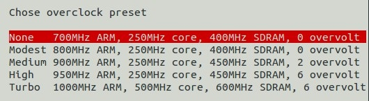

## Configuración del sistema

Existe una aplicación para configurar la manera en la que funcionará nuestra Raspberry Pi. Podemos hacerlo desde el menú de configuración.

(Esta aplicación cambia con bastante frecuencia y puede ser que las opciones que veas en tu equipo no sean exactamente las mismas que se muestran en las imágenes)



Al abrirlo, veremos que hay 4 pestañas, cada una de ellas dedicada a unos aspectos diferentes de la configuración:

### Configuración del sistema



Aquí podemos decidir si el sistema arranca en modo texto, escritorio visual o la configuración de red.

Lo más importante es cambiar la contraseña para evitar que cualquiera pudiera entrar.

### Configuración de Interfaces



Aquí veremos qué drivers activamos (porque vayamos a usar esos dispositivos), o qué protocolos de comunicación usaremos para acceder.

Si vamos a acceder desde otro ordenador deberemos activar SSH en el caso de  acceder vía consola (texto), o VNC para acceder al escritorio. Más adelante veremos qué es y cómo acceder usando estas herramientas

### Configuración de rendimiento



A partir de la versión 3 de Raspberry Pi, no se puede cambiar la velocidad del procesador desde este interface (en las versiones anteriores era posible), pero sí que podemos cambiar, la cantidad de memoria que se asigna al procesador gráfico, con lo que conseguiremos que las aplicaciones que usan intensivamente gráficos, vayan más rápidas.

### Configuración de idiomas y teclado



Esta parte de la configuración es fundamental para configurar la zona horaria, el idioma (Local) y el teclado.

[](https://drive.google.com/file/d/1TAKfTNZ3QrOeabAnJ4CJK58w5HaJ_vpD/view?usp=sharing)


[Vídeo de la primera configuración de Raspberry Pi](https://drive.google.com/file/d/1TAKfTNZ3QrOeabAnJ4CJK58w5HaJ_vpD/view?usp=sharing)


### Configuración desde consola

Si necesitamos configurar desde consola de texto, también podemos lanzar la aplicación de configuración escribiendo:

```sh
sudo raspi-config
```

(Recuerda que usamos _sudo_ para indicar que necesitamos acceder a la aplicación como administrador).

Y obtendremos las siguientes pantallas de configuración. (Puede variar algo según la versión).








En cualquier momento podemos volver a reconfigurar con:

```sh
sudo raspi-config
```

[](https://drive.google.com/file/d/1dP2cdq1loc6QcadgjP1hSeW0a7ovkmeU/view?usp=sharing)


[Vídeo de la configuración desde la consola de texto de Raspberry Pi](https://drive.google.com/file/d/1dP2cdq1loc6QcadgjP1hSeW0a7ovkmeU/view?usp=sharing)

