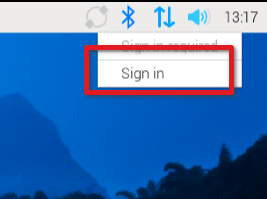
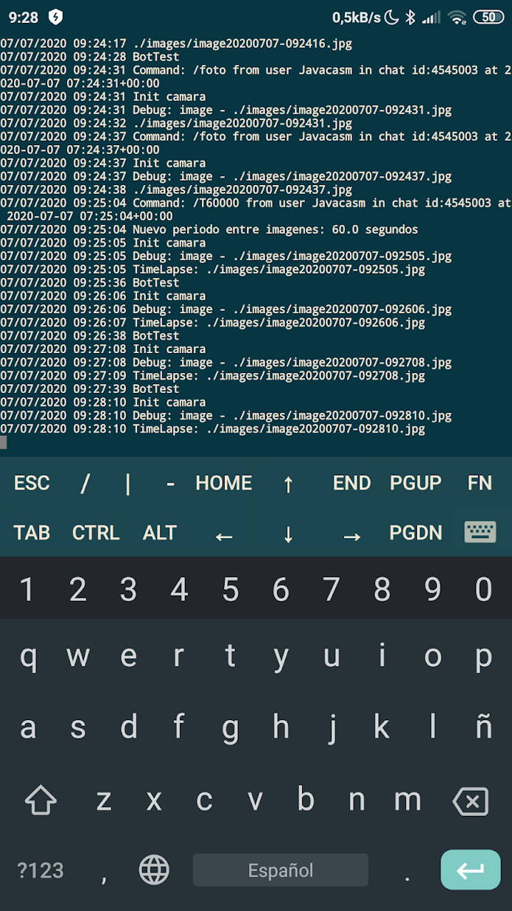

### Acceso remoto

Salvo que vayamos a usar nuestra Raspberry Pi como un ordenador de mesa, con su pantalla, ratón y teclado, vamos a necesitar conectarnos a ella remotamente, a través de la red.

Podemos acceder remotamente de 2 formas:

* Accediendo al escritorio visual,  que se nos mostrará como si de un monitor se tratara y lo controlaremos con nuestro teclado y ratón. Este tipo de conexión se conoce como **VNC** por ser el protocolo más empleado a día de hoy. Para conectarnos necesitaremos tener instalado en nuestro ordenador  un cliente de ese protocolo **VNC**
	

* Conectando sólo con un interfaz de tipo texto, como un terminal o consola usando el protocolo de acceso remoto **ssh**. Aunque a primera vista puede parecer más limitado, la realidad es que podemos hacer casi lo mismo desde teclado que desde escritorio. Para conectarnos por **ssh** necesitaremos un cliente de este protocolo, que viene incluido en todos los sistemas operativos modernos.

	

Por tema de seguridad, los accesos remotos están cortados y tenemos que activarlos para poder acceder remotamente.

Si hemos hecho la instalación con RPI Imager ya habremos configurado el acceso al wifi, y también podemos activar el acceso por ssh desde el  principio.

Antes de ver cómo usar estos métodos de conexión, vamos a ver algunos detalles sobre la forma en la que podemos acceder remotamente o no a nuestra Raspberry Pi.
### Conceptos de redes

Primero, veamos un diagrama simplificado de una red doméstica típica:


Ahora, expliquemos los componentes y su funcionamiento:

1. Conexión a Internet:
   - El módem se conecta directamente a la infraestructura de tu Proveedor de Servicios de Internet (ISP).
   - Recibe una dirección IP pública asignada por el ISP.

2. Router:
   - Actúa como el punto central de tu red doméstica.
   - Crea y gestiona tu red local (LAN).
   - Proporciona conexiones tanto por cable (Ethernet) como inalámbricas (Wi-Fi).

3. Red local:
   - El router asigna direcciones IP privadas (generalmente en el rango 192.168.x.x o 10.0.x.x) a todos los dispositivos conectados.
   - Esto incluye dispositivos conectados por cable y por Wi-Fi.

4. Network Address Translation (NAT):
   - El router utiliza NAT para traducir entre las direcciones IP privadas de tu red local y la dirección IP pública.
   - Cuando un dispositivo en tu red local solicita datos de Internet, el router cambia la dirección IP privada del dispositivo por la IP pública antes de enviar la solicitud.
   - Cuando los datos regresan, el router sabe a qué dispositivo enviarlos dentro de la red local.

Ahora, ¿por qué el router nos conecta a Internet pero no permite conexiones desde fuera?

1. Seguridad por defecto:
   - Los routers están configurados para proteger tu red local de amenazas externas.
   - Por defecto, bloquean las conexiones entrantes no solicitadas.

2. Funcionamiento de NAT:
   - NAT permite que los dispositivos internos inicien conexiones hacia Internet.
   - Sin embargo, no tiene forma de saber a qué dispositivo interno enviar una conexión entrante no solicitada.

3. Firewall integrado:
   - La mayoría de los routers incluyen un firewall básico que bloquea el tráfico entrante no autorizado.

4. Ausencia de reenvío de puertos:
   - Para permitir conexiones entrantes específicas, necesitarías configurar el reenvío de puertos, lo cual no está activado por defecto.

5. IP dinámica:
   - Muchos ISP asignan direcciones IP públicas dinámicas que cambian periódicamente, dificultando las conexiones entrantes consistentes.

Esta configuración proporciona un buen equilibrio entre facilidad de uso y seguridad para la mayoría de los usuarios domésticos. Permite que todos los dispositivos de la red local accedan a Internet, mientras protege la red de accesos no autorizados desde el exterior.

Para permitir conexiones entrantes (como para SSH, VNC o para alojar un servidor web), necesitarías configurar específicamente tu router para ello, lo que generalmente implica:

1. Configurar el reenvío de puertos.
2. Posiblemente configurar una IP pública estática o usar un servicio de DNS dinámico.
3. Ajustar la configuración del firewall.

Vamos a ampliar ahora el diagrama para incluir las operadoras de telefonía. 


Explicación del diagrama:

1. Red doméstica:
   - Similar al diagrama anterior, muestra el módem conectado a Internet, el router, y los dispositivos conectados por cable y Wi-Fi.

2. Red de la operadora móvil:
   - Se muestra una torre de telefonía móvil conectada a Internet.

3. Móvil:
   - El móvil aparece con dos conexiones posibles:
     a) Una conexión 4G/5G a la torre de telefonía móvil.
     b) Una conexión Wi-Fi a la red doméstica.

Este diagrama ilustra cómo un móvil puede alternar entre dos tipos de conexiones:

1. Conexión a la red móvil (4G/5G):
   - El teléfono se conecta directamente a la torre de telefonía móvil.
   - Esta conexión se usa típicamente cuando estás fuera de casa o fuera del alcance de redes Wi-Fi conocidas.
   - La operadora móvil proporciona acceso a Internet a través de su propia infraestructura.

2. Conexión a la red Wi-Fi doméstica:
   - Cuando estás en casa, el teléfono puede conectarse a tu red Wi-Fi.
   - En este caso, el tráfico de Internet del móvil pasa por tu router doméstico, igual que el resto de dispositivos de la casa.
   - Esta conexión suele ser preferida en casa porque generalmente es más rápida y no consume datos del plan móvil.

Aspectos importantes a considerar:

1. Cambio automático: Los móviles modernos pueden cambiar automáticamente entre estas conexiones, priorizando generalmente el Wi-Fi cuando está disponible.

2. Direcciones IP diferentes: El teléfono tendrá diferentes direcciones IP dependiendo de la red a la que esté conectado.

3. Seguridad: La conexión Wi-Fi doméstica puede ser más segura si está correctamente configurada, mientras que las conexiones móviles pueden ser más vulnerables en ciertos aspectos.

4. Acceso remoto: Cuando el móvil está en la red de la operadora, se enfrenta a los mismos desafíos para acceder a tu red doméstica que cualquier otro dispositivo externo, debido al NAT y firewall de tu router.

Este escenario dual es lo que permite a los móviles mantener una conexión constante a Internet, alternando entre redes móviles y Wi-Fi según la disponibilidad y la configuración del usuario.

### Conexión desde una red externa

Por todo esto podremos acceder a nuestra Raspberry Pi remotamente dentro de nuestra red, pero no podremos acceder cuando está en otra red, por ejemplo si la tenemos en casa y queremos acceder  desde la red del trabajo o si queremos acceder desde el móvil cuando estamos usando datos.

Existen varias soluciones para este problema:
* Usar una VPN que nos permita acceder a la otra red, es una solución típica de muchas empresas para permitir acceder a los ordenadores remotamente. 
* Algunos software como RealVNC (una versión del protocolo VNC) nos lo permiten hacer con cuentas de pago
* Utilizar una herramienta de Raspberry Pi llamada __Raspberry Pi Connect__.

Vamos a ver esta última opción por sencillez

### Raspberry pi Connect

Nos proporciona la misma funcionalidad de acceso remoto de la versión comercial de  RealVNC pero además, de momento, sin límite de dispositivos, se llama Raspberry Pi Connect y puedes leer más información en [esta publicación](https://www.raspberrypi.com/news/raspberry-pi-connect/)

Para instalarlo

```sh
sudo apt update
sudo apt upgrade
sudo apt install rpi-connect
```

Tras instalarlo tenemos que rearrancar, bien con el comando adecuado

```sh
sudo reboot
``` 

Pulsando el botón de reset, o con la opción de Apagar del menú.

Tras rearrancar, aparecerá el icono en la barra de herramientas


Si no saliera lo activamos a mano con:

```console
systemctl --user start rpi-connect
```

Que arrancará el servicio.



Ahora pulsamos "Sign in" para conectar con nuestra cuenta (o crearla si no tenemos).Nos llevará a la siguiente web

![[raspi-connect-singin.png]]

Si no nos aparece el icono, para conectarnos por primera vez ejecutamos:

```console
$ rpi-connect signin
```

que nos dará un mensaje similar a este

```console
Complete sign in by visiting https://connect.raspberrypi.com/verify/XXXX-XXXX
```

Nos conectamos a esa URL y completamos el registro

Si no tenemos cuenta la creamos. Tras crear la cuenta o conectarnos a la que ya teníamos, nos pedirá el nombre del nuevo equipo

![[raspi-connect-device-name.png]]

Ahora cuando entremos en [connect.raspberrypi.con]()  desde cualquier ordenador, desde nuestra red o desde internet, veremos nuestros dispositivos

![[raspi-connect-devices.png]]

Desde esta página podemos ver los detalles de cada máquina, pudiendo cambiar su nombre 

Podemos elegir si queremos acceder al escritorio del equipo o a una conexión de terminal vía ssh:


Tras pulsar connect, podemos acceder al equipo remotamente

![[raspi-connect-connected.png]]

El icono aparecerá de color morado cuando hay una conexión remota

Más detalles técnicos en la[ página de rpi-connect](https://www.raspberrypi.com/documentation/services/connect.html)
### ¿Cómo hace VNC o servicios similares para acceder remotamente a los ordenadores de nuestra red local?

Los servicios como VNC (Virtual Network Computing) utilizan varias técnicas para permitir el acceso remoto a equipos en una red local desde fuera de ella.

Primero, veamos un diagrama simplificado del proceso:


Ahora, expliquemos cómo funcionan estos servicios y las técnicas que utilizan:

1. Configuración del Router:
   - Reenvío de Puertos (Port Forwarding): Se configura el router para que redirija las conexiones entrantes en un puerto específico (por ejemplo, 5900 para VNC) a la dirección IP local del equipo con el servidor VNC.

2. Uso de Servidores de Reenvío:
   - Muchos servicios VNC utilizan servidores intermediarios para facilitar la conexión.
   - El equipo local (servidor VNC) establece una conexión saliente al servidor de reenvío.
   - El cliente VNC externo se conecta a este servidor de reenvío.
   - El servidor actúa como puente, redirigiendo el tráfico entre el cliente y el servidor VNC.

3. Técnicas de Atravesamiento de NAT:
   - UDP Hole Punching: Técnica que permite establecer conexiones directas entre dispositivos detrás de NAT.
   - STUN (Session Traversal Utilities for NAT): Ayuda a descubrir la IP pública y el tipo de NAT.

4. Uso de VPN (Red Privada Virtual):
   - Algunos servicios VNC pueden usar una VPN para crear una conexión segura entre el cliente y la red local.

5. Servicios de DNS Dinámico:
   - Asignan un nombre de dominio a tu IP pública dinámica, facilitando la conexión incluso si la IP cambia.

6. Protocolos de Conexión Inversa:
   - El servidor VNC inicia la conexión hacia un servidor intermediario, evitando problemas de NAT y firewalls.

7. Encriptación y Seguridad:
   - Utilizan protocolos de encriptación para asegurar la conexión.
   - Implementan autenticación robusta para prevenir accesos no autorizados.

Proceso típico de conexión:

1. El servidor VNC en tu red local se registra con un servicio de reenvío.
2. Cuando quieres conectarte remotamente, tu cliente VNC contacta al servicio de reenvío.
3. El servicio de reenvío facilita la conexión entre tu cliente y el servidor VNC en tu red local.
4. Se establece una conexión encriptada y autenticada.
5. Puedes ver y controlar tu equipo remoto como si estuvieras frente a él.

Consideraciones importantes:

- Seguridad: Es crucial configurar correctamente la autenticación y usar conexiones encriptadas.
- Ancho de banda: El acceso remoto puede requerir una buena conexión a Internet en ambos extremos.
- Latencia: Puede haber un ligero retraso en las acciones debido a la distancia y el enrutamiento.

### SSH (vía consola)

SSH es el protocolo de acceso remoto por consola (o terminal). Se suele utilizar cuando no necesitamos (o no tenemos) un entorno gráfico. Es una forma de conexión segura (usa encriptación y verificación a ambos lados) utilizada para acceder a router y otros dispositivos remotos

Tenemos que activarlo en la configuración para poder acceder desde fuera.Entramos en la configuración avanzada

```sh
sudo raspi-config
```


Podemos hacerlo también por comandos con

```sh
sudo service ssh start
sudo insserv ssh
```

Ahora podremos conectarnos remotamente con ssh, desde Linux con el comando **ssh** o con otras herramientas que veremos a continuación

```sh
ssh pi@192.189.0.123
```

Si lo vamos a activar se recomienda cambiar la contraseña para evitar que cualquiera pueda acceder a nuestro equipo.

[](https://drive.google.com/file/d/1Eu0yXNhgxUOZj9TjB35dlq-3y1--L4Lq/view?usp=sharing)

[Vídeo: Conexión vía SSH a Raspberry Pi](https://drive.google.com/file/d/1Eu0yXNhgxUOZj9TjB35dlq-3y1--L4Lq/view?usp=sharing)

### Herramientas de conexión ssh

Son muchas las herramientas que existen para poder conectarnos entre equipos usando SSH, vamos a ver un par de ellas.

#### Putty 

[Putty](http://www.chiark.greenend.org.uk/~sgtatham/putty/download.html) es una herramienta open source disponible para muchos sistemas operativos pensada para conectar remotamente con equipos usando distintos protocolos como ssh, telnet, serie, etc


Permite guardar las credenciales de cada sistema, facilitando la conexión.

#### JuiceSSH

[JuiceSSH](https://play.google.com/store/apps/details?id=com.sonelli.juicessh) es una herramienta de conexión ssh para móviles y tabletas Android.

También nos permite gestionar las credenciales de acceso y los diferentes equipos a los que conectarnos:


El uso incluso en un móvil es más cómodo de lo que parece, puesto que permite el uso de teclas como TAB, ctrl, cursor, etc.




[](https://drive.google.com/file/d/1GG4mscjTBS9VqsDxgyXM6n1UopfQzrIB/view?usp=sharing)

[Cliente SSH para móviles y tabletas Android: juicceSSH](https://drive.google.com/file/d/1GG4mscjTBS9VqsDxgyXM6n1UopfQzrIB/view?usp=sharing)

### Automatizar conexiones ssh

Si vamos a conectarnos frecuentemente a un mismo equipo puede resultar pesado tener que poner siempre usuario y contraseña. 

Podemos automatizar el protocolo ssh sin más que añadir nuestra **clave pública ssh** a la lista de host autorizados del servidor al que nos vamos a conectar, haciendo lo siguiente:

1. Generar nuestra **clave pública ssh**, asociada al usuario y la máquina
```sh
ssh-keygen -t rsa -b 4096 -C user@email.com
```
2. Ahora copiamos nuestra clave pública ssh a 
```sh
cat ~/.ssh/id_rsa.pub | ssh username@server.address.com 'cat >> ~/.ssh/authorized_keys'
```
La siguiente vez que nos conectemos lo haremos sin necesidad de introducir la clave.

Como podemos ver en el último comando que hemos usado, podemos usar ssh de muchas formas diferentes:

* Para conectarnos de manera interactiva a otro ordenador.
* Para enviar ficheros entre equipos. En un proyecto más adelante lo usaremos bastante.
* Para enviar contenido entre equipos como hemos hecho con el comando 'cat'.
* Para ejecutar comandos remotamente. Por ejemplo si hacemos:
```sh
ssh pi@raspi4 df -h
```
Nos permitirá saber cómo de llenos están los discos en el ordenador raspi4.


### VNC

VNC es un protocolo que nos permite acceder remotamente al escritorio de otra máquina.

En las nuevas versiones de Raspbian podemos activar VNC desde la configuración (o desde raspi-config), en el apartado de Interfaces.

Para conectarnos necesitamos instalar un cliente de VNC, como por ejemplo [RealVNC](https://www.realvnc.com/en/connect/download/viewer/). Una vez instalado lo usaremos introduciendo la IP o el nombre de nuestra Raspberry Pi


### Cambio de resolución del escritorio

Cuando arrancamos una Raspberry Pi sin tener monitor conectado y la tenemos configurada para que se cree el escritorio gráfico suele crearse con una resolución pequeña.

En el siguiente vídeo vamos a ver cómo hacer para modificar esa resolución. No hay más que entrar en Configuración de Raspberry -> Display y pulsar en Set Resolution

[](https://drive.google.com/file/d/1o8hYMcc-zDuWLMg7_wBSPXxQGDwuB7Np/view?usp=sharing)

[Vídeo: Cambio resolución del escritorio de una Raspberry Pi](https://drive.google.com/file/d/1o8hYMcc-zDuWLMg7_wBSPXxQGDwuB7Np/view?usp=sharing)

#### Instalación de VNC en equipos antiguos

En todas la versiones modernas ya viene instalado VNC y sólo tenemos que activarlo, pero si no está disponible en nuestra instalación podemos instalarlo de manera sencilla con:

```sh
sudo apt-get install tightvncserver
```

Este software requiere que un servicio se ejecute al arrancar si queremos acceder en cualquier momento. Podemos instalarlo añadiendo la siguiente línea al archivo **/etc/rc.local**

```sh
su -c "/usr/bin/tightvncserver :1 -geometry 800x600 -depth 16" pi
```


Ahora accederemos usando un cliente vnc, como por ejemplo [VNC Viewer](https://www.realvnc.com/es/connect/download/viewer/) de RealVNC. Si nos creamos una cuenta en RealVNC podremos acceder desde cualquier parte, incluso desde internet, sorteando nuestro router.


Existen clientes de VNC para teléfonos móviles y tabletas, lo que nos da muchas posibilidades

La conexión por VNC nos permite acceder como si estuviéramos conectados directamente

### Conexión y acceso directo

Vamos a configurar nuestra raspberry y un portátil con Ubuntu para facilitar al máximo la conexión y así no tener que utilizar muchos componentes. De esta manera podremos trastear con un kit mínimo, evitando tener que usar un teclado, ratón y sobre todo un monitor.


En concreto usaremos simplemente un cable de red (ethernet) y un cable micro-usb para alimentar la raspberry.

Con esta configuración no podemos consumir en total más de los 500mA que proporciona el USB.

Tendremos que modificar ficheros de configuración en el PC y en la raspberry.

Asumimos que tenemos conexión a internet vía Wifi y utilizaremos el cable ethernet para dar conectividad a la raspberry. Crearemos una red entre el portátil y la raspberry creando una subred distinta y haremos que el portátil actúe como gateway de esa red enrutando los paquetes hacia la raspberry y dándole acceso a internet.

Comencemos editando la configuración del pc, para lo que ejecutaremos en el pc:

```sh
sudo vi /etc/network/interfaces
```
y dejamos el contenido del fichero (la red que se usa normalmente es las 192.168.1.x de ahí que el gateway sea 192.168.1.1 que es el real)


Ahora vamos a editar la configuración de la raspberry. La forma más sencilla es editando los ficheros de configuración desde el pc, para lo que insertamos la tarjeta sd de la raspberry (obviamente con esta apagada) en el pc y ejecutamos en este:
```sh
sudo vi /media/10b4c001-2137-4418-b29e-57b7d15a6cbc/etc/network/interfaces
```
Quedando el mismo:


Ahora, colocamos la tarjeta sd en la raspberry y volvemos a encenderla


Conectamos el cable ethernet entre los dos

En el PC hacemos comprobamos que la tarjeta eth0 está ok y con la ip correspondiente, haciendo

```sh
ifconfig /all
```
Veremos que aparece el interface eth0 con ip 192.168.0.80

Ahora vamos a hacer que el portátil actúe como router. Para ello ejecutamos los siguientes comandos

```sh
sudo su -
root@ubuntu-asus:~# echo 1 > /proc/sys/net/ipv4/ip_forward
root@ubuntu-asus:~# /sbin/iptables -t nat -A POSTROUTING -o wlan0 -j MASQUERADE
```

Por último editamos el fichero de configuración de DNS con
```sh
sudo vi /etc/resolv.conf
```

y lo dejamos así


Ahora solo falta probar que tenemos conectividad, haciendo un ping
```sh
ping 192.168.0.90
```

Si todo es correcto ya podremos acceder via ssh o  VNC
