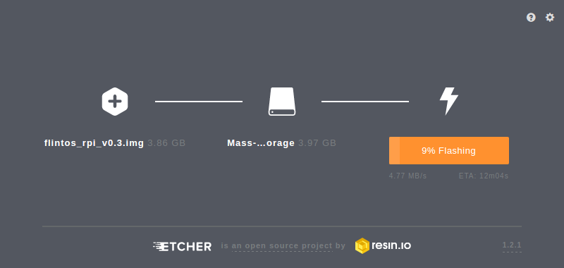
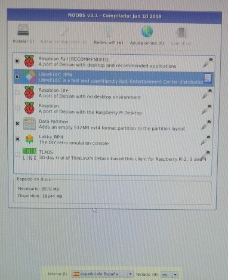
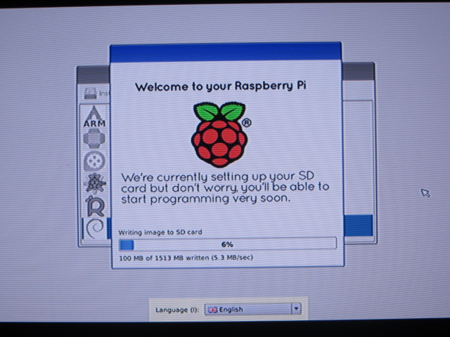
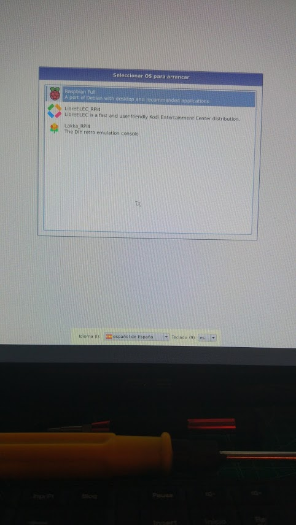

## Instalación manual

Vamos a ver cómo hacer todo el proceso manualmente para entender los pasos o por si RPI Imager no nos permite usar la versión de sistema operativo que queremos.

Realmente **NO RECOMIENDO HACERLO ASÍ** salvo que ya lo hayas hecho y controles 100% del tema.	

¿Qué necesitamos?

* Formatear tarjeta ([Formatter4](https://www.sdcard.org/downloads/formatter/))
* Descargamos la imagen del sistema que queramos desde la [página de descargas (Downloads) de la web de Raspberry.org](https://www.raspberrypi.com/software/)
* Si usamos una imagen tipo Noobs, basta con que descomprimamos el contenido del fichero zip en la tarjeta SD
* Si es una imagen (fichero tipo img o iso) lo grabamos con RPI Imager o por ejemplo con la herramienta multiplataforma Etcher (Windows, OsX y Linux) para instalar imágenes https://www.balena.io/etcher/

	
* ¿Qué imagen usar?:
	* Empecemos con [Noobs](https://github.com/raspberrypi/noobs) que nos va a permitir instalar otras imágenes.
    * Tenemos 2 opciones para descargar la imagen de noobs:
        * Una instalación mínima de noobs, que descargará luego todo lo necesario desde la red.
        * Una instalación base de Noobs que incluye todo lo necesario para instalar el sistema operativo Raspbian, que es el más usado y que una vez copiado en la tarjeta no necesita conexión a la red.
	

	

Vemos que desde la pantalla de arranque de noobs nos permite elegir la imagen que queremos instalar. 

Algunas aparecen directamente (ya están en la tarjeta) y si tenemos conectividad a internet (bien por que tenemos conectado un cable ethernet o porque hemos configurado el wifi) podremos seleccionar más imágenes, que se descargarán durante la instalación.

Podemos instalar varios sistemas operativos y cada vez que arranquemos podremos escoger cuál queremos usar.

Según la selección que hagamos hará falta más espacio en la tarjeta y pudiera ocurrir que no quepan todos los que queremos instalar.

Podemos seleccionar el idioma y la configuración de teclado

Para empezar deberíamos seleccionar Raspbian y se arrancará el proceso de instalación, que tarda unos minutos

##  ¡¡¡Arrancar!!!

Al arrancar el sistema Raspbian aparecerá una pantalla multicolor que nos indica que la imagen está operativa.

Y después se verá en formato texto el arranque

Si hemos instalado varios sistemas podremos elegir entre ellos, si no hacemos nada arrancará el último que usáramos.

