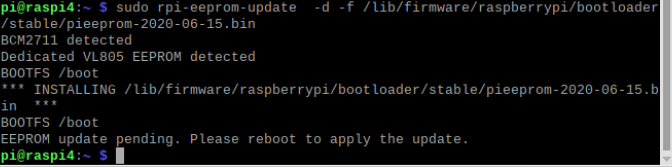

## Instalación en Raspberry Pi 4

La instalación en la Raspbery tiene algunos detalles a tener en cuenta:

* De los 2 HDMI, el de más a la izquierda es el 0 y es el que debemos conectar sí sólo se va a usar un monitor.
* Podemos hacer la instalación en un disco USB (o pendrive USB) para usarlo como disco del sistema sin necesidad de tarjeta SD.

También podemos instalar una versión de 64bits experimental, todavía en estado beta y a la que le faltan todavía algunos drivers esenciales. [Más información](https://forums.raspberrypi.com/viewtopic.php?t=275370), descargando las imágenes desde la [página de la beta](https://downloads.raspberrypi.org/raspios_arm64/images/)

### Instalación para arranque con disco USB

Vamos a usar un disco USB para instalar y arrancar nuestro SO. Necesitamos un pen drive rápido (o un disco SSD). Debe ser USB 3.0 y de alta velocidad para aprovechar su rendimiento.

Necesitaremos una tarjeta SD para la crear la imagen y copiarla al pen USB.

1. Instalamos un sistema limpio en la tarjeta SD
2. Actualizamos el SO con:


```sh
sudo apt update
sudo apt full-upgrade
```

3. Copiamos el contenido de nuesra tarjeta SD al disco USB con el programa **SD Card Copier** de nuestra Raspberry Pi

4. Ahora vamos a actualizar la eeprom para activar el arranque desde USB. Editaremos el fichero  /etc/default/rpi-eeprom-update cambiando "critical" por "stable"

```sh
sudo nano /etc/sudo nano /etc/default/rpi-eeprom-update
```

5. Comprobamos que tenemos disponible el firmware que vamos a escribir en la versión stable que será  posterior al 15 de Junio. Lo haremos con el comando:

```sh
ls /lib/firmware/raspberrypi/bootloader/stable/
```


6. Ahora escribimos los cambios en la eeprom con:

```sh
sudo rpi-eeprom-update  -d -f /lib/firmware/raspberrypi/bootloader/stable/pieeprom-2020-06-15.bin 
```



7. Si todo ha ido bien, apagamos la Paspberry, quitamos la tarjeta SD probamos a arrancar.

[Vídeo: Cómo arrancar Raspberry Pi 4 desde USB](https://youtu.be/jgCfJbiEbHE)

[](https://youtu.be/jgCfJbiEbHE)

En [este enlace](https://www.jeffgeerling.com/blog/2020/im-booting-my-raspberry-pi-4-usb-ssd) se ve que la mejora de rendimiento puede ser realmente importante.

### Recursos

[Vídeo de Andreas Spiess: Quickie: Raspberry Pi official USB Boot now much simpler. How fast is a cheap SSD?](https://www.youtube.com/watch?v=8vC3D19e_Ac)

