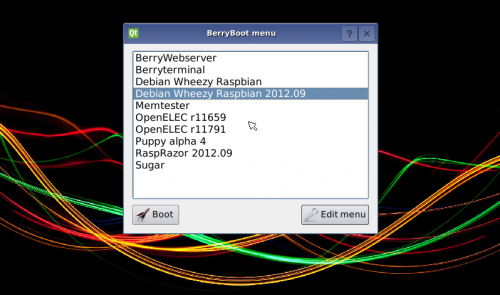

### Pasar de Lite a Desktop

Si hemos instalado la versión mínima Lite y queremos pasar a la versión desktop, para tener disponible el escritorio podemos hacer:

```sh
sudo apt update
sudo apt upgrade
sudo apt dist-upgrade
sudo apt install xserver-xorg
sudo apt install raspberrypi-ui-mods
sudo apt install lightdm
```

Esta opción no nos instala las herramientas de escritorio, que tendremos que ir instalando manualmente.

### Otros instaladores: BerryBoot

El instalador de Noobs está basado en un desarrollo previo llamado [BerryBoot](https://www.berryterminal.com/doku.php/berryboot), [proyecto opensource](https://github.com/maxnet/berryboot) que ha seguido evolucionando independientemente y que a día de hoy tiene algunas ventajas



Ventajas:

* Ocupa solo 30Mb, porque sólo es el instalador, y luego se descarga toda la imagen de internet
* Hay muchas más opciones de SOs disponibles
* Podemos hacer la instalación en la SD (lo que es lo habitual) o en otro dispositivo USB (para luego clonarlo en una SD) o en un dispositivo de red, para reutilizarlo
* Lee las señales HDMI CEC de nuestro monitor y en el arranque podemos usar el mando a distancia de nuestra TV para seleccionar el SO del que queremos arrancar
* Podemos utilizar las imágenes guardadas en un USB para hacer la instalación, siendo en este caso la instalación totalmente offline
* Se pueden clonar imágenes de la tarjeta
* Permite hacer backups de sistemas operativos
* Podemos añadir otros OS a los ya instalados
* Si no tenemos monitor instalado podemos hacer una instalación vía VNC como [nos explican aquí](https://www.berryterminal.com/doku.php/berryboot/headless_installation) sin más que añadir esta línea al fichero cmdline.txt de la tarjeta SD

```sh
vncinstall ipv4=192.168.88.88/255.255.255.0/192.168.88.1 
```

Ahora solo tenemos que arrancar un cliente VNC y apuntar a esa IP
Si queremos usar wifi sólo necesitamos añadir al fichero wpa_supplicant.conf de la tarjeta SD la información siguiente:

```
ctrl_interface=DIR=/var/run/wpa_supplicant GROUP=netdev
ap_scan=1


network={
	ssid="ssid-punto-de-acceso"
	psk="contraseña-wpa"
}
```

Podemos descargar BerryBoot de [este enlace para Raspberry Pi 4](https://downloads.sourceforge.net/project/berryboot/berryboot-20200612-pi4.zip) y [de este para las versiones anteriores](https://downloads.sourceforge.net/project/berryboot/berryboot-20190612-pi0-pi1-pi2-pi3.zip)

## Simuladores

¿Y si no tengo una Raspberry Pi?

Existen [varios emuladores](https://www.google.es/search?q=raspberry+simulator&oq=raspberry+simulator&aqs=chrome..69i57j69i65l3j69i60l2.3806j0j7&sourceid=chrome&es_sm=93&ie=UTF-8) aunque no esperes que la experiencia sea la misma....

### Simulación en windows
Desde la página [diverteka](http://www.diverteka.com/?p=66) nos explican cómo instalar el emulador de una versión antigua en windows.


* Descargamos la imagen en  [http://sourceforge.net/projects/rpiqemuwindows/](http://sourceforge.net/projects/rpiqemuwindows/)
* Emulador qemu
* Imagen (2012-07-15-wheezy-raspbian.img) o (https://downloads.raspberrypi.org/raspbian/images/2012-07-15-wheezy-raspbian/2012-07-15-wheezy-raspbian.zip)

* Ejecutamos

```
	qemu-system-arm.exe -M versatilepb -cpu arm1176 -hda imagen/2013-09-25-wheezy-raspbian.img -kernel kernel-qemu -m 192 -append "root=/dev/sda2"
```

En este [Vídeo del emulador](http://www.youtube.com/watch?feature=player_embedded&v=QvqaNUx7-pU) podemos verlo en funcionamiento

### Emuladores en otros sistemas

En diferentes foros podemos ver cómo otros usuarios usan diferentes emuladores

* Emulador [en ubuntu](http://www.cnx-software.com/2011/10/18/raspberry-pi-emulator-in-ubuntu-with-qemu/)

* [Simulando en virtualBox](https://www.raspberrypi.org/forums/viewtopic.php?f=9&t=2961)

