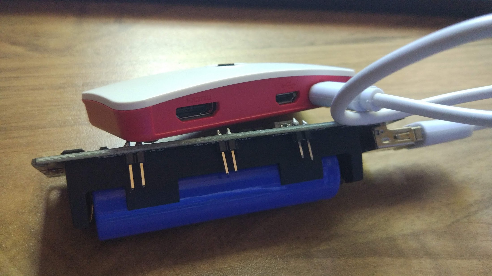

## Instalación en una Raspberry Pi Zero W 

Vamos a hacer una instalación ahora en una Raspberry Pi Zero W que vamos a utilizar para tomar fotos remotamente, con lo que normalmente no va a tener ni monitor, ni teclado conectados. Ello unido a su menor potencia nos va a llevar a usar una versión del SO sin escritorio visual, ni las aplicaciones asociadas.

Una vez conectada al Wifi, accederemos a ella vía ssh, usando terminal/consola.


1. Instalaremos Raspberry Pi OS Lite usando Imager
1. Inicialmente conectaremos un teclado y una pantalla HDMI para una primera configuración por consola.
1. Colocamos la Raspberry Pi Zero W en su caja y la cerramos con cuidado
1. Conectaremos un adaptador HDMI
1. Conectaremos el cable adaptador USB
1. Alimentamos con el cable USB de alimentación desde la batería  

Colocamos la Raspberry Pi Zero W en su caja y conectamos la alimentación y queda así de reducido



Ahora ya arracamos para hacer la configuración necesaria desde la consola:

Configuración inical:
* Cambiamos contraseña
* Configuramos Wifi
* Configuración del hostname
* Activamos ssh
* Cofiguramos idioma, zona horaria y teclado

Todo ello lo haremos usando la configuración por consola con raspi-config

```sh
sudo raspi-config
```
### Configuración de asignación de IP fija en el router

Puesto que vamos a acceder remotamente a la Raspberry, necesitamos que el router siempre nos asigne la misma dirección IP. Para ello configuraremos en la sección de DHCP la asignación de una IP dada para el MAC de nuestra Zero.

Al configurar un  hostname, si nuestro router lo permite, podremos acceder también usando el nombre.

### Resto de la configuración 

Una vez hecho esto ya podemos conectarnos por ssh
```sh
ssh pi@NombreRaspiZero
```
 y configurar el resto de opciones:

* Activamos la cámara
* Actualización del SO
* Instalamos los paquetes de python necesarios para nuestra aplicación


[](https://youtu.be/YIW2HbepDKg)

[Vídeo: Instalación y configuración desde consola de Raspberry Pi Zero W](https://youtu.be/YIW2HbepDKg)

En las instalaciones del OS versión "Lite", podemos hacer que por defecto se active el acceso ssh desde el inicio.

PAra ello basta con crear un fichero vacío llamado **"ssh"** en directorio raíz de la tarjeta y vuelve a arrancar.

### "Trucos" desde la consola

* Podemos saber la dirección ip usando el comando **ifconfig**
* Para saber la red wifi a la que estamos conectados usaremos **iwconfig**
* Podemos añadir acceso a una red wifi editando el fichero wpa_suplicant con
    ```sh
    sudo nano /etc/wpa_supplicant/wpa_supplicant.conf
    ```
    y añadiendo el siguiente texto
    ```
    network={
            ssid="ssidDelaRedjazzBajo_plus"
            psk="contraseña"
    }
    ```
* Para apagar la Raspberry usaremos **sudo halt**
* Para reiniciar **sudo reboot**
