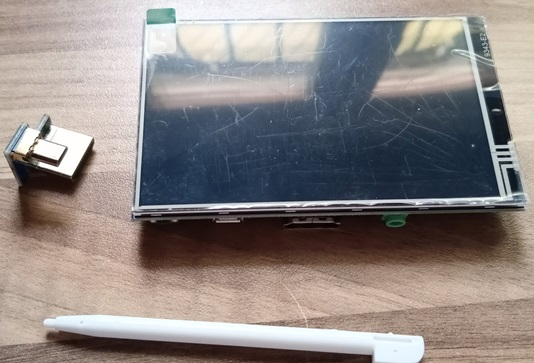
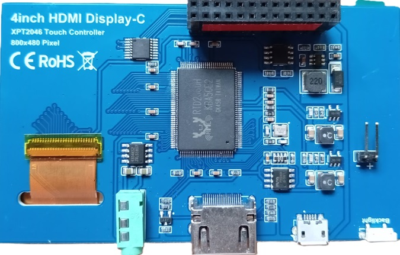
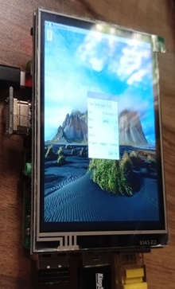
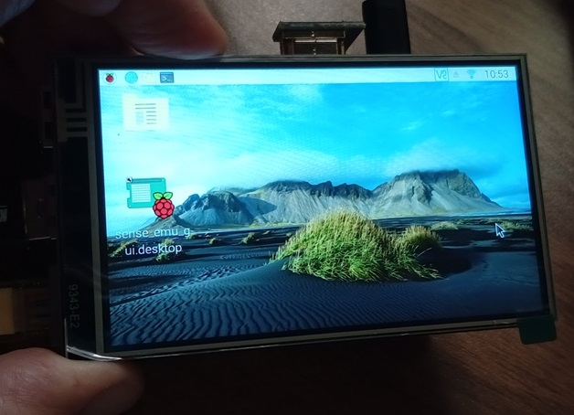
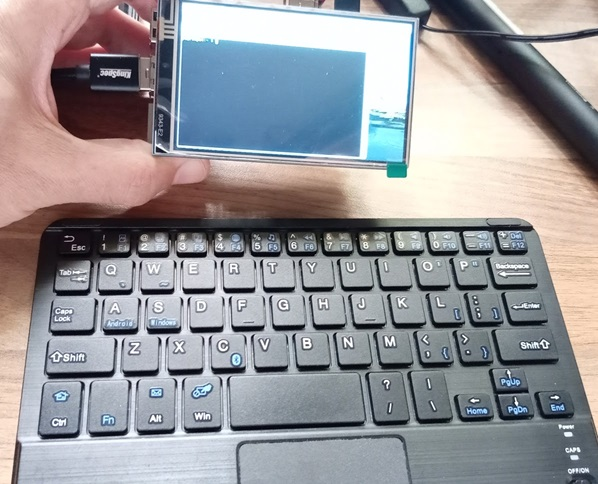
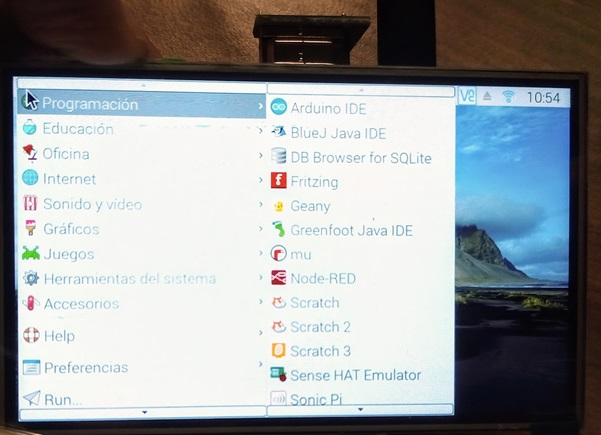
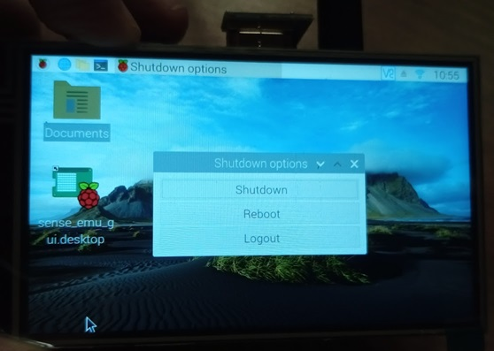
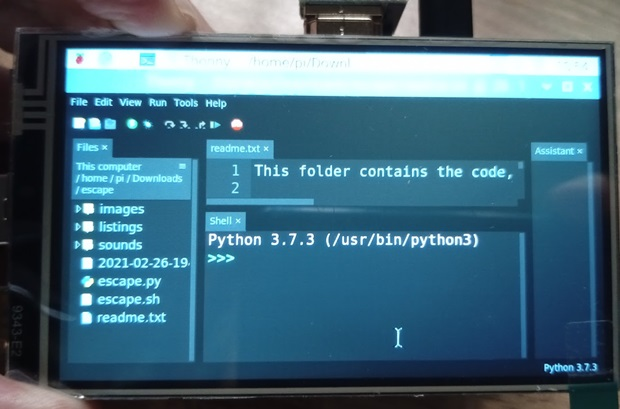

# Pantalla TFT táctil

Vamos a ver cómo podemos conectar una pantalla TFT Táctil de 4" con una resolución de 800x480, que nos sirva para hacer un sistema compacto. El tamaño de la pantalla es igual al de la Raspberry Pi, lo que lo hace muy adecuado si queremos montar todo en una caja:




La conexión se hace vía HDMI con una doble adaptador HDMI M-M (con HDMI normales los 2, o uno mini si es para Raspberry 4) y GPIO para el sensor táctil. También incluye un conector jack para la salida del audio (en la Raspberry lo configuraremos como Audio HDMI). También dispone de un conector USB por si queremos alimentarla independientemente, alimentándose por defecto por los pines 5V y GND de GPIO.




La conexión de la pantalla usa SPI con los siguientes pines GPIO:

GPIO|nombre
---|---
19|	TP_SI
21|	TP_SO
22|	TP_IRQ
23|	TP_SCK
26|	TP_CS

Esta pantalla se puede utilizar con cualquier ordenador, pero la conexión GPIO de la pantalla táctil está pensada para conectarse a una Raspberry.

## Instalación

La instalación es bastante sencilla, con la ayuda de unos scripts y la [documentación del fabricante](http://www.lcdwiki.com/4inch_HDMI_Display-C). 

Recomiendo que hagas los cambios conectado remotamente, bien por _ssh_ o por _VNC_, pero con la pantalla ya conectada y con el conector correspondiente conectando los HDMI de la pantalla y de la Raspberry.

Primero clonamos su repositorio [https://github.com/goodtft/LCD-show](https://github.com/goodtft/LCD-show) para obtener los scripts y drivers:

```sh 

git clone https://github.com/goodtft/LCD-show
```

Antes de hacer cambios, vamos a hacer una copia del fichero: "/boot/config.txt" por si quisiéramos volver a la configuración inicial:

```sh

sudo cp /boot/config.txt /boot/config_antes_cambios_TFT.txt

```
Desde el directorio "LCD-show" ejecutamos el script de instalación como administrador:

```
sudo ./MPI4008-show
```

El script instala los drivers, y configura la pantalla modificando el fichero "config.txt."

Cuando termina la instalación, reinicia la Raspberry. Al arrancar de nuevo, por defecto nos dejará la pantalla en formato vertical:



Si queremos rotarla a un formato apaisado, ejecutaremos el fichero sudo ./rotate.sh 90 que está dentro de LCD-show

```sh
sudo ./rotate.sh 90
```

También podemos rotarlo a 270, si lo preferimos.

Como hemos dicho, durante la instalación se modifica el fichero "/boot/config.txt", añadiendo líneas para configurar el correcto acceso al HDMI, activando SPI (protocolo de conexión) y configurando la rotación que hayamos elegido. En mi caso se hicieron estos cambios:

```
dtparam=spi=on      # activamos SPI
enable_uart=1
display_rotate=3    # rotación configurada
max_usb_current=1
config_hdmi_boost=7 # nivel de la señal HDMI
hdmi_group=2        # configuración de hdmi
hdmi_mode=1         
hdmi_mode=87        # Modo de vídeo específico que controla el driver
hdmi_drive=2        # Using HDMI no DVI
hdmi_cvt 480 800 60 6 0 0 0  # Resolución y frecuencia
dtoverlay=ads7846,cs=1,penirq=25,penirq_pull=2,speed=50000,keep_vref_on=0,swapxy=0,pmax=255,xohms=150,xmin
=200,xmax=3900,ymin=200,ymax=3900 # paŕametros del driver

```

## Uso

Una vez instalado y arrancada la Raspberry, comprobamos que la pantalla se ve bien y tiene una resolución adecuada para el tamaño.




Incluso un terminal es operativo, eso sí, conectando un teclado externo (bluetooth en este caso).



Los menús son fácilmente accesibles con el puntero



La mayoría de las ventanas se ajustan y adaptan bien a la pantalla, como la de apagado:



Si abrimos una aplicación como Thonny, se adapta y se puede utilizar para unos cambios rápidos.



