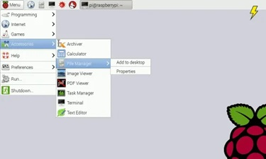

## Problemas habituales

Es frecuente encontrarnos con problemas en la instalación o en el posterior uso de nuestra Raspberry Pi. Veamos los más frecuentes y cómo se pueden resolver/evitar.

### Alimentación

Necesitamos una mínima alimentación para los diferentes modelos: 2A para la V3, 3A para V4 y 5A para la V5. Si la alimentación está por debajo de ese valor, se pueden producir cuelgues inesperados e incluso que no arranque.

El consumo depende del uso, ya que el procesador puede regular su velocidad en función de la necesidad de procesamiento de cada consumo. Por si estamos usando una aplicación que sea intensiva el consumo se va a  elevar.

Cuando la Raspberry detecta que no tiene suficiente alimentación, visualiza un icono de un rayo amarillo en la pantalla.

Es el primer aviso y deberíamos  intentar utilizar una fuente de alimentación más potente.

### Velocidad o uso de la tarjeta SD

Se recomienda una tarjeta de al menos velocidad 10, una velocidad menor da problemas como bloqueos y hasta puede que no arranque.

Con el tiempo y el uso intensivo de la tarjeta, por ejemplo una base de datos que escribe o actualiza muchos datos, la tarjeta va degradando su velocidad y puede llegar a dejar de funcionar.

Si pensamos hacer un uso intensivo del almacenamiento, mejor dejar la tarjeta SD para el sistema operativo y añadir un disco externo, SSD o USB para las otras aplicaciones.

### Espacio en disco

En las últimas versiones se recomiendan 16GB, pero mejor usar una tarjeta de 32GB (Este mensaje se vuelve obsoleto en cada nueva versión....).

### No se ve nada en el monitor

¿Lo arrancaste con el monitor conectado? Es necesario arrancar la Raspberry Pi con el monitor conectado, si la Raspberry no detecta ningún monitor en arranque, desactiva la salida de vídeo.

### Problemas típicos de acceso a la Raspberry Pi

* Si no podemos acceder remotamente a la Raspberry Pi:
	* Nos equivocamos con el nombre/dirección de la máquina. Aparece un error de "Servidor desconocido".
	* No hemos activado ssh o VNC. Aparece un error de "Conexión no autorizada".
	* No está disponible la Wifi configurada:
		* Conectamos un cable Ethernet provisional y cuando accedamos configuramos el wifi.
		* Conectamos un monitor, teclado y ratón y configuramos el wifi.
	* Suelo configurar un acceso al wifi de mi móvil  y en caso de emergencia, puedo conectar.

## ¿Se te ocurren nuevos errores? No dejes de compartirlos.

