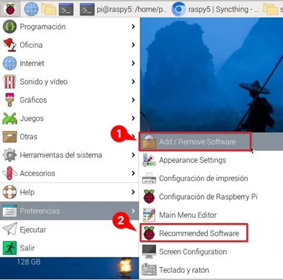
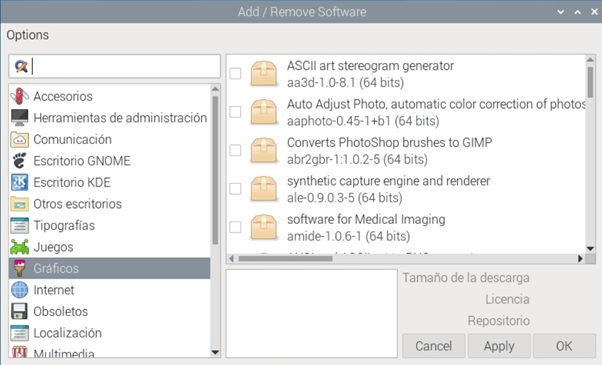
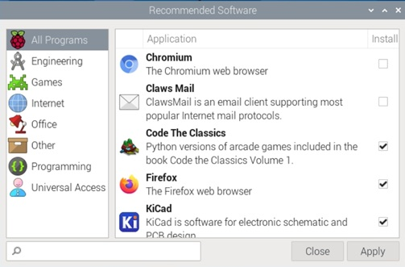

### Instalación de programas desde el escritorio

Dependiendo de la versión de Raspberry Pi OS que instalemos (Lite o Full), tendremos más o menos aplicaciones disponibles al  empezar a usar nuestra Raspberry Pi. No obstante, siempre podemos añadir o quitar programas.

Como todos los sistemas operativos basados en **Debian**, la Raspberry Pi dispone de  una lista de repositorios donde están organizados los diferentes paquetes y aplicaciones, cada uno de estos paquetes contiene información sobres las dependencias que existen entre ellos, sus versiones, así como todo lo necesario para instalarlo, configurarlo o desinstalarlo. 

Al seleccionar un paquete para su instalación, se consultará si ya se dispone de los paquetes de los que depende su funcionamiento en nuestra máquina y en caso negativo se instalarán. También se comprueba si existe algún tipo de incompatibilidad con el software existente.

Desde el escritorio podemos instalar o desinstalar aplicaciones usando cualquiera de estas dos  herramientas visuales desde el menú Preferencias. Ambas usan el mismo sistema de instalación y son compatibles al 100% entre ellas:



1. Desde la herramienta **"Add/Remove Software**"  (Añadir/Eliminar programas), tendremos acceso a una enorme cantidad de programas, podemos navegar por las diferentes categorías o buscar por el nombre del paquete.

	
2. Desde la herramienta "**Recommended Software**" (Software recomendado),  aparecen los paquetes más frecuentes, y que se instalan por defecto en la opción de instalación completa.

	


En este [vídeo](https://drive.google.com/file/d/1c_LRoSGBBeoYAdmiOQ91qIT4NKQxBLS-/view?usp=sharing) vemos cómo actualizar e instalar software para la Raspberry Pi usando las herramientas de escritorio.

[](https://drive.google.com/file/d/1c_LRoSGBBeoYAdmiOQ91qIT4NKQxBLS-/view?usp=sharing)

### Instalación de programas desde línea de comandos

También podemos instalar paquetes desde la consola. Para ello, tenemos que conocer el nombre completo y ejecutaremos el siguiente comando desde un terminal:

```sh
sudo apt install paquete
```

Más adelante, veremos con más detalle esta herramienta y cómo la podemos utilizar para actualizar el sistema.
