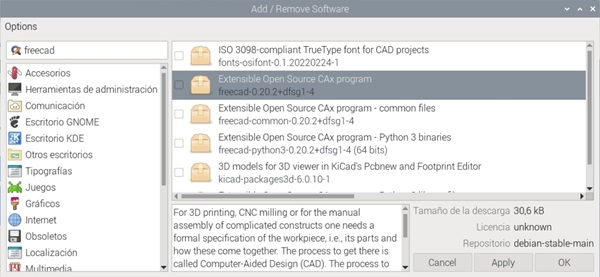
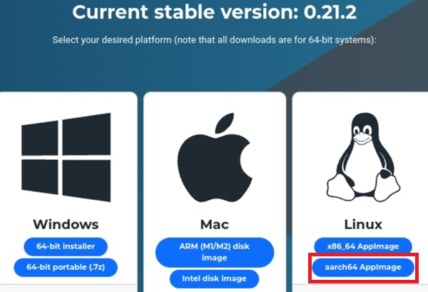
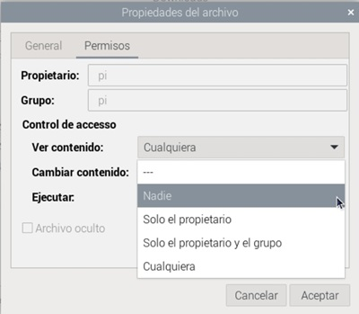

## Descarga de programas

Algunas veces, queremos instalar paquetes que no están en los repositorios oficiales o bien, dado que el mantenimiento y actualización de los repositorios de software es algo que hace el propietario del sistema operativo, y dada la cantidad de software disponible, a veces puede ocurrir que la versión que encontremos en los repositorios sea más antigua que la disponible en la página del desarrollador del programa. 

En ese caso, podemos descargar el programa e instalarlo. Debemos seleccionar la versión para nuestro sistema operativo, como hemos dicho Raspberry Pi OS deriva de __Debian__ y para nuestro tipo de procesador, ARM de 64 bits o **aarm64**.

Veamos un ejemplo. Si queremos instalar el software de diseño 3D __Freecad__ desde la herramienta de instalación de Raspberry Pi, veremos que nos aparece la versión 0.20



En cambio, en la [web del desarrollador](https://freecad.org), vemos la versión 0.21.2. Podemos descargar el paquete eligiendo la versión para **aarch64** (para la plataforma ARM 64 bits), y usarlo en nuestra Raspberry Pi. 



Vemos que en este caso se trata de un paquete  "appimage",  un formato que incluye el ejecutable, librerías y todo lo necesario. No requiere instalación, con lo que tras descargarlo, podemos usarlo directamente tras añadirle el permiso de ejecución. 



Otra forma de descargar programas es utilizando el fichero instalable con extensión **deb**. Tras descargar el fichero adecuado para la plataforma **Aarm64**, lo instalaremos usando el siguiente comando, suponiendo que lo tenemos descargado en la carpeta **Descargas**.

```sh
sudo apt install -i paquete_aarm64.deb
```

Más adelante, veremos con más detalle cómo usar el comando **apt** 
