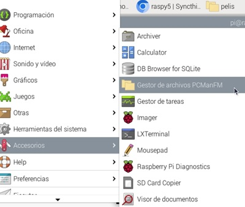
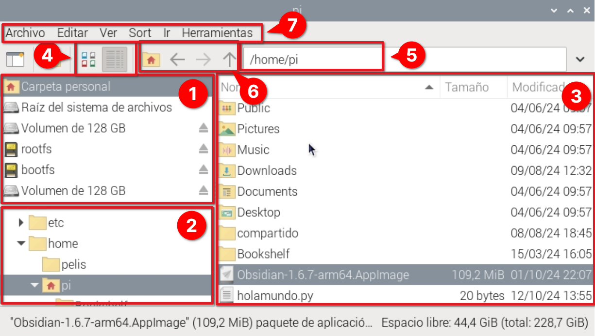
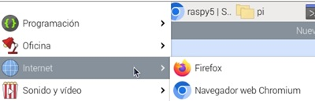
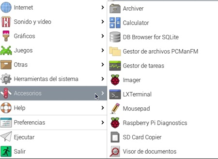
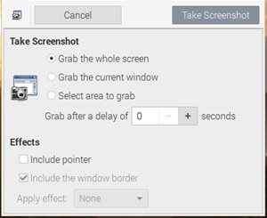

## Manejando tu Raspberry Pi

Vamos a ver cómo manejar alguno de los programas más habituales de Raspberry Pi OS.

### Administrando ficheros

Para trabajar con nuestros ficheros usaremos la aplicación "Gestor de archivos PCManFM" en el menú Accesorios.



Al abrirlo, encontramos la típica aplicación de gestión de ficheros:



Veamos algunas de las partes:

1. Panel con los volúmenes o particiones disponibles y los marcadores (directorios marcados como favoritos).
2. Vista en árbol de la estructura de directorios
3. Panel con el contenido de la carpeta seleccionada. Podemos reordenar el contenido  tocando en la cabecera de las columnas.
4. Podemos usar estos iconos para ver gráficamente el contenido de la carpeta o los detalles en forma de lista.
5. Directorio que estamos viendo, podemos editar su contenido para movernos a otra carpeta.
6. Podemos ir a nuestra carpeta personal (carpeta "home"), o al anterior o al directorio que contiene al actual.
7.  Desde el menú podemos crear directorios, archivos, movernos a las carpetas más frecuentes, copiar y pegar,....

Si conectamos un dispositivo de almacenamiento externo,  un pendrive o un disco duro USB, nos aparecerá en el panel 1 que hemos visto antes. Si pulsamos sobre su nombre accederemos a su contenido. Por defecto, los dispositivos se aparecen como si colgaran de la carpeta **/media/pi/DISPOSITIVO**. Para desconectarlos, pulsamos en el botón de expulsar que aparece a la derecha del nombre en el panel 1.
### Navegador Web

En el menú "Internet" tenemos disponible el navegador Chromium, la versión de código abierto 100% del navegador Chrome . También podemos instalar Firefox



### Accesorios

En el menú "Accesorios", vamos a encontrar muchas aplicaciones útiles:




* **Archiver** para Comprimir/extraer ficheros.
* **Calculator**: una calculadora.
* **Gestor de tareas**: nos permite ver los procesos en ejecución, así como su consumo de memoria CPU, ... Además si pulsamos sobre uno de los procesos, los podemos detener (pausa), finalizar o cambiarles la prioridad.

	

* **RPI Imager**: programa que usamos para instalar el sistema operativo en dispositivos extraíbles.
* **LXTerminal**: terminal/consola que nos permite ejecutar comandos y conectarnos remotamente con otros equipos usando **ssh**.
* **Mousepad**: un aparentemente sencillo editor de texto que nos permite crear documentos en muchos formatos.
* **Raspberry Pi Diagnostics**: realiza un test de rendimiento sobre una tarjeta recién formateada.
* **SD Card Copier**: nos permite realizar copias de tarjetas SD, muy útil para clonar tarjetas una vez que tengamos una instalación operativa.
* **Visor de documentos**: nos permite ver los ficheros en diferentes formatos, como por ejemplo PDFs.

Por supuesto que podemos instalar más programas como el "Visor de base de datos" que aparece en la imagen.

### Capturas de la pantalla

Podemos hacer capturas del escritorio usando la tecla **Imprimir Pantalla** si nuestro teclado la tiene o bien usando el comando **Scrot**, que pondrá un fichero con la captura en directorio home del usuario (/home/pi por defecto) con un nombre dado por la fecha, hora y resolución. Por ejemplo "2021-02-26-194221_1024x768_scrot.png".

Podemos hacer que la captura se haga después de un determinado retardo, usando la opción **-d**. Por ejemplo para hacer la captura a los 10 segundos: 

```sh
scrot -d 10
```

También podemos darle un nombre concreto al fichero resultado al usar el comando:

```sh
scrot ficheroCaptura.png
```

Si necesitamos más opciones, podemos instalar un programa como **Gnome Screenshot** que nos dará más opciones. Lo instalaremos como siempre con:

```sh
sudo apt install gnome-screenshot
```
Y aparecerá en el menú de "Accesorios".

Nos permitirá capturar todo el escritorio, una ventana, una zona, definiendo un determinado retardo. También nos permite tras hacer la captura, seleccionar el nombre y la carpeta del fichero, o si queremos que se copie la imagen en el clipboard.



### Hacer cálculos con Mathematica

Hay una versión gratuita (para uso no comercial) de Wolfram  Mathematica, instalada por defecto en Raspbian.


[](https://drive.google.com/file/d/1oXjMaNmL4gpaTHPePZYbIb6_lRsAGODi/view?usp=sharing)


[Vídeo: Trabajando con Mathematica en Raspberry](https://drive.google.com/file/d/1oXjMaNmL4gpaTHPePZYbIb6_lRsAGODi/view?usp=sharing)

