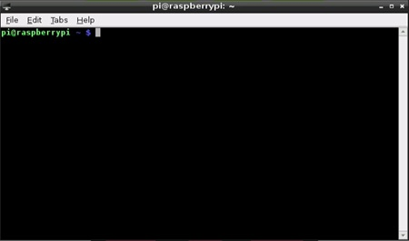

### Consola (línea de comandos)

Podemos hacer casi todo desde el habitual entorno gráfico, pero también desde el terminal o la consola, podemos ejecutar programas y tareas, por eso también la llamamos, línea de comandos.

Si te acostumbras a usarla, verás que ganas en productividad y además verás que puedes automatizar muchas tareas. 



#### Comandos básicos:

Como ya hemos dicho, Raspberry Pi OS es una versión de [Linux](https://es.wikipedia.org/wiki/GNU/Linux), que no es más que una versión moderna del sistema operativo [Unix](https://es.wikipedia.org/wiki/Unix). Por esto tenemos acceso a los comandos de esos sistemas operativos.

Como todos los sistemas operativos modernos, Linux está diseñado teniendo en cuenta la seguridad. Por ello, un usuario por defecto, sólo puede acceder y modificar sus propios archivos. Tampoco podrá modificar la configuración del sistema.

Veamos algunos de los comandos más utilizados:

* La tecla _Tabulador_ nos permite completar el nombre del fichero/directorio.
* Las teclas _Flecha Arriba_ y _Flecha Abajo_, permiten recuperar los comandos ya utilizados para volver a ejecutarlos y si es necesario, editarlos.
* **ls** : muestra los archivos y directorios ( **ls -l** para más detalles y **ls -a** para mostrar todos).
* **cd** : cambia de directorio (**cd ~** nos lleva a nuestro directorio home y **cd ..** sale del directorio actual).
* **chmod** : cambia los permisos de un fichero/directorio (**chmod ugo-w fichero** quita todos los permisos de escritura).
* **pwd** : nos dice el directorio actual.
* **mv** : mueve directorios/ficheros a un nuevo destino.
* **rm** : borra directorios/ficheros.
* **mkdir** : crea un directorio.
* **passwd** : cambia la contraseña del usuario actual.
* **ps -ef** : muestra los procesos en ejecución.
* **top** : administrador de tareas.
* **clear** : borra todo el contenido del terminal.
* **df** : muestra el % de disco ocupado.
* **nano** : editor de texto básico.
* **vi** : editor de texto avanzado pero complejo.
* **du** : muestra lo que ocupa un directorio (**du -s * ** muestra lo que ocupa un directorio y todo lo que contiene).
* **ifconfig**: muestra la configuración actual de la red, con sus IPs y las direcciones MAC.
* **history** : muestra todos los comandos que se han ejecutado antes. Podemos ejecutar el comando de la posición **n**, con **!n** . Las teclas abajo/arriba del cursor nos permiten iterar por los comandos usados.
* **man comando**: Para obtener ayuda sobre comando.
* Para hacer fichero ejecutable ejecutamos el comando, **chmod u+x fichero** y para ejecutarlo,**./fichero**.

Cuando queremos usar algún comando sobre un archivo que no es nuestro o el propio comando intenta modificar la configuración del sistema, tendremos que anteponer al comando la palabra **sudo** (que quiere decir que la vamos a ejecutar como si fuéramos administrador). 

* **sudo halt** apaga la Raspberry Pi.
* **sudo shutdown -h now** apaga la Raspberry Pi.
* **sudo reboot** reinicia la Raspberry Pi.

[](https://drive.google.com/file/d/1a2UjGmzv0XXMpadJ1iItbat_ibDuG6Sl/view?usp=sharing)

[Vídeo: Uso del terminal y comandos Linux en Raspberry Pi](https://drive.google.com/file/d/1a2UjGmzv0XXMpadJ1iItbat_ibDuG6Sl/view?usp=sharing)


### Sistema de permisos en Linux

Veamos en detalle el sistema de permisos de ficheros en Linux:

1. Estructura Básica de Permisos: Cada archivo y directorio tiene tres grupos de permisos:
	  - Usuario propietario (u).
	  - Grupo propietario (g).
	  - Otros usuarios (o).

2. Tipos de Permisos Básicos y su valor numérico:
```bash
	r (read/lectura)    = 4
	w (write/escritura) = 2
	x (execute/ejecutar) = 1
```

3. Podemos visualizar los Permisos:
```bash
	ls -l archivo.txt
	-rw-r--r-- 1 usuario grupo 1234 Oct 27 10:00 archivo.txt
```

Veamos el desglose del formato:
```
	- rw- r-- r--
	│ │   │   └── Permisos para otros.
	│ │   └────── Permisos para grupo.
	│ └────────── Permisos para usuario.
	└──────────── Tipo de archivo (- archivo, d directorio).
```

4. Comandos principales para gestionar permisos:

**chmod** (Change Mode):
```bash
	# Formato numérico
	chmod 755 archivo.txt  # rwxr-xr-x
	chmod 644 archivo.txt  # rw-r--r--
	
	# Formato simbólico
	chmod u+x archivo.txt  # Añade ejecución al usuario
	chmod g-w archivo.txt  # Quita escritura al grupo
	chmod o=r archivo.txt  # Establece solo lectura para otros
```

El comando **chown** (Change Owner), nos permite cambiar el propietario de un fichero:
```bash
	# Cambiar propietario
	chown usuario archivo.txt
	
	# Cambiar propietario y grupo
	chown usuario:grupo archivo.txt
```

El comando **chgrp** (Change Group), permite cambiar el grupo al que pertenece el fichero:
```bash
	# Cambiar solo el grupo
	chgrp grupo archivo.txt
```

5. Existen algunos Permisos Especiales :

	SUID (Set User ID) = 4000
```bash
	chmod u+s archivo  # El archivo se ejecuta con los permisos del propietario
```

	SGID (Set Group ID) = 2000
```bash
	chmod g+s directorio  # Los nuevos archivos heredan el grupo del directorio
```

	Sticky Bit = 1000
```bash
	chmod +t directorio  # Solo el propietario puede borrar archivos
```

6. Casos comunes de uso:
```bash
	chmod 755 script.sh  # rwxr-xr-x Hacer un archivos ejecutable
```

```bash
	chmod 644 config.txt  # rw-r--r-- Archivo de configuración
```
Los archivos de configuración suelen tener estos permisos (cualquier puede leerlos pero solo los modifica el root):
```bash
	chmod 600 id_rsa  # rw------- Archivos privados, sólo los lee y escribe el propietario
```

7. Ejemplos prácticos:

* Veamos cómo crear un fichero script ejecutable:
```bash
	# 1. Crear archivo
	touch script.sh
	
	# 2. Hacerlo ejecutable
	chmod u+x script.sh
	
	# 3. Verificar permisos
	ls -l script.sh
```

* Proteger archivo de configuración:
```bash
	# Solo lectura para grupo y otros
	chmod 644 config.conf
	
	# Verificar
	ls -l config.conf
```

8. Recomendaciones de seguridad:

	- Usa el principio de mínimo privilegio.
	- Evita dar permisos 777 (todos los permisos a todos).
	- Revisa regularmente los permisos de archivos sensibles.
	- Ten cuidado con los permisos especiales (SUID, SGID).

9. Herramientas útiles:

```bash
	# Encontrar archivos con permisos específicos
	find /ruta -perm 777
	
	# Cambiar permisos recursivamente
	chmod -R 755 directorio
	
	# Ver permisos en formato octal
	stat -c "%a %n" archivo
```

10. Usos comunes según tipo de archivo:

	- Scripts: 755 (rwxr-xr-x)
	- Archivos de texto: 644 (rw-r--r--)
	- Directorios: 755 (rwxr-xr-x)
	- Archivos privados: 600 (rw-------)
	- Archivos compartidos: 664 (rw-rw-r--)
#### Estructura de directorios y ficheros

Algunas características de sistema de fichero de Linux:

* Usa un formato de partición ext4 (también existen aunque en desuso el ext3 y el ext2), aunque permite usar FAT, el típico sistema de archivos de Windows.
* El árbol de directorios tiene un único directorio raíz del que cuelga todo. Todos los dispositivos (pendrives, discos externos, discos de red) se integran dentro de este árbol, montando su raíz en un directorio determinado (montamos y desmontamos con __mount__ y __umonut__ ).

El usuario sólo tiene acceso a su directorio y solo el administrador (**root**), puede acceder al resto de directorios.

##### Algunos directorios

* **/** directorio raíz.
* **/etc** configuración.
* **/home** usuario.
* **/usr** programas para usuarios.
* **/usr/share** recursos de programas (imágenes, traducciones).
* **/usr/share/doc** documentación.
* **/bin** ejecutables del sistema.
* **/lib** librerías.
* **/boot** Arranque del sistema.
* **/usr/bin** ejecutables para usuarios.
* **/media** o **/mnt** punto de montaje de dispositivos de almacenamiento externo.


#### Usuarios

El usuario es "**pi**", con contraseña "**raspberry**" por defecto, pero podemos y debemos cambiarla en la configuración inicial con RPI-Imager.

#### Cuidado con sudo

Los usuarios normales pueden hacer muchas cosas, pero las tareas más importantes (y por tanto peligrosas si se hacen mal), como pueden ser la configuración o borrado de ficheros críticos, no están permitidas.

Esas tareas sólo las puede hacer el usuario administrador, llamado **root**, que puede hacer cualquier cosa. 

Como hay veces que un usuario necesita hacer alguna de estas tareas, por ejemplo editar un fichero de configuración, podemos solicitar permisos para hacer esa tarea anteponiendo al comando la palabra "sudo". Algunas acciones nos pedirán que introduzcamos el password de nuestro usuario como medida de seguridad.	

Por ejemplo, si queremos editar un fichero de la carpeta de configuración **etc** llamado **ftab**, haremos:

```sh
sudo geany /etc/fstab
```
	
_geany_ es el editor de ficheros de texto y al usar "sudo", estamos pidiendo permiso para hacer algo como root.

Esto nos sirve para ver que podemos abrir aplicaciones de escritorio desde la consola.

Si en un momento dado, necesitamos hacer muchas tareas como root, podemos abrir una consola con este usuario haciendo:

```sh
sudo su -
```

Pero mucho cuidado que esto nos da todo el poder del usuario administrador(**root**) y por tanto, toda la responsabilidad.
