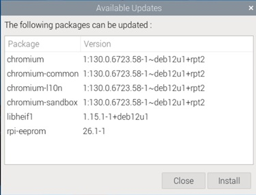

## Mantenimiento

Una vez instalado el sistema, necesitamos de vez en cuando actualizarlo. Veamos cómo hacerlo.

El sistema periódicamente comprueba si hay actualizaciones, y si es así aparecerá un icono arriba a la derecha.  

Si lo pulsamos, podemos ver las actualizaciones pendientes o hacer que estas se instalen.




### Actualización (update)

Desde un terminal/consola tecleamos lo siguiente:

Para buscar cambios en los repositorios:

```sh
sudo apt update
```

Para instalar estos cambios:

```sh
sudo apt upgrade
```

Para actualizar el sistema, no sólo actualizando los paquetes:

```sh
sudo apt dist-upgrade
```

Para actualizar a una nueva distribución (si está disponible):

```sh
sudo apt full-upgrade
```

Para instalar un paquete determinado, haremos lo siguiente:

```sh
sudo apt install paquete
```

Vemos como en todos los comandos utilizamos la palabra "sudo", esto es debido a que se necesitan privilegios de administrador para todo lo relacionado con la actualización del sistema.

[](https://drive.google.com/file/d/1tWwCM229eJSLx0h_iZxk-3A7VHJu2jYr/view?usp=sharing)

[Vídeo: Actualizar e instalar software desde terminal en Raspberry Pi](https://drive.google.com/file/d/1tWwCM229eJSLx0h_iZxk-3A7VHJu2jYr/view?usp=sharing)

### Eliminación de paquetes obsoletos

Con la instalación y actualización de los paquetes a lo largo del tiempo, algunas de las dependencias se quedan obsoletas e incluso algunos de los paquetes, puede que ya no sean necesarios. 

Por eso es necesario que cada cierto tiempo, eliminemos los paquetes  "huérfanos" que ya no se necesitan por el sistema, haciendo:

```sh
sudo apt autoremove
```

También podemos hacer:

```sh
sudo apt autoclean
```

Para eliminar los paquetes que ya quedaron obsoletos.

#### Actualización de los distintos firmwares

Los diferentes componentes de la Raspberry Pi necesitan de varios firmwares para funcionar, que también conviene tener actualizados. Podemos actualizarlos con:

```sh
sudo rpi-update
```

Hay que tener **cuidado con este comando**: si actualizamos un firmware pero el sistema operativo no lo está, y por tanto, espera encontrar una versión anterior del firmware, podemos encontrarnos con que nuestra Raspberry Pi, se queda completamente bloqueada.

A veces, puede ocurrir que nos encontremos con que un cambio nos da algún problema que antes no teníamos. En ese caso, podemos volver a la versión anterior estable, haciendo lo siguiente:

```sh
sudo apt-get update
sudo apt-get install --reinstall libraspberrypi0 libraspberrypi-{bin,dev,doc} raspberrypi-bootloader
sudo reboot
```

#### Actualización de una versión a la siguiente

Aunque es conveniente que cuando salga una nueva versión hagamos una instalación desde cero, a veces tenemos muchas aplicaciones instaladas o mucha información del usuario que nos llevaría mucho tiempo extraer y luego volver a copiar/instalar. En ese caso, nos podemos plantear hacer una actualización de una versión a otra.

Vamos a ver un ejemplo de cómo actualizar de una versión del SO a la siguiente. En este caso particular, cómo pasar de "Stretch" a "Buster".

1. Modificamos la versión a la que apuntan los repositorios de 'stretch' a 'buster'. Podemos hacerlo cambiando a mano el ficheros **/etc/apt/sources.list** y **/etc/apt/sources.list.d/raspi.list** o con un comando como el siguiente:

    ```sh
    grep -rl stretch /etc/apt/ | sudo xargs sed -i 's/stretch/buster/g'
    ```

2. Actualizamos el sistema completamente:

    ```sh
    sudo apt update
    sudo apt dist-upgrade
    sudo apt full-upgrade
    ```

3. Actualizamos los firmwares:

    ```sh
    sudo rpi-update
    ```

4. Quitamos aplicaciones que ya no están en buster:

    ```sh
    sudo apt purge timidity lxmusic gnome-disk-utility deluge-gtk evince wicd wicd-gtk clipit usermode gucharmap gnome-system-tools pavucontrol
    ```

5. Ahora, actualizamos el aspecto con la nueva configuración visual abriendo ‘Appearance Settings’ y en la pestaña ‘Defaults’, pulsamos ‘Set Defaults’, lo que debería ponernos un tamaño de fuente y de iconos, acorde a la resolución usada.

Podemos hacer este cambio entre diferentes versiones con sólo cambiar los nombres de las versiones.

#### Instalación de paquetes a partir del código fuente

* Descargamos el código fuente (normalmente comprimido).
* Lo descomprimimos con:
```sh
unzip codigo_fuente.zip
```
ó
```sh
tar xvf codigo_fuente.tgz
```
(según el formato en el que esté comprimido).

Dentro del directorio del código ya descomprimido, normalmente encontramos un fichero README o INSTALL que nos dará las instrucciones, que suelen ser muy parecidas a estas:

1. Preparan el código para que compile en nuestro sistema y además, comprueban que tengamos las herramientas y librerías necesarias con:
	```sh
	cmake .
	```
	ó
	```sh 
	configure 
	```
2. Compila el código y generamos un ejecutable:
	```sh
	make
	```
3. Lo instalamos en el sistema (por eso necesitamos usar sudo).
	```sh
	sudo make install
	```
