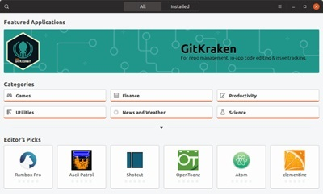
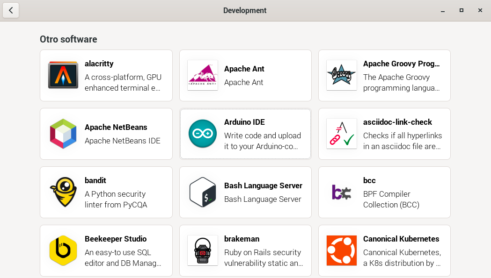

#### Tienda de aplicaciones Snap

A veces encontramos que algunos paquetes no están disponibles o al menos, no en su versión más moderna. Para ello, podemos instalar "Tiendas" alternativas a la oficial de RaspberryPi.org, que suele tener los paquetes más actualizados.

Una de estas tiendas es SNAP de Canonical, la empresa creadora de Ubuntu. Podemos instalarla de forma sencilla (a fin de cuentas es una aplicación que enlaza con los repositorios).




#### Ventajas de usar SNAP

Existen varias ventajas al usar la tienda de aplicaciones Snap:

**Facilidad de instalación y uso:**

- Las aplicaciones Snap se empaquetan con todas sus dependencias (o paquetes que necesitan para funcionar), lo que las hace fáciles de instalar y usar. No es necesario buscar e instalar bibliotecas adicionales, lo que puede ahorrar tiempo y esfuerzo.
- La instalación de aplicaciones Snap es tan simple como hacer clic en un botón. Una vez que se instala una aplicación, está lista para usar.
- Las aplicaciones Snap se actualizan automáticamente, lo que te garantiza que siempre tengas la última versión.

**Aislamiento y seguridad:**

- Las aplicaciones Snap se ejecutan en entornos aislados, lo que significa que no pueden interferir con otras aplicaciones o con el sistema operativo. Esto ayuda a mejorar la seguridad y la estabilidad del sistema.
- Las aplicaciones Snap solo tienen acceso a los recursos que les concedes explícitamente. Esto ayuda a proteger tu privacidad y tus datos.

**Mayor disponibilidad de software:**

- La tienda de aplicaciones Snap ofrece una amplia gama de aplicaciones, que incluyen tanto aplicaciones populares como software de nicho (o de temas específicos).
- Se agregan nuevas aplicaciones a la tienda Snap todo el tiempo, por lo que siempre hay algo nuevo que descubrir.

**Compatibilidad:**

- Las aplicaciones Snap son compatibles con una amplia gama de distribuciones de Linux.
- Esto significa que puedes usar las mismas aplicaciones Snap en tu computadora de escritorio, tu portátil o tu servidor.

**Otras ventajas:**

- Las aplicaciones Snap son generalmente más pequeñas que las aplicaciones tradicionales, lo que significa que ocupan menos espacio en tu disco duro.
- Las aplicaciones Snap se descargan e instalan rápidamente, incluso en conexiones de red lentas.
- Puedes desinstalar fácilmente las aplicaciones Snap, si ya no las necesitas.

En general, la tienda de aplicaciones Snap ofrece una manera conveniente, segura y fácil de instalar y usar software en Linux. Si estás buscando una forma de simplificar tu experiencia de software de Linux, te recomiendo que le des una oportunidad a Snap.

Aquí hay algunos recursos adicionales donde puedes aprender más sobre Snap:

- [https://shop.snapon.com/](https://shop.snapon.com/)
- [https://www.youtube.com/watch?v=yGh5XWrSUsI](https://www.youtube.com/watch?v=yGh5XWrSUsI)
- [https://snapcraft.io/docs/installing-snap-on-ubuntu](https://snapcraft.io/docs/installing-snap-on-ubuntu)

#### Desventajas de usar SNAP

A pesar de las ventajas que mencioné anteriormente, también existen algunas desventajas a considerar al usar la tienda de aplicaciones Snap:

**Potencial impacto en el rendimiento:**

- Las aplicaciones Snap pueden tener un impacto leve en el rendimiento del sistema, ya que se ejecutan en entornos aislados.
- Este impacto suele ser mínimo, pero puede ser más notorio en sistemas con recursos limitados.

**Preocupaciones de privacidad:**

- Si bien las aplicaciones Snap están diseñadas para ser seguras, algunas personas pueden tener preocupaciones sobre la recopilación de datos por parte de Snap.
- Snap recopila algunos datos de uso anónimos para mejorar la tienda de aplicaciones y los servicios.
- Si te preocupa la privacidad, es importante leer la política de privacidad de Snap antes de usar la tienda de aplicaciones.

**Compatibilidad:**

- Si bien la compatibilidad de Snap ha mejorado significativamente en los últimos años, todavía no todas las aplicaciones están disponibles como Snaps.
- Esto significa que es posible que aún debas usar métodos tradicionales para instalar algunas aplicaciones.

**Dependencia de Snap:**

- Si te acostumbras a usar Snap, es posible que te vuelvas dependiente de la plataforma.
- Esto puede dificultar el cambio a otra distribución de Linux o sistema operativo en el futuro.

**Soporte a largo plazo:**

- Snap es una tecnología relativamente nueva y aún no está claro si tendrá un soporte a largo plazo.
- Si inviertes mucho en aplicaciones Snap, existe el riesgo de que la plataforma se discontinúe en el futuro.

En general, las desventajas de usar Snap son relativamente menores en comparación con las ventajas. Sin embargo, es importante ser consciente de estas limitaciones antes de decidir si usarla o no.

Al final, la decisión es personal. Depende de tus necesidades, preferencias y nivel de tolerancia al riesgo. Si valoras la facilidad de uso, la seguridad y la amplia disponibilidad de software, entonces Snap puede ser una buena opción para ti. Sin embargo, si te preocupa el rendimiento, la privacidad o la compatibilidad, es posible que desees considerar otras opciones.

#### Instalación de Snap

Para instalar la tienda de aplicaciones Snap, tenemos que:

* Instalar el servicio snapd:
```sh
sudo apt update
sudo apt upgrade
sudo apt install snapd
```
* Rearrancar
```bash
sudo reboot 
```
* Instalar el paquete base de snap
```bash
sudo snap install core
```
* Instalar la tienda snap
```bash
sudo snap install snap-store
```
* Abrimos la tienda, desde el menú "Preferencias" y ya podemos instalar el software que queramos:

	
	Si buscamos en el apartado de desarrollo, veremos que por ejemplo Arduino es la misma versión.

	