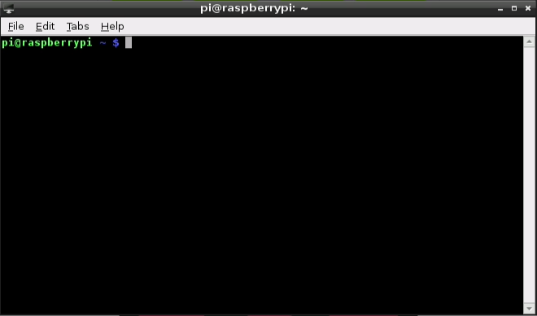

## Manejando tu Raspberry Pi

Como sabes es una máquina Linux, con lo que podrás manejarla igual que se maneja cualquier otra máquina Linux

### Consola (línea de comandos)

Podemos hacer casi todo desde el habitual entorno gráfico, pero también desde el terminal o la consola, también llamada líneas de comandos.

Si te acostumbras a usarla verás que ganas en productividad y además verás que puedes automatizar muchas tareas. 

#### Comandos básicos:

[Vídeo: Uso del terminal y comandos Linux en Raspberry Pi](https://youtu.be/BF0Kjb4g454)

Como ya hemos dicho, Raspbian es una versión de [Linux](https://es.wikipedia.org/wiki/GNU/Linux), que nos más que una versión moderna del sistema operativo [Unix](https://es.wikipedia.org/wiki/Unix). Por esto tenemos acceso a los comandos de esos sistemas operativos.

Veamos algunos de los comandos más utilizados:

* La tecla Tabulador nos permite completar el nombre del fichero/directorio
* **ls** : muestra los archivos y directorios ( **ls -l** para más detalles y **ls -a** para mostrar todos)
* **cd** : cambia de directorio (**cd ~** nos lleva a nuestro directorio home y **cd ..** sale del directorio actual)
* **chmod** : cambia los permisos de un fichero/directorio (**chmod ugo-w fichero** quita todos los permisos de escritura)
* **pwd** : nos dice el directorio actual
* **mv** : mueve directorios/ficheros a un nuevo destino
* **rm** : borra directorios/ficheros
* **mkdir** : crea un directorio
* **passwd** : cambia la contraseña del usuario actual
* **ps -ef** : muestra los procesos en ejecución
* **top** : administrador de tareas
* **clear** : borra todo el contenido del terminal
* **df** : muestra el % de disco ocupado
* **nano** : editor de texto básico
* **vi** : editor de texto avanzado pero complejo
* **du** : muestra lo que ocupa un directorio (**du -s *** muestra lo que ocupa un directorio y todo lo que contiene)
* **sudo halt** apaga la raspberry
* **sudo shutdown -h now** apaga la raspberry
* **history** : muestra todos los comandos que se han ejecutado antes. Podemos ejecutar el comando de la posición n, con !n . Las teclas abajo/arriba del cursor nos permiten iterar por los comandos usados.
* **man comando**: Para obtener ayuda sobre comando
* Para hacer fichero script: añadimos los comandos, chmod u+x fichero y para ejecutarlo ./fichero

#### Estructura de ficheros

Algunas características de sistema de fichero de linux

* Usa un formato de partición ext4 (también existen aunque en desuso el ext3 y el ext2), aunque permite usar FAT
* El árbol de directorios tiene un único directorio raíz del que cuelga todo. Todos los dispositivos (pen drives, discos externos, discos de red) se integran dentro de este árbol, **montando** su raiz en un directorio determinado (montamos y desmontamos con __mount__ y __unmonut__ )

El usuario sólo acceso a su directorio y el solo el administrador (**root**) puede acceder al resto de directorios

##### Algunos directorios

* / raiz
* /etc configuración
* /home usuario
* /usr programas para usuarios
* /usr/share recursos de programas (imágenes, traducciones)
* /usr/share/doc documentación
* /bin ejecutables del sistema
* /lib librerías
* /boot Arranque del sistema
* /usr/bin ejecutables para usuarios

#### Usuarios

El usuario por defecto es "**pi**" con contraseña "**raspberry**" por defecto

#### Cuidado con sudo

Los usuarios normales pueden hacer muchas cosas, pero las tareas más importantes (y por tanto peligrosas si se hacen mal), como pueden ser la configuración o borrado de ficheros críticos no están permitidas.

Esas tareas sólo las puede hacer el usuario administrador, llamado **root**, que puede hacer cualquier cosa. 

Como hay veces que un usuario necesita hacer alguna de estas tareas, por ejemplo editar un fichero de configuración, podemos solicitar permisos para hacer esa tarea anteponiento al comando la palabra "sudo". Algunas acciones nos pedirán que introduzcamos el password de nuestro usuario como medida de seguridad.	

Por ejemplo si queremos editar un fichero de la carpeta de configuración etc llamado ftab, haremos

	sudo geany /etc/fstab
	
geany es el editor de ficheros de texto, y al usar "sudo" estamos pidiendo permiso para hacer algo como root

Esto nos sirve para ver que podemos abrir aplicaciones de escritorio desde la consola.

Nos da todo el poder del usuario administrador (**root**)

### Interface gráfico

Para arrancar el interface gráfico desde consola si no está arrancado usando

		startx

### Acceso remoto

Algo muy frecuente es que queramos acceder a nuestra Raspberry Pi remotamente, es decir sin un teclado ni monitor conectado directamente. Evidentemente necesitamos tener un SO instalado y habilitar el acceso remoto. Veamos algunas de las formas de hacerlo.

### SSH (vía consola)

[Vídeo: Conexión vía SSH a Raspberry Pi](https://youtu.be/-BH3spberkc)

SSH es el protocolo de acceso por consola

Tenemos que activarlo en la configuración para poder acceder desde fuera.Entramos en la configuración avanzada

	sudo raspi-config

Podemos hacerlo también por comandos con

	sudo service ssh start
	sudo insserv ssh

Ahora podremos conectarnos remotamente con ssh

	ssh pi@192.189.0.123

O bien usando algún software como [Putty](http://www.chiark.greenend.org.uk/~sgtatham/putty/download.html)

Conviene cambiar la contraseña para evitar que cualquiera pueda acceder

TODO: FICHERO ssh.md

### VNC

VNC es un protocolo que nos permite acceder remotamente al escritorio de otra máquina.

En las nuevas versiones de Raspbian podemos activar VNC desde la configuración (o desde raspi-config).

Si no está disponible podemos instalarlo en nuestra Raspberry de manera sencilla con:

	sudo apt-get install tightvncserver

Este software requiere que un servicio se ejecute al arrancar si queremos acceder en cualquier momento. Podemos instalarlo añadiendo la siguiente línea al archivo **/etc/rc.local**

	su -c "/usr/bin/tightvncserver :1 -geometry 800x600 -depth 16" pi

Ahora accederemos usando un cliente vnc, como por ejemplo [VNC Viewer](https://www.realvnc.com/es/connect/download/viewer/) de RealVNC. Si nos creamos una cuenta en RealVNC podremos acceder desde cualquier parte, incluso desde internet, sorteando nuestro router.

Existen clientes de VNC para teléfonos móviles y tabletas, lo que nos da muchas posibilidades

La conexión por VNC nos permite acceder como si estuvieramos conectados directamente

### Acceso directo

Vamos a configurar nuestra raspberry y un portátil con Ubuntu para facilitar al máximo la conexión y así no tener que utilizar muchos componentes. De esta manera podremos trastear con un kit mínimo, evitando tener que usar un teclado, ratón y sobre todo un monitor.

En concreto usaremos símplemente un cable de red (ethernet) y un cable micro-usb para alimentar la raspberry.

Con esta configuración no podemos consumir en total más de los 500mA que proporciona el USB.

Tendremos que modificar ficheros de configuración en el PC y en la raspberry.

Asumiremos que tenemos conexión a internet via Wifi y utilizaremos el cable ethernet para dar conectividad a la raspberry. Crearemos una red entre el portátil y la raspberry creando una subred distinta y haremos que el portátil actúe como gateway de esa red enrutando los paquetes hacia la raspberry y dándole acceso a internet.

Comencemos editando la configuración del pc, para lo que ejecutaremos en el pc:

	sudo vi /etc/network/interfaces

y dejamos el contenido del fichero (la red que se usa normalmente es las 192.168.1.x de ahí que el gateway sea 192.168.1.1 que es el real)

Ahora vamos a editar la configuración de la raspberry. La forma más sencilla es editando los ficheros de configuración desde el pc, para lo que insertamos la tarjeta sd de la raspberry (obviamente con esta apagada) en el pc y ejecutamos en este:

	sudo vi /media/10b4c001-2137-4418-b29e-57b7d15a6cbc/etc/network/interfaces

Quedando el mismo:

Ahora, colocamos la tarjeta sd en la raspberry y volvemos a encenderla

Conectamos el cable ethernet entre los dos

En el PC hacemos comprobamos que la tarjeta eth0 está ok y con la ip correspondiente, haciendo

	ifconfig /all

Veremos que aparece el interface eth0 con ip 192.168.0.80

Ahora vamos a hacer que el portátil actúe como router. Para ello ejecutamos los siguientes comandos

	sudo su -
	root@ubuntu-asus:~# echo 1 > /proc/sys/net/ipv4/ip_forward
	root@ubuntu-asus:~# /sbin/iptables -t nat -A POSTROUTING -o wlan0 -j MASQUERADE

Por último editamos el fichero de configuración de DNS con

	sudo vi /etc/resolv.conf

y lo dejamos así

Ahora solo falta probar que tenemos conectividad, haciendo un ping

	ping 192.168.0.90

Si todo es correcto ya podremos acceder via ssh o  VNC

## Usos

Veamos cómo podemos utilizar lo aprendido...

### Para hacer cálculos con Mathematica

Hay una versión gratuita (para uso no comercial) de Worlfram  Mathematica instalada por defecto en Raspbian

[Vídeo: Trabajando con Mathematica en Raspberry](https://youtu.be/VVHoREZ8Rc4)

### Vigilancia

Podemos usar su cámara (la original o una USB)

Usaremos un software standard de Linux: motion

	sudo apt-get install motion

Editamos la configuracion

	sudo nano /etc/motion/motion.conf

Lo arrancamos

	montion -n

Podremos acceder a la imagen en vivo de la cámara con

	 http://rasperry_ip:8081
	 
