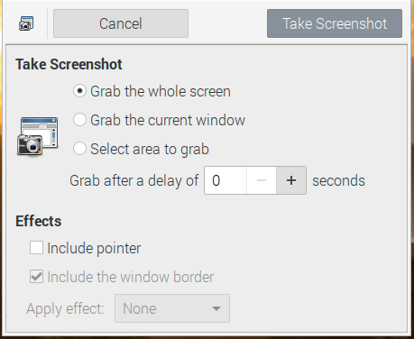

## Manejando tu Raspberry Pi

Como sabes Raspberry es una máquina Linux, con lo que podrás manejarla igual que se maneja cualquier otro equipo Linux.

### Capturas de la pantalla

Podemos hacer capturas del escritorio usando la tecla Imprimir Pantalla si nuestro teclado la tiene o bien usando el comando **Scrot**, que pondrá un fichero con la captura en directorio home del usuario (/home/pi por defecto) con un nombre dado por la fecha, hora y resolución. Por ejemplo "2021-02-26-194221_1024x768_scrot.png".

Podemos hacer que la captura se haga después de un determinado retardo usando la opción **-d**. Por ejemplo para hacer la captura a los 10 segundos. 

```sh
scrot -d 10
```

También podemos darle un nombre concreto al fichero resultado al usar el comando

```sh
scrot ficheroCaptura.png
```

Si necesitamos más opciones podemos instalar un programa como **Gnome Screenshot** que nos dará más opciones. Lo instalaremos como siempre con

```sh
sudo apt install gnome-screenshot
```
Y aparecerá en el menú de "Accesorios"

Nos permitirá capturar todo el escritorio, una ventana, una zona, definiendo un determinado retardo. También nos permite tras hacer la captura seleccionar el nombre y carpeta del fichero o si queremos que se copie la imagen en el clipboard.




### Consola (línea de comandos)

Podemos hacer casi todo desde el habitual entorno gráfico, pero también desde el terminal o la consola, también llamada línea de comandos.

Si te acostumbras a usarla verás que ganas en productividad y además verás que puedes automatizar muchas tareas. 


#### Comandos básicos:

Como ya hemos dicho, Raspbian es una versión de [Linux](https://es.wikipedia.org/wiki/GNU/Linux), que no es más que una versión moderna del sistema operativo [Unix](https://es.wikipedia.org/wiki/Unix). Por esto tenemos acceso a los comandos de esos sistemas operativos.

Veamos algunos de los comandos más utilizados:

* La tecla Tabulador nos permite completar el nombre del fichero/directorio
* **ls** : muestra los archivos y directorios ( **ls -l** para más detalles y **ls -a** para mostrar todos)
* **cd** : cambia de directorio (**cd ~** nos lleva a nuestro directorio home y **cd ..** sale del directorio actual)
* **chmod** : cambia los permisos de un fichero/directorio (**chmod ugo-w fichero** quita todos los permisos de escritura)
* **pwd** : nos dice el directorio actual
* **mv** : mueve directorios/ficheros a un nuevo destino
* **rm** : borra directorios/ficheros
* **mkdir** : crea un directorio
* **passwd** : cambia la contraseña del usuario actual
* **ps -ef** : muestra los procesos en ejecución
* **top** : administrador de tareas
* **clear** : borra todo el contenido del terminal
* **df** : muestra el % de disco ocupado
* **nano** : editor de texto básico
* **vi** : editor de texto avanzado pero complejo
* **du** : muestra lo que ocupa un directorio (**du -s *** muestra lo que ocupa un directorio y todo lo que contiene)
* **sudo halt** apaga la raspberry
* **sudo shutdown -h now** apaga la raspberry
* **history** : muestra todos los comandos que se han ejecutado antes. Podemos ejecutar el comando de la posición n, con !n . Las teclas abajo/arriba del cursor nos permiten iterar por los comandos usados.
* **man comando**: Para obtener ayuda sobre comando
* Para hacer fichero script: añadimos los comandos, chmod u+x fichero y para ejecutarlo ./fichero

[](https://drive.google.com/file/d/1a2UjGmzv0XXMpadJ1iItbat_ibDuG6Sl/view?usp=sharing)

[Vídeo: Uso del terminal y comandos Linux en Raspberry Pi](https://drive.google.com/file/d/1a2UjGmzv0XXMpadJ1iItbat_ibDuG6Sl/view?usp=sharing)

#### Estructura de directorios y ficheros

Algunas características de sistema de fichero de linux

* Usa un formato de partición ext4 (también existen aunque en desuso el ext3 y el ext2), aunque permite usar FAT, el típico sistema de archivos de Windows.
* El árbol de directorios tiene un único directorio raíz del que cuelga todo. Todos los dispositivos (pendrives, discos externos, discos de red) se integran dentro de este árbol, **montando** su raíz en un directorio determinado (montamos y desmontamos con __mount__ y __unmonut__ )

El usuario sólo acceso a su directorio y el solo el administrador (**root**) puede acceder al resto de directorios

##### Algunos directorios

* / directorio raiz
* /etc configuración
* /home usuario
* /usr programas para usuarios
* /usr/share recursos de programas (imágenes, traducciones)
* /usr/share/doc documentación
* /bin ejecutables del sistema
* /lib librerías
* /boot Arranque del sistema
* /usr/bin ejecutables para usuarios
* /media o /mnt punto de montaje de dispositivos de almacenamiento externo


#### Usuarios

El usuario por defecto es "**pi**" con contraseña "**raspberry**" por defecto

#### Cuidado con sudo

Los usuarios normales pueden hacer muchas cosas, pero las tareas más importantes (y por tanto peligrosas si se hacen mal), como pueden ser la configuración o borrado de ficheros críticos no están permitidas.

Esas tareas sólo las puede hacer el usuario administrador, llamado **root**, que puede hacer cualquier cosa. 

Como hay veces que un usuario necesita hacer alguna de estas tareas, por ejemplo editar un fichero de configuración, podemos solicitar permisos para hacer esa tarea anteponiendo al comando la palabra "sudo". Algunas acciones nos pedirán que introduzcamos el password de nuestro usuario como medida de seguridad.	

Por ejemplo si queremos editar un fichero de la carpeta de configuración etc llamado ftab, haremos

```sh
sudo geany /etc/fstab
```
	
geany es el editor de ficheros de texto, y al usar "sudo" estamos pidiendo permiso para hacer algo como root

Esto nos sirve para ver que podemos abrir aplicaciones de escritorio desde la consola.

Si en un momento dado necesitamos hacer muchas tareas como root podemos abrir una consola con este usuario haciendo

```sh
sudo su -
```

Pero mucho cuidado que esto nos da todo el poder del usuario administrador(**root**) y por tanto toda la responsabilidad

### Interface gráfico

Para arrancar el interface gráfico desde consola si no está arrancado usando
```sh
startx
```


## Usos

Veamos cómo podemos utilizar lo aprendido...

### Para hacer cálculos con Mathematica

Hay una versión gratuita (para uso no comercial) de Wolfram  Mathematica instalada por defecto en Raspbian


[](https://drive.google.com/file/d/1oXjMaNmL4gpaTHPePZYbIb6_lRsAGODi/view?usp=sharing)


[Vídeo: Trabajando con Mathematica en Raspberry](https://drive.google.com/file/d/1oXjMaNmL4gpaTHPePZYbIb6_lRsAGODi/view?usp=sharing)


### Vigilancia

Podemos usar su cámara (la original o una USB)

Usaremos un software standard de Linux: **motion**

```sh
sudo apt-get install motion
```

Editamos la configuración

```sh
sudo nano /etc/motion/motion.conf
```


Lo arrancamos
```sh
motion -n
```

Podremos acceder a la imagen en vivo de la cámara con

```sh
http://raspberry_ip:8081
```
 
