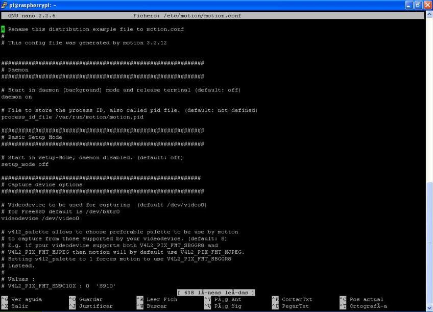

### Vigilancia

Podemos usar su cámara (la original o una USB)

Usaremos un software standard de Linux: **motion**

```sh
sudo apt-get install motion
```

Editamos la configuración

```sh
sudo nano /etc/motion/motion.conf
```



Lo arrancamos
```sh
motion -n
```

Podremos acceder a la imagen en vivo de la cámara con

```sh
http://raspberry_ip:8081
```
 
