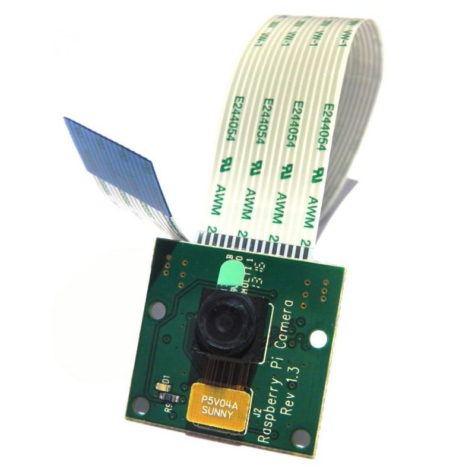
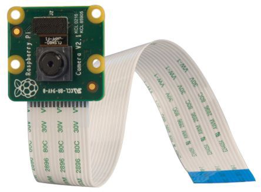
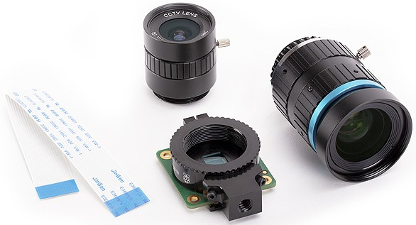
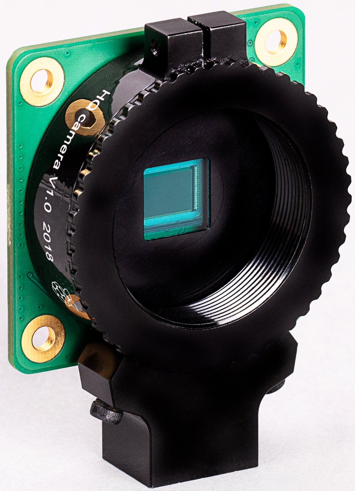
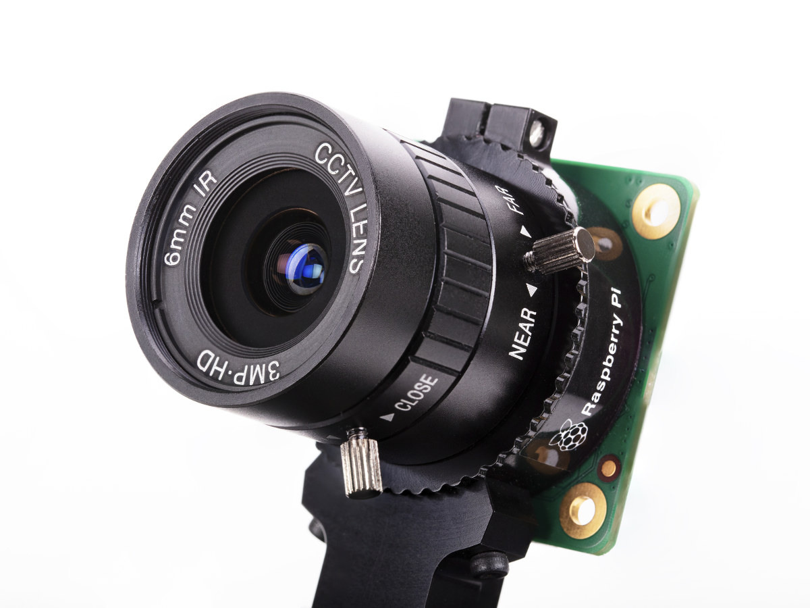
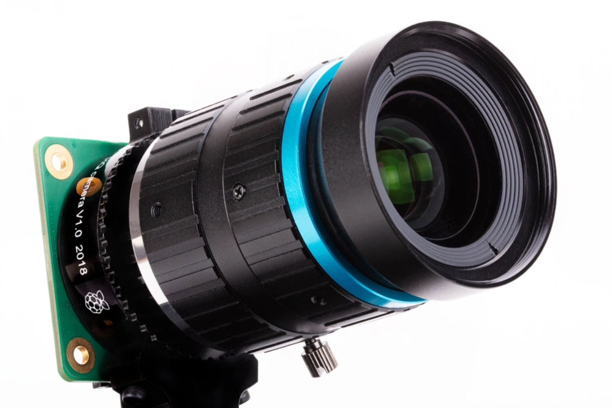
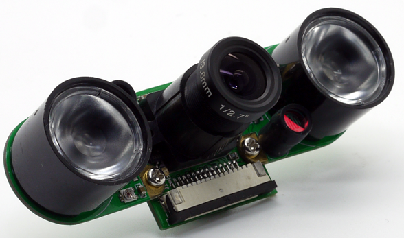
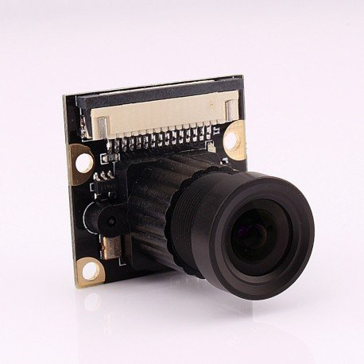
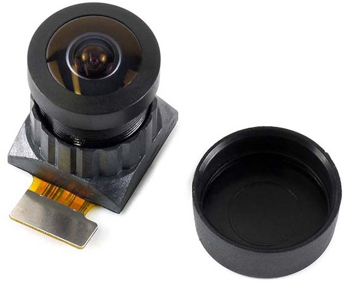
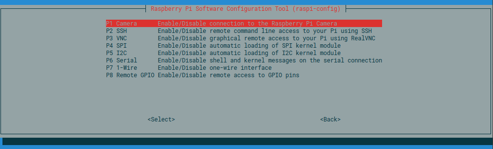

## Cámaras

Vamos a ver las distintas cámaras para Raspberry Pi. Existen varios modelos  creados por la Fundación Raspberry y otros facricantes, pero todos son compatibles con el mismo cable y conector.

Para optimizar el rendimiento está conectada directamente a la GPU, así no ocupa tiempo de procesamiento de la CPU.

Veamos los distintos modelos:

|Modelo|MegaPixels|Resolución|Sensor|Tamaño de Sensor|Precio|Versiones|
|---|---|---|---|---|---|---
|v1.3|5MP|2592x1944|OV5647|3.76x2.74mm|15€|Filtro IR y NOIR
|v2.1|8MP|3280x2464|Sony IMX219| 3.68x2.76mm|25€|Filtro IR y NOIR
|HQ|12MP|4056x3040|Sony IMX477|6.287x4.712mm|59€ + objetivos|Filtro IR|

Las versiones v1.3 y la v2.0 son muy parecidas. Se trata de cámaras con foco fijo cambiando el modelo de sensor y la resolución. 





Ambas se pueden encontrar en la versión normal con filtro IR y la NOIR sin filtro IR, preparada para una mejor visión nocturna.


La v1.3 ya está descatalogada pero se puede encontrar en versiones compatibles. Podemos comprar la versíón v2 tanto en su [versión IR](https://www.raspberrypi.com/products/camera-module-v2/) como [la NOIR](https://www.raspberrypi.com/products/pi-noir-camera-v2/)

Recientemente se ha presentado la nueva [HQ Camera](https://www.raspberrypi.com/products/raspberry-pi-high-quality-camera/) 


La cámara HQ amplía la resolución hasta los 12MP, usando además un sensor de mayor tamaño. El sensor incluye soporte compatible con trípode estándar.



El disponer de una montura de tipo  C y CS añade un mundo de posibilidades al poder usar distintos objetivos. De momento están disponibles de 6mm y 16mm, pero al ser una montura estándar se podrán incorporar otros objetivos.





### Cámaras compatibles

Como los conectores de la cámara son estándar, hay muchos fabricantes que venden modelos totalmente compatibles, como estos modelos nocturnos, algunos de ellos con lentes ajustables manualmente.





También podemos comprar la cámara y conectarla al módulo directamente:




[Datos sobre las distintas versiones](https://www.raspberrypi.com/documentation/accessories/camera.html). Más detalles sobre el hardware de las cámaras en [post asociado](https://dronebotworkshop.com/pi-cameras/) y en [este vídeo](https://www.youtube.com/watch?v=MVgr302PNwY).


### Conectando la cámara

Todos los modelos usan el mismo conector y se conectan de la misma forma.


La cámara tiene su propio conector, junto al conector HDMI

Para conectarla pondremos el cable de la manera que se ve en la imagen


Antes de poder utilizarla tenemos que activarla (En futuras versiones no será necesario activarla, con lo que puede ser que no veas esta opción si estás instalando una versión más moderna)

```sh
sudo raspi-config
```
En el menú de "Interfacing Options"



Necesitamos reiniciar para que arranquen adecuadamente los drivers.

En versiones más modernas tendremos que activar la opción de “Legacy Cámara” en configuración.


### Versión de Raspbian Buster o anterior


Podemos probarla con este comando

```sh
raspistill -v -o test.jpg
```        

Que mostrará lo que enfoca la cámara durante 5 segundos y luego guardará una imagen en el fichero test.jpg


Tenemos 2 aplicaciones para usar la cámara **raspistill** que tomará imágenes fijas y **raspivid** que grabará vídeo.

### Imágenes estáticas

Si queremos cambiar el retardo con el se captura, usamos la opción **-t** indicando el tiempo en milisegundos:

```sh
raspistill -o myimage.jpg -t 3000
```

Este programa tiene muchas opciones que podemos ver con "raspistill --help | less"

```sh

"raspistill" Camera App (commit 6e6a2c859a17 Tainted)

Runs camera for specific time, and take JPG capture at end if requested

usage: raspistill [options]

Image parameter commands

-q, --quality	: Set jpeg quality <0 to 100>
-r, --raw	: Add raw bayer data to jpeg metadata
-l, --latest	: Link latest complete image to filename <filename>
-t, --timeout	: Time (in ms) before takes picture and shuts down (if not specified, set to 5s)
-th, --thumb	: Set thumbnail parameters (x:y:quality) or none
-d, --demo	: Run a demo mode (cycle through range of camera options, no capture)
-e, --encoding	: Encoding to use for output file (jpg, bmp, gif, png)
-x, --exif	: EXIF tag to apply to captures (format as 'key=value') or none
-tl, --timelapse	: Timelapse mode. Takes a picture every <t>ms. %d == frame number (Try: -o img_%04d.jpg)
-fp, --fullpreview	: Run the preview using the still capture resolution (may reduce preview fps)
-k, --keypress	: Wait between captures for a ENTER, X then ENTER to exit
-s, --signal	: Wait between captures for a SIGUSR1 or SIGUSR2 from another process
-g, --gl	: Draw preview to texture instead of using video render component
-gc, --glcapture	: Capture the GL frame-buffer instead of the camera image
-bm, --burst	: Enable 'burst capture mode'
-dt, --datetime	: Replace output pattern (%d) with DateTime (MonthDayHourMinSec)
-ts, --timestamp	: Replace output pattern (%d) with unix timestamp (seconds since 1970)
-fs, --framestart	: Starting frame number in output pattern(%d)
-rs, --restart	: JPEG Restart interval (default of 0 for none)

GL parameter commands

-gs, --glscene	: GL scene square,teapot,mirror,yuv,sobel,vcsm_square
-gw, --glwin	: GL window settings <'x,y,w,h'>

Common Settings commands

-?, --help	: This help information
-w, --width	: Set image width <size>
-h, --height	: Set image height <size>
-o, --output	: Output filename <filename> (to write to stdout, use '-o -'). If not specified, no file is saved
-v, --verbose	: Output verbose information during run
-cs, --camselect	: Select camera <number>. Default 0
-md, --mode	: Force sensor mode. 0=auto. See docs for other modes available
-gps, --gpsdexif	: Apply real-time GPS information to output (e.g. EXIF in JPG, annotation in video (requires libgps.so.23)

Preview parameter commands

-p, --preview	: Preview window settings <'x,y,w,h'>
-f, --fullscreen	: Fullscreen preview mode
-op, --opacity	: Preview window opacity (0-255)
-n, --nopreview	: Do not display a preview window
-dn, --dispnum	: Display on which to display the preview window (dispmanx/tvservice numbering)

Image parameter commands

-sh, --sharpness	: Set image sharpness (-100 to 100)
-co, --contrast	: Set image contrast (-100 to 100)
-br, --brightness	: Set image brightness (0 to 100)
-sa, --saturation	: Set image saturation (-100 to 100)
-ISO, --ISO	: Set capture ISO
-vs, --vstab	: Turn on video stabilisation
-ev, --ev	: Set EV compensation - steps of 1/6 stop
-ex, --exposure	: Set exposure mode (see Notes)
-fli, --flicker	: Set flicker avoid mode (see Notes)
-awb, --awb	: Set AWB mode (see Notes)
-ifx, --imxfx	: Set image effect (see Notes)
-cfx, --colfx	: Set colour effect (U:V)
-mm, --metering	: Set metering mode (see Notes)
-rot, --rotation	: Set image rotation (0-359)
-hf, --hflip	: Set horizontal flip
-vf, --vflip	: Set vertical flip
-roi, --roi	: Set region of interest (x,y,w,d as normalised coordinates [0.0-1.0])
-ss, --shutter	: Set shutter speed in microseconds
-awbg, --awbgains	: Set AWB gains - AWB mode must be off
-drc, --drc	: Set DRC Level (see Notes)
-st, --stats	: Force recomputation of statistics on stills capture pass
-a, --annotate	: Enable/Set annotate flags or text
-3d, --stereo	: Select stereoscopic mode
-dec, --decimate	: Half width/height of stereo image
-3dswap, --3dswap	: Swap camera order for stereoscopic
-ae, --annotateex	: Set extra annotation parameters (text size, text colour(hex YUV), bg colour(hex YUV), justify, x, y)
-ag, --analoggain	: Set the analog gain (floating point)
-dg, --digitalgain	: Set the digital gain (floating point)
-set, --settings	: Retrieve camera settings and write to stdout


Notes

Exposure mode options :
off,auto,night,nightpreview,backlight,spotlight,sports,snow,beach,verylong,fixedfps,antishake,fireworks

Flicker avoid mode options :
off,auto,50hz,60hz

AWB mode options :
off,auto,sun,cloud,shade,tungsten,fluorescent,incandescent,flash,horizon,greyworld

Image Effect mode options :
none,negative,solarise,sketch,denoise,emboss,oilpaint,hatch,gpen,pastel,watercolour,film,blur,saturation,colourswap,washedout,posterise,colourpoint,colourbalance,cartoon

Metering Mode options :
average,spot,backlit,matrix

Dynamic Range Compression (DRC) options :
off,low,med,high
```
Entre estas opciones podemos encontrar **-tl** que nos va a permitir tomar una imagen cada cierto tiempo (time lapse). Con ello podemos generar una secuencia de imágenes con una sola línea de comando

```sh
raspistill -o myimage_%d.jpg -tl 2000 -t 25000
```

Una imagen cada 2 segundos durante 25 segundos Cada foto tendrá un número de secuencia

```sh
myimage_1.jpg
myimage_2.jpg
myimage_3.jpg
myimage_4.jpg
...
```

### Vídeo

El comando **raspivid**  nos va a permitir grabar vídeos. Para capturar 5s de vídeo en formato h264 utilizaremos:

```sh
raspivid -o video.h264
```

Si queremos capturar 10 segundos usaremos:

```sh
raspivid -o video.h264 -t 10000
```

Para ver todas las opciones disponibles podemos hacer

```sh
$raspivid | less
```

Para una documentación más detallada sobre las opciones del ejecutable se puede consultar el siguiente [enlace](https://www.raspberrypi.org/documentation/raspbian/applications/camera.md)

### Versión de Raspbian Bullseye o posterior

Para usar la cámara usaremos:

```sh
libcamera-hello
```

que nos mostrará una previsualización durante 5 segundos y luego se cerrará

Si hacemos:

```sh
libcamera-hello -t 0
```

la pantalla de previsualización se mostrará indefinidamente hasta que pulsemos el botón de cerrar de la ventana.

Para capturar una imagen que guardaremos con el nombre 'imagen.jpg' usaremos:

```sh
libcamera-jpeg -o imagen.jpg
``` 

Por ejemplo para capturar una imagen tras esperar 10 segundos con resolución 1920x1080 haremos:

```sh
libcamera-jpeg -o test_1920x1080.jpg -t 10000 --width 1920 --height 1080
```
Existe un comando más avanzado (similar al antiguo raspistill): **libcamera-still**

```sh
libcamera-still -o test.jpg
```

También podemos guardarlo en otros formatos como _png_ con la opción '-e png'

```sh
libcamera-still -e png -o test.png
```

Este comando tienen multitud de opciones, que podemos consultar [su documentación](https://www.raspberrypi.com/documentation/accessories/camera.html#libcamera-still)

También se puede capturar en formato RAW (el formato más profesional que no comprimir ni modifica la imagen) con la opción '-r' que se guardará en forma DNG (Adobe Digital Negative)

Para capturar vídeo usaremos el comando libcamera-vid:

```sh
libcamera-vid -t 10000 -o test.h264
```

Capturará un vídeo en formato h264 (también puede ser formato mjpeg o yuv420) durante 10 segundos y lo guardará en el fichero test.h264

También podemos usarlo para hacer un streaming el vídeo con este comando:

```sh
libcamera-vid -t 0 --inline --listen -o tcp://0.0.0.0:8888
```

Podemos ver todas las opciones en [su documentación](https://www.raspberrypi.com/documentation/accessories/camera.html#libcamera-vid)

### Uso de cámaras Webcam

También podemos usar cámaras USB compatibles  como  la PS3 Eye.

Veremos si se ha detectado con:

```sh
$ ls -l /dev/video*
```

Si se detecta


Instalamos fswebcam

```sh
sudo apt-get install fswebcam
```

Que nos permitirá tomar una imagen con

```sh
fswebcam -d /dev/video0 -r 640x480 test.jpeg
```
